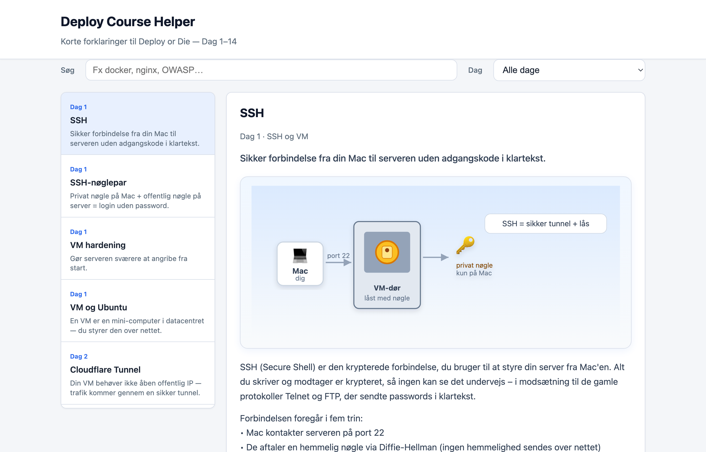
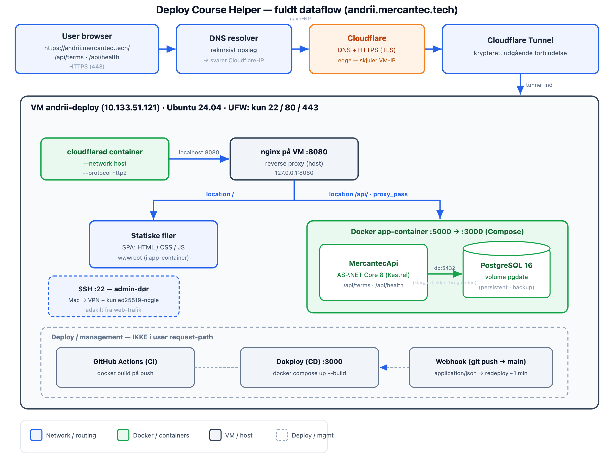
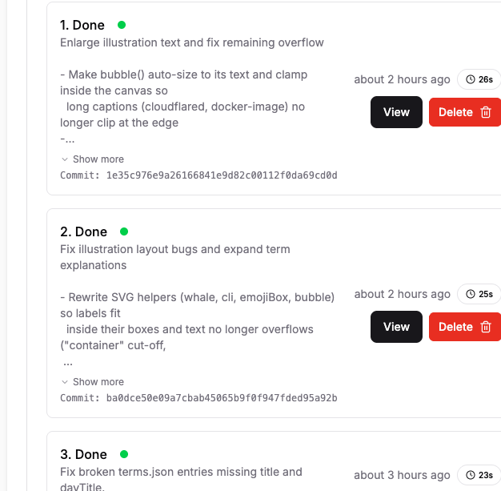
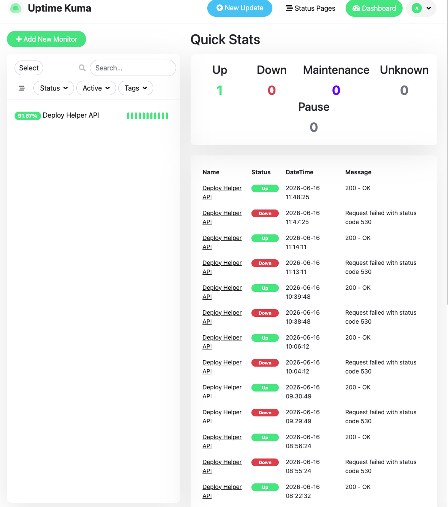

# Deploy or Die — Отчёт по проекту (RU)

> Рабочая русская версия. Сдаётся датский вариант — [RAPPORT.md](RAPPORT.md).

**Имя:** Andrii Bondar · **Логин:** anbo0005
**Домен:** https://andrii.mercantec.tech
**Repo:** https://github.com/Mercantec-GHC/deploy-or-die-anbo0005
**Курс:** Deploy or Die (14 дней) · Mercantec

---

## 1. Описание проекта

### Что я собрал и задеплоил?

Я собрал и задеплоил **Deploy Course Helper** — небольшое веб-приложение, которое
работает как интерактивный словарь понятий курса (Дни 1–14). Оно состоит из ASP.NET
Core 8 Web API со статическим фронтендом (HTML/CSS/vanilla JS) из `wwwroot/`. Контент
(понятия курса с объяснениями и иллюстрациями) лежит в `Data/terms.json` и отдаётся
через API.

Endpoints:
- `GET /api/terms` — все понятия
- `GET /api/terms/{id}` — одно понятие
- `GET /api/terms/days` — дни/темы
- `GET /api/health` — health check (используется Uptime Kuma)
- `GET /` — статический SPA



*Скриншот работающего приложения (понятие SSH с иллюстрацией-метафорой).*

**Важная оговорка:** мой фокус был сознательно на **самом процессе деплоя и
инфраструктуре**, а не на разработке приложения. Приложение намеренно простое, чтобы
выжать максимум из deploy-материала — pipeline, сервер, контейнеры, безопасность,
эксплуатация — а не тратить время на сложную кодовую базу. Приложение реальное и
работает, но это средство отработать всю цепочку деплоя, а не цель сама по себе.

### Стек технологий

- **Backend:** ASP.NET Core 8 (Kestrel)
- **Frontend:** статический HTML/CSS/JavaScript (без фреймворка)
- **База данных:** PostgreSQL 16 (`postgres:16-alpine`) — в контейнере с persistent volume.
  *Замечание:* контент приложения сейчас читается из `Data/terms.json`; БД поднята,
  проверена (backup + persistence) и входит в инфраструктуру деплоя, но приложение пока
  не читает/пишет в Postgres
- **Контейнеры:** Docker Engine + Docker Compose v2
- **Веб-сервер/прокси:** Nginx 1.24.0 на хосте VM
- **Edge/HTTPS:** Cloudflare Tunnel (`cloudflared`)
- **CI:** GitHub Actions · **CD:** Dokploy
- **ОС:** Ubuntu 24.04 LTS

---

## 2. Инфраструктура и деплой



*Рисунок: полный поток данных от браузера пользователя до приложения и базы на VM.*

### Сервер

VM от Mercantec: Ubuntu 24.04 LTS, 4 CPU, 8 GB RAM, hostname `andrii-deploy`. Доступ
через FortiClient VPN + SSH. Я **не выставляю VM наружу публичным A-record или открытыми
веб-портами** — весь веб-трафик приходит через Cloudflare Tunnel. (DHCP однажды сменил
мой IP с `.122` на `.121` после reboot, пришлось поправить `~/.ssh/config`.)

### Домен и HTTPS

Домен `andrii.mercantec.tech` указывает на Cloudflare (DNS управляет преподаватель).
`dig` возвращает IP Cloudflare, а не VM — это корректно для tunnel-сетапа:

```bash
$ dig +short andrii.mercantec.tech
104.21.23.58
172.67.209.112
```

HTTPS терминируется на **Cloudflare**, поэтому Certbot на VM не нужен. Трафик идёт так:

```
Пользователь → HTTPS → Cloudflare → tunnel → cloudflared → nginx :8080 → app :5000
```

`cloudflared` работает как контейнер с `--network host` и `--protocol http2`
(QUIC был заблокирован в сети Mercantec).

### Docker, Nginx и база данных

- **Nginx** (на хосте) слушает `127.0.0.1:8080` и работает как reverse proxy:
  `location /` и `/api/` → `proxy_pass http://127.0.0.1:5000/`.
- **App + DB** через Docker Compose: app-контейнер на `127.0.0.1:5000` (Kestrel внутри
  слушает :3000), Postgres на `127.0.0.1:5432`.
- **Всё на localhost:** ни app-, ни db-, ни админ-порты не открыты в интернет — наружу
  доступен только nginx (через tunnel).

**Multi-stage Dockerfile:** stage 1 (`sdk:8.0`) компилирует через `dotnet publish`,
stage 2 (`aspnet:8.0`) — только runtime. Runtime-образ остаётся маленьким (~320 MB), и
.NET SDK вообще не нужен на хосте VM.

`docker-compose.yml` описывает два сервиса (`app`, `db`), общую сеть (app обращается к
БД по hostname `db`, не `localhost`), named volume `pgdata`, `env_file: .env` и
`depends_on: db (service_healthy)`.

```bash
# Compose-стек: app + база работают (db healthy)
$ docker compose ps
NAME                       STATUS
mercantecapi-...-app-1     Up
mercantecapi-...-db-1      Up (healthy)
```

---

## 3. CI/CD Pipeline

### Как я деплою?

Автоматизированная цепочка от моего Mac до VM:

```
Mac (dotnet run локально) → git push main → GitHub Actions (CI) + Dokploy webhook (CD)
```

- **CI — GitHub Actions** (`.github/workflows/ci.yml`): запускается на `push` и
  `pull_request` в `main`. Собирает Docker-образ (`docker build`) как контроль качества.
  VM не трогает — только доказывает, что образ собирается.
- **CD — Dokploy** (self-hosted на VM): подключён к репо через GitHub PAT, ветка `main`,
  autodeploy. **Webhook** от GitHub вызывает Dokploy при каждом push, и Dokploy выполняет
  `docker compose up --build` за ~1 минуту.

**Ограничение (честно):** CI сейчас только собирает образ — он пока не запускает
unit-тесты, dependency-scan или Trivy. Это естественный следующий шаг к более зрелому
pipeline.



*Dokploy Deployments: каждый push в `main` запускает автоматический redeploy — здесь с хешем коммита, статусом и временем сборки.*

### Контроль версий и управление проектом

- Один Git-репо на всё: `app/` (код + Dockerfile + compose) и `docs/` (заметки, workflow,
  лог, handoff). Стратегия веток: `main` (solo-проект, малый scope).
- Веду **pre-commit чеклист** в `docs/WORKFLOW.md` (нет секретов, нет `bin/obj`, проверка
  `git status`/`diff` перед коммитом).
- Статус и прогресс — в `docs/DOCS_INDEX.md` (✅/⬜ по дням), `docs/SESSION_HANDOFF.md`
  (файл возобновления между сессиями) и `docs/DEPLOY_RESULTS_LOG.md` (результаты по дням).
  GitHub Projects не использовал — трекинг это документация в репо.

---

## 4. Безопасность

Несколько конкретных мер выполнено (проверено), часть осталась теорией.

**Реализовано:**
- **SSH-hardening:** только ed25519-ключ, `PermitRootLogin no`, `PasswordAuthentication no`
  в `sshd_config`. Проверено по `Accepted publickey` в логе sshd.
- **UFW firewall:** `deny incoming` / `allow outgoing`, открыты только **22, 80, 443**.
- **Cloudflare Tunnel:** нет публичного IP/открытых веб-портов на VM — поверхность атаки
  минимальна. Postgres и админ-порты (Dokploy, Uptime Kuma) слушают только `127.0.0.1`.
- **Секреты:** DB-credentials в `.env` (в `.gitignore`, никогда в git).
- **Security headers** (День 11, nginx): CSP, HSTS, X-Frame-Options,
  X-Content-Type-Options, Referrer-Policy — подтверждено `curl -I`.
- **OWASP-взгляд на свой проект:** A02 (секреты вне git, TLS через Cloudflare),
  A05 (headers + БД только на localhost). У `/api/` нет auth — это сознательно ОК для
  публичного read-only демо.

```bash
# Firewall — открыты только нужные порты
$ sudo ufw status
Status: active
22/tcp    ALLOW    Anywhere
80/tcp    ALLOW    Anywhere
443/tcp   ALLOW    Anywhere
```

```bash
# Security headers от nginx (День 11)
$ curl -sI https://andrii.mercantec.tech/ | head
HTTP/2 200
content-security-policy: default-src 'self' ...
strict-transport-security: max-age=...
x-frame-options: DENY
x-content-type-options: nosniff
referrer-policy: strict-origin-when-cross-origin
```

**Инцидент безопасности (открытая задача):** GitHub PAT случайно попал на скриншот во
время работы — реальный риск (утёкший credential). **Статус: ещё не закрыт** — токен
нужно revoke/ротировать на GitHub. Урок: недостаточно убрать токен из заметки, т.к.
история и скриншоты остаются; митигация завершена только когда сам токен признан
недействительным.

**Теория / не выполнено на этом проекте:** Trivy image-scan, `dotnet list package
--vulnerable`, Certbot (не нужен при tunnel), NIS2/CRA (устно День 2).

---

## 5. Мониторинг и эксплуатация

### Как я слежу за тем, что решение работает?

- **Dokploy UI** (`https://andriidokploy.mercantec.tech`): статус контейнеров
  (Running/Exited), ресурсы и история деплоев — взгляд *изнутри* VM.
- **Uptime Kuma** (`louislam/uptime-kuma`, порт `127.0.0.1:3001`, доступ через
  SSH-port-forward): мониторит `GET https://andrii.mercantec.tech/api/health` каждые
  60 сек. Статус **Up · 200 OK**. Kuma проверяет весь путь снаружи (Cloudflare → tunnel →
  nginx → app) — то, что Dokploy не видит.
- **App-уровень:** `/api/health` отдаёт 200 JSON (сигнал uptime), неизвестное понятие
  даёт 404, runtime-ошибки видны в ASP.NET stdout через Dokploy Logs.
- **Логи:** ASP.NET stdout через `docker compose logs` и Dokploy Logs.
- **Backup:** `pg_dump` → `backup_20260615.sql`; persistence проверена через
  `docker restart db` + `SELECT 1`.



*Uptime Kuma: монитор бьёт в `/api/health` каждые 60 сек. Периодические события «530» — это как раз падения Cloudflare Tunnel (см. раздел 6); мониторинг ловит их снаружи, как увидел бы пользователь.*

**Ограничение:** сам Kuma работает контейнером на *той же* VM. Он проверяет полный внешний путь (через Cloudflare-tunnel и обратно), но не является полностью независимым наблюдателем: если упадёт вся VM или её сеть, Kuma тоже упадёт и не сможет прислать алерт. Внешний сторонний uptime-сервис на другой сети был бы надёжнее — естественный следующий шаг.

### Обработка ошибок на практике

Я научился читать статус-коды как диагноз:
- **502** = tunnel OK, но nginx/app не отвечает (например, app-контейнер ещё не стартовал).
- **530 / "Lost connection with edge"** = tunnel потерял соединение → фикс:
  `docker restart cloudflared`.
- **1033** = `cloudflared` не запущен.

---

## 6. Обучение и рефлексия

### Что прошло хорошо

- Вся цепочка сложилась и проверялась шаг за шагом: SSH/UFW (День 1–2) → Docker + Postgres
  + tunnel (День 3) → nginx reverse proxy (День 4–5) → app в контейнере (День 6) →
  compose-стек (День 7) → CI + CD (День 8) → backup, мониторинг и headers (День 9–11).
- Всегда тестировал в порядке `:5000 → :8080 → https://домен`, чтобы точно знать,
  *на каком слое* ошибка:

```bash
$ curl -s -o /dev/null -w "%{http_code}\n" http://127.0.0.1:5000/api/terms   # app    → 200
$ curl -s -o /dev/null -w "%{http_code}\n" http://127.0.0.1:8080/api/terms   # nginx  → 200
$ curl -s -o /dev/null -w "%{http_code}\n" https://andrii.mercantec.tech/api/terms  # tunnel → 200
```

- CI/CD-поток работал: push в `main` → зелёный CI → redeploy Dokploy за ~1 мин.

### Что пошло не так

- **502 при старте tunnel:** `cloudflared` в bridge-сети указывал на localhost самого
  контейнера. Фикс: `--network host`.
- **QUIC заблокирован:** пришлось форсить `--protocol http2`.
- **Cloudflare Tunnel часто падал — моя главная проблема эксплуатации.** Периодически
  `cloudflared` терял edge-соединение (`Lost connection with edge`), и домен отвечал
  **530**, хотя `curl http://127.0.0.1:8080` локально давал 200. Это показывало, что
  ошибка в слое tunnel — не в app или nginx. Workaround — `docker restart cloudflared`,
  после чего лог снова показывал `Registered tunnel connection`. Более надёжное решение —
  запускать cloudflared как авто-перезапускаемый сервис с health-надзором, чтобы он
  поднимался сам без ручного вмешательства.
- **Encoding webhook:** дефолтный `form` у GitHub давал "Branch Not Match" в Dokploy.
  Фикс: Content-Type `application/json`.
- **Scope GitHub Actions:** первый push workflow упал из-за отсутствия `workflow`-scope у
  токена. Фикс: `gh auth refresh -s workflow`.
- **Неверный fingerprint сервера — один IP указывал на две разные VM.** Один и тот же
  внутренний IP (`10.133.51.122`) на разных попытках отвечал двумя разными
  ED25519-fingerprint'ами. Неверный хост (`SHA256:P4Z…`) давал ответить на prompt, но
  затем отклонял с `Permission denied (publickey)` — это была VM другого студента,
  которой DHCP выдал тот же IP, и моего ключа на ней не было. Правильная VM
  (`SHA256:MFyp…`) сразу логинила с `Welcome to Ubuntu 24.04.4 LTS`. Fingerprint был
  единственным способом отличить две машины. (Позже мой IP ещё и сменился с `.122` на
  `.121` после reboot.) Урок: всегда проверять fingerprint — не жать вслепую "yes" — и
  чистить старый host key через `ssh-keygen -R`:

```bash
$ ssh-keygen -R 10.133.51.122          # убрать устаревший host key

# Попытка 1 — неверная VM (тот же IP, другая машина):
$ ssh mercantec-andrii
ED25519 key fingerprint is SHA256:P4Z/CQ6Zhu1V+QL+ZlhGh487DWYnWCFKo2ssu05Bs2k
Are you sure you want to continue connecting? yes
andrii@10.133.51.122: Permission denied (publickey).

# Попытка 2 — правильная VM:
$ ssh mercantec-andrii
ED25519 key fingerprint is SHA256:MFypL9BQUdg1oJq/HkYZxtcv7/w8wvXBOZwRoVjD0Ho
Are you sure you want to continue connecting? yes
Welcome to Ubuntu 24.04.4 LTS
```

### Чему я научился

Технически я теперь понимаю цепочку деплоя как **отдельные слои**, каждый из которых может
падать и диагностироваться по отдельности: SSH (:22, только ключ) — это другая «дверь»,
чем веб-трафик (tunnel → nginx → app). Dockerfile (*как собрать образ*) и compose (*что
запускается вместе*) — не дубликаты. `localhost` внутри контейнера — это не хост VM. А CI
(собирает код) — не то же самое, что CD (деплоит на VM).

Рефлексия по scope: сознательно держа приложение простым, я смог пройти и реально
*проверить* каждый шаг деплоя — вместо того чтобы утонуть в коде приложения. Это дало
максимум обучения из deploy-материала.

Это был **solo-проект**, поэтому «командная» часть свелась к дисциплине с самим собой:
документировать каждую сессию (handoff-файл), вести лог результатов и держать строгую
рутину коммитов/проверок, чтобы возобновлять работу не теряя нить.

**Следующие шаги:** реально подключить приложение к Postgres (читать/писать понятия из
БД), добавить unit-тесты и dependency-/image-scan (Trivy) в CI, и завершить ротацию PAT.
