## День 1 — (8 июня) — **SSH и базовая безопасность**

- Получить собственный сервер (DigitalOcean/AWS/Azure) — мы используем серверы Datacenter через Twingate
- Настройка SSH и Twingate VPN
- Базовые Linux-команды
- SSH-безопасность (disable root, key-only)
- Системные обновления и управление пакетами
- **Цель**: вы можете войти на свой сервер и настроить базовую безопасность

**:learning-motives: Цели обучения на день : встреча в Teams в 08:30** :teams_icon: Докладчики @MAGS и @Paw

1. Я могу подключиться к удалённому серверу по SSH и использовать базовые Linux-команды
2. Я могу настроить Twingate VPN и понимать, как он защищает доступ к серверам
3. Я могу повысить безопасность сервера, отключив root-login и используя SSH-ключи
- :theory-icon: Теория дня  ✔️

    # День 1 – SSH и базовая безопасность

    > Теория к Дню 1 (8 июня). Всё это — первый шаг к тому, чтобы вывести *ваше* приложение в продакшен: вы должны уметь безопасно заходить на сервер, где оно будет работать.
    >

    ---

    ## SSH (Secure Shell)

    **SSH** — это зашифрованный протокол для входа и управления удалённым сервером по сети. Весь трафик (и логин, и команды) шифруется, чтобы никто не мог его прочитать.

    - **Порт:** стандартный порт 22 (TCP).
    - **Команда:** `ssh user@host` — например `ssh root@192.168.1.10` или `ssh ubuntu@my-server.example.com`.
    - **Вход по ключу:** вместо пароля можно использовать **пару ключей** (приватный ключ на вашем ПК, публичный ключ на сервере). Это безопаснее и проще автоматизировать.

    ### Подключение

    ```bash
    ssh user@SERVER-IP-OR-DOMAIN
    ```

    При первом подключении нужно подтвердить "fingerprint" сервера. После этого вы можете работать на сервере так, как будто сидите за ним физически.

    ---

    ## Twingate VPN

    **Twingate** — это Zero Trust VPN-решение. Вместо открытия всей сети доступ выдаётся только к конкретным ресурсам (например, серверам), на которые у вас есть права.

    - Серверы обычно находятся за Twingate и не открыты напрямую в интернет на порту 22.
    - Вы устанавливаете Twingate на ПК, входите в систему и после этого можете использовать SSH только к тем серверам, к которым организация дала доступ.
    - Это уменьшает поверхность атаки и усложняет злоумышленникам поиск и атаку серверов.

    ### Datahouse — зачем это в курсе

    Mercantec использует серверы в **датацентре Datahouse** (HOT / hotdata). Для Deploy это ваша **VM** — «мини-ПК» с Ubuntu, куда позже ставите .NET, Docker, Nginx и т.д.

    ### Школьные материалы (ссылки)

    | Ресурс | URL |
    | --- | --- |
    | Курс / обзор DH Datacenter | https://mercantec.notion.site/dh-datacenter |
    | Slides (процесс доступа) | SharePoint — ссылка у преподавателя (MAGS) |
    | Booking-guide (Ronni) | https://mars.merhot.dk/w/index.php/Booking-guide |

    ### FortiClient VPN

    - Скачать: https://www.fortinet.com/support/product-downloads — версия **только VPN** (не 30-дневная платная «полная» FortiClient сверху на странице).
    - Вход: `@edu.mercantec.dk` + **MFA** (authentication app). Пароль — школьный (как Teams/Lectio); не хранить в git.
    - В профиле: правильные **Remote Gateway** и **port** (как в инструкции на Notion).
    - Forti нужен для части школьных ресурсов, но **для booking это может быть недостаточно** (см. ниже).

    ### Booking VM — URL (в материалах встречаются разные)

    | URL | Комментарий |
    | --- | --- |
    | `https://booking.hotdata.dk/` | Старый/официальный в booking-guide |
    | `https://vm.hotdata.dk/` | «Ny platform» в материалах курса |
    | `https://vm.testauto.dk/login` | Преподаватель открывает сейчас (актуально проверить у школы) |
    | `http://10.132.128.21/` | ✅ **Рабочий booking** (HTTP port 80). Lucas / support. **Не** `https://` — порт 443 refused |

    **Процесс booking (одинаковый):**

    1. Login / Sign up с `@edu.mercantec.dk`.
    2. **Create Booking** → Virtual machine.
    3. Template для Deploy: **Ubuntu 24.04 Server** (не Desktop, не Windows).
    4. Assign to teacher → дата окончания → комментарий (зачем VM).
    5. Ждёте **approve** преподавателя → получаете IP/логин.

    ### Сеть: VPN vs OLC WIFI (важно — противоречие в доках)

    | Источник | Что говорят |
    | --- | --- |
    | Материалы курса | Booking через **Forti VPN** + URL выше |
    | Booking-guide | Нужна сеть **Datahouse** (розетка в полу/стене или **Datahouse-WiFi**) |
    | Support (2026) | Сайты за firewall HOT; доступ с **OLC WIFI**; **не** через global-test и **не** через VPN |

    Если дома / мобильный hotspot / офис — timeout **ожидаем**. Уточняйте у преподавателя/support: нужен ли физически **OLC WIFI** на школе.

    ### Linux templates (Deploy — только это)

    | Template | Для курса |
    | --- | --- |
    | **Ubuntu 24.04 Server** | ✅ Основной выбор |
    | Ubuntu Server 24.04 (200GB) | Только если нужен большой диск |
    | Ubuntu 24.04 Desktop | ❌ |
    | Debian 12, Linux Mint, Windows… | ❌ (другие предметы) |

    Пароли VM по умолчанию и коды Wi‑Fi — **только локально** в `SERVER_INFO.md`, не в git.

    ### Support (Datahouse)

    - Ronni Sørensen: `rrso.skp@edu.mercantec.dk`
    - Viktor Viskov: `vikt3586@edu.mercantec.dk`
    - DH-Helpdesk: `dh.helpdesk@edu.mercantec.dk`
    - Teams — тоже можно; email-адреса вводить **вручную** (не из `mailto:` в PDF).

    ### Twingate

    - Может использоваться позже; сейчас основной путь — **Forti + Datahouse booking** (или OLC WIFI по ответу школы).

    ---

    ## Базовые Linux-команды

    Команды, которые вы используете на сервере (чаще всего Ubuntu/Debian):

    | Kommando | Расшифровка (запомнить) | Beskrivelse |
    | --- | --- | --- |
    | `pwd` | **p**rint **w**orking **d**irectory — «где я?» | Показывает текущую папку (path) |
    | `ls` | **list** — список файлов и папок | Показывает файлы и папки. `ls -la` также показывает скрытые файлы и детали |
    | `cd <mappe>` | **c**hange **d**irectory — перейти в папку | Переход в папку. `cd ..` — на уровень выше |
    | `mkdir <navn>` | **m**a**k**e **dir**ectory — создать папку | Создаёт папку |
    | `cat <fil>` | **cat**enate — показать содержимое файла | Показывает содержимое файла |
    | `nano <fil>` | редактор **nano** (править файл) | Открывает файл в редакторе nano (удобно для старта) |
    | `sudo <kommando>` | **s**uper**u**ser **do** — от имени админа | Запускает команду с правами администратора (root) |
    | `systemctl status <tjeneste>` | **system control** — статус сервиса | Показывает статус системного сервиса (например ssh, nginx) |
    | `exit` | **exit** — выход | Завершает SSH-сессию |

    ---

    ## SSH-безопасность

    ### Отключить root-login

    **Root** — суперпользователь с полным доступом. Если root может входить по паролю через интернет, это любимая цель атакующих.

    - Создайте обычного пользователя с правами `sudo`.
    - Отключите **root-login** в SSH-конфиге (`/etc/ssh/sshd_config`): `PermitRootLogin no`.
    - После этого входите только обычным пользователем и используйте `sudo` для админ-действий.

    ### Вход по ключу (key-only)

    - **Пароли** можно подобрать, украсть или выманить фишингом. **SSH-ключи** — это длинные криптографические ключи.
    - У вас есть **приватный ключ** на вашем ПК (например `~/.ssh/id_ed25519`) и **публичный ключ** на сервере (в `~/.ssh/authorized_keys`).
    - Сервер можно настроить на вход только по ключам: `PasswordAuthentication no`. Тогда вход по паролю отключается.
    - **Важно:** защищайте приватный ключ — его нельзя передавать или сливать. При желании защитите его passphrase.

    ---

    ## Системные обновления и управление пакетами

    На Debian/Ubuntu используется **apt** (Advanced Package Tool).

    - **Обновить список пакетов:** `sudo apt update`
    - **Обновить установленные пакеты:** `sudo apt upgrade`
    - **Установить пакет:** `sudo apt install <pakkenavn>`

    Обновления безопасности часто приходят через эти пакеты. Регулярные `apt update` и `apt upgrade` закрывают известные уязвимости и являются важной частью awareness и эксплуатации.

    ---

    ## Информационная безопасность (кратко)

    ### Угрозы

    - **Malware:** вредоносное ПО (вирусы, трояны, spyware) — может попасть через загрузки, письма или уязвимые сервисы.
    - **Phishing:** попытка выманить у вас пароли или данные (например, фальшивые письма или страницы, похожие на настоящий логин).
    - **Ransomware:** шифрует ваши данные и требует выкуп за расшифровку. Часто распространяется через фишинг или уязвимые сервисы.

    Поэтому важны сильный контроль доступа, обновления и осторожность с ссылками и вложениями.

    ### Меры awareness

    - **Пароли:** сильные уникальные пароли (или лучше — **ключи**, как в SSH) для важных систем.
    - **Двухфакторная аутентификация (2FA):** дополнительный шаг (например, код в телефоне), чтобы украденного пароля было недостаточно.
    - **Обновления безопасности:** держите системы и софт обновлёнными (`apt upgrade`, апдейты от вендоров), чтобы закрывать известные уязвимости.

    Эти вещи — часть ежедневной культуры безопасности, как на серверах, так и на ваших личных устройствах.

    ---

    ## Цели обучения (итог)

    1. Подключаться к удалённому серверу по SSH и использовать базовые Linux-команды.
    2. Настраивать Twingate VPN и понимать, как он защищает доступ к серверам.
    3. Повышать безопасность сервера, отключая root-login и используя SSH-ключи.
    4. Объяснять угрозы (malware, phishing, ransomware) и меры awareness (пароли, 2FA, обновления безопасности).
# День 1 - Как получить доступ к первому VPS и Git

Это пошаговое руководство, как безопасно зайти на сервер в первый раз. Вы используете **Twingate** для доступа к сети сервера и **SSH** для входа. Выполняйте шаги по порядку.

> ℹ️ Серверы настраивает преподаватель. Вы получаете IP-адрес и имя пользователя — спросите в Teams-чате, если ещё не получили.
>

---

# Обзор — что происходит при входе?

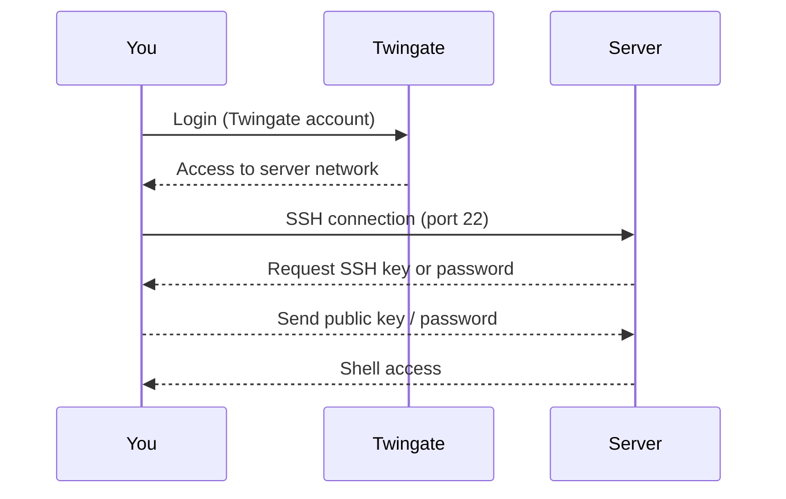

1. Вход в аккаунт Twingate (или FortiClient сейчас)
2. Доступ к сети серверов
3. SSH-подключение (порт 22)
4. Сервер запрашивает SSH-ключ или пароль
5. Mac подписывает запрос **приватным** ключом; сервер проверяет по **публичному** в `authorized_keys`
6. Shell-доступ

---

# Шаг 1 – Доступ к сети и booking VM

1. Установите **FortiClient VPN-only** (см. ссылки в теории выше).
2. Настройте профиль (remote gateway + port по Notion/инструкции).
3. Войдите: `@edu.mercantec.dk` + MFA → статус **VPN Connected**.
4. **Сеть для booking:** по ответу support — часто нужен **OLC WIFI** на школе; Forti alone может не хватить. Уточните у преподавателя.
5. Откройте booking: **`http://10.132.128.21/`** (HTTP, port 80 — рабочий вариант). Старые HTTPS-ссылки (`booking.hotdata.dk`, `vm.hotdata.dk`) часто не работают.
6. **Create Booking** → template **Ubuntu 24.04 Server** → assign teacher → ждёте approve.
7. После approve — IP/логин → SSH (шаг 3).

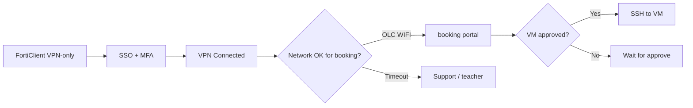


> ✅ **Тест:** booking-страница открывается в той же сети, что у преподавателя (часто OLC WIFI). Forti Connected без открытия booking — **не** значит, что всё настроено неправильно с вашей стороны.
>
> Пока VM в статусе `ожидает approve`: можно заранее подготовить SSH-ключи на вашем ПК (это сэкономит время после того, как дадут IP).
>
> - Не трогайте старый `~/.ssh/id_rsa`, если он ещё нужен.
> - Для школы используйте отдельные файлы: `~/.ssh/id_ed25519_mercantec_school` (приватный) и `~/.ssh/id_ed25519_mercantec_school.pub` (публичный).
>

---

# Шаг 2 – Создать SSH-ключи (один раз)

SSH-ключи безопаснее паролей. Вы создаёте пару ключей: **приватный ключ** остаётся на вашем ПК, **публичный ключ** добавляется на сервер.

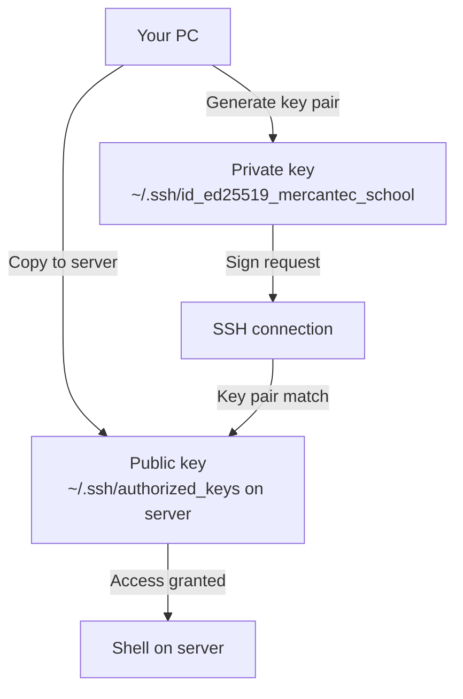

**Сгенерировать ключи в терминале:**

```bash
ssh-keygen -t ed25519 -f ~/.ssh/id_ed25519_mercantec_school -C "user@example.com"
```

- Ключ сохранится в `~/.ssh/id_ed25519_mercantec_school`
- При желании задайте passphrase (рекомендуется) или нажмите Enter без неё

**Скопировать публичный ключ на сервер:**

```bash
ssh-copy-id -i ~/.ssh/id_ed25519_mercantec_school.pub user@SERVER-IP
```

Или вручную — показать и скопировать публичный ключ:

```bash
cat ~/.ssh/id_ed25519_mercantec_school.pub
```

> ⚠️ **Никогда не передавайте приватный ключ** (файл без `.pub`: например `~/.ssh/id_ed25519_mercantec_school`). Передавать можно только публичный (`.pub`).
>

**(Опционально) Алиас для SSH в `~/.ssh/config`:**

```ssh-config
Host mercantec-school
    HostName SERVER-IP
    User user
    IdentityFile ~/.ssh/id_ed25519_mercantec_school
    IdentitiesOnly yes
```

---

# Шаг 3 – Войти на сервер по SSH

```bash
ssh user@SERVER-IP
```

При первом входе вы увидите примерно:

```
The authenticity of host '10.x.x.x' can't be established.
ED25519 key fingerprint is SHA256:abc123...
Are you sure you want to continue connecting (yes/no)?
```

Введите `yes` и нажмите Enter. Fingerprints сохраняются в `~/.ssh/known_hosts` — в следующий раз вопрос не появится.

---

# Шаг 4 – Усилить сервер (делается один раз)

После входа выполните эти команды, чтобы усилить безопасность сервера:

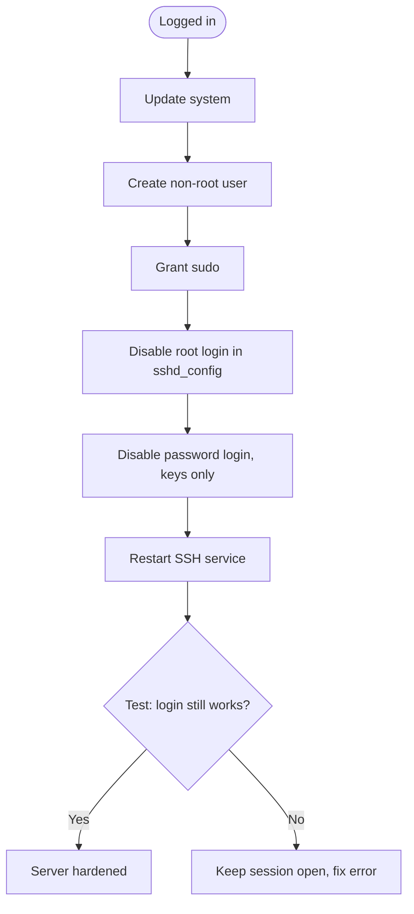


**Обновить пакеты:**

```bash
sudo apt update && sudo apt upgrade -y
```

**Создать нового пользователя и выдать sudo:**

```bash
sudo adduser username
sudo usermod -aG sudo username
```

**Отключить root-login и password-login:**

Откройте SSH-конфиг:

```bash
sudo nano /etc/ssh/sshd_config
```

Найдите и измените эти строки (при необходимости уберите `#`):

```
PermitRootLogin no
PasswordAuthentication no
```

Сохраните `Ctrl+O`, выйдите `Ctrl+X`, перезапустите SSH:

```bash
sudo systemctl restart ssh
```

> ⚠️ **Важно:** проверьте вход в **новой** вкладке терминала ПЕРЕД тем, как закрывать текущую сессию. Иначе можно заблокировать себе доступ.
>

---

# DH-DC Ubuntu 2404 (школьный материал Datahouse)

> При booking выбирайте template **Ubuntu 24.04 Server**. Команды и код — без перевода.

---

### Подключение к серверу по SSH

Нам нужно подключиться к серверу; с VPN-соединением это относительно просто сделать через SSH.

Можно использовать разные программы, например PuTTY или MobaXterm. Они не особо требовательны к ресурсам и обычно рассчитаны на одно подключение. Здесь мы работаем только в терминале, что может быть непривычно, если вы раньше этого не делали. Если вы не пробовали `nano`, `vi` или `vim`, рекомендую Visual Studio Code с расширением Remote Explorer.

Remote Explorer позволяет подключаться к внешним серверам, в основном по SSH.

Мы используем его, в том числе, для подключения к нашему DH-Datacenter.

**VS Code Remote Explorer — подключение (шаги вместо школьных скриншотов):**

1. Установи расширение **Remote Explorer** (или **Remote - SSH**).
2. Открой боковую панель **Remote Explorer** → **SSH Targets**.
3. **+** → **Add New SSH Host** → введи `root@10.133.51.122` (или `user@IP` из booking).
4. Выбери файл config: `~/.ssh/config`.
5. В списке targets: **Connect** → выбери **Linux**.
6. Первый раз: подтверди **fingerprint** (`yes`).
7. Введи пароль (из booking / `SERVER_INFO.md` локально).

> В оригинале школы здесь **2 скриншота** из PDF (`!image.png`) — список SSH targets и окно подключения. В репозиторий они не попали, поэтому был только текст «📷 Скриншот…». Если пришлёшь скрины — положу в `docs/notes/assets/` и вставлю сюда.

Remote Explorer помогает держать подключения в порядке. Можно сохранить IP-адреса и имена пользователей, чтобы помнить только пароль. Это делает работу проще и быстрее.

Создаём новое SSH-подключение в формате `{User}@{IP}`; пример из школьного материала — `administrator@10.135.71.xx` (у тебя сейчас: `root@10.133.51.122`). Затем спросят, какую ОС вы используете — для этого гайда выбираем Linux. После этого принимаем SHA256-ключ (fingerprint), по которому можно доверять серверу, и в конце вводим пароль — обычно это стандартный пароль Datahouse (выдаёт школа; хранить только в SERVER_INFO.md локально). Теперь есть подключение, и можно пользоваться всеми функциями IDE.

---

## 🔐 SSH

SSH (Secure Shell) — это гораздо больше, чем просто инструмент входа: это полноценный криптографический протокол с несколькими уровнями защиты. Ниже разобрано, что происходит, когда вы вводите `ssh administrator@10.135.71.xx`.

---

### Три слоя протокола SSH

SSH построен из трёх слоёв поверх TCP/IP:

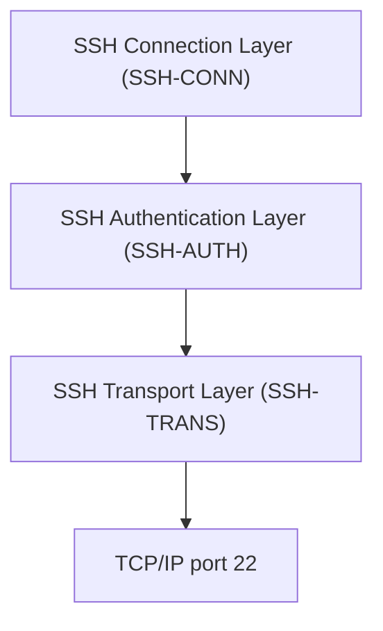


- **Transport Layer**: устанавливает зашифрованное соединение и аутентификацию сервера
- **Authentication Layer**: проверяет, кто вы (пароль / SSH-ключ)
- **Connection Layer**: мультиплексирует shell, SFTP, туннели в одном соединении

---

### SSH Handshake — что происходит «за кулисами»?

При подключении выполняется целая последовательность шагов, прежде чем появится prompt:

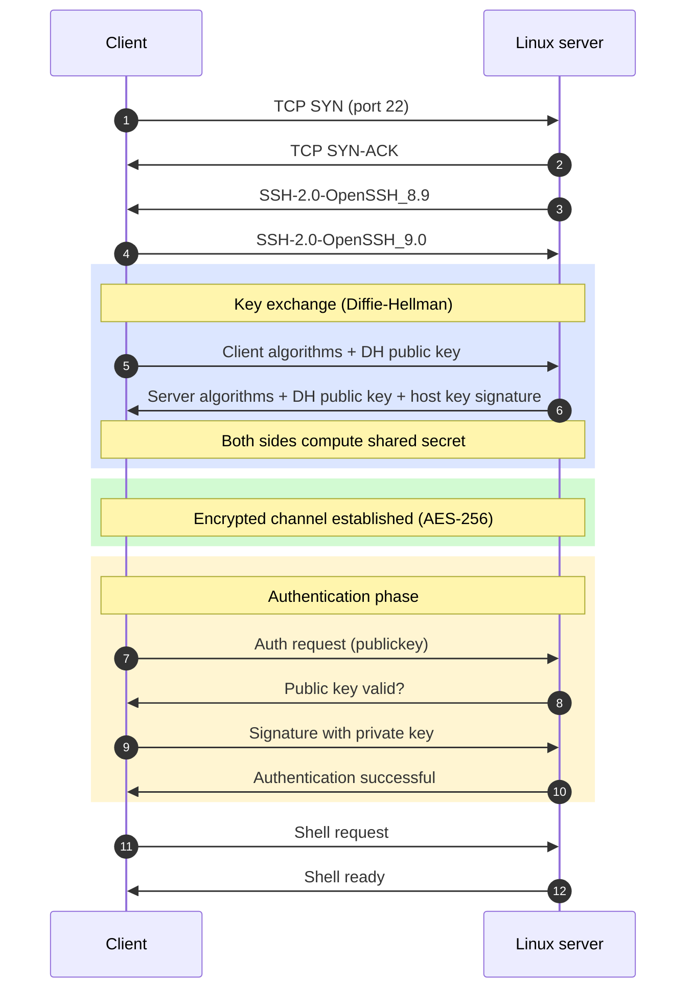


---

### Асимметричное шифрование — «магия» пары ключей

SSH-ключи основаны на **асимметричном шифровании**: две математически связанные ключи, один из которых нельзя вывести из другого:

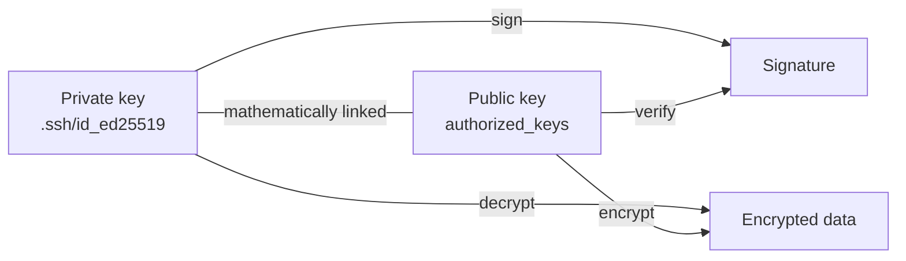


**Главный принцип**: приватный ключ *никогда* не покидает ваш ПК. На сервере только публичный ключ — им нельзя войти в систему.

---

### Challenge-Response: как сервер убеждается, что это вы

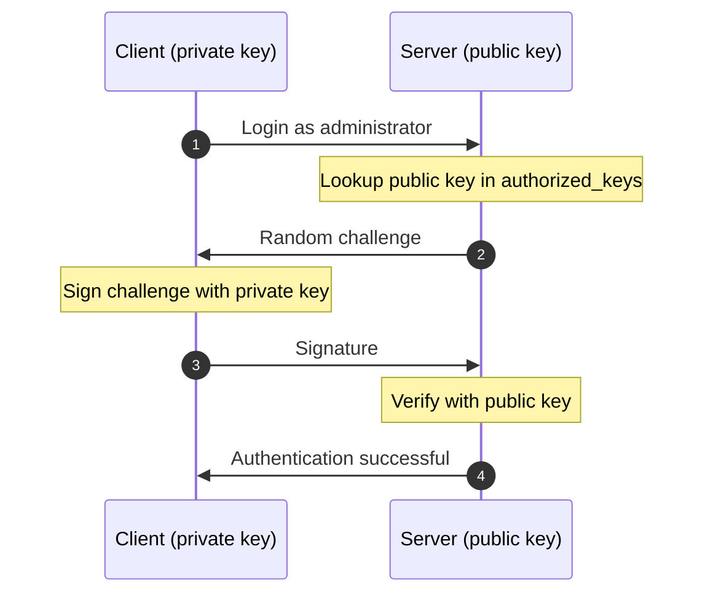


**Почему это безопасно?**

- Только у вас есть приватный ключ → только вы можете сделать валидную подпись
- Каждый раз новая случайная challenge → replay-атаки не работают
- Даже если у злоумышленника есть файл `authorized_keys` → без вашего приватного ключа он бесполезен

---

### Шифрование сессии — весь трафик защищён

После key exchange для обмена данными используется **симметричное шифрование** (например AES-256-GCM):

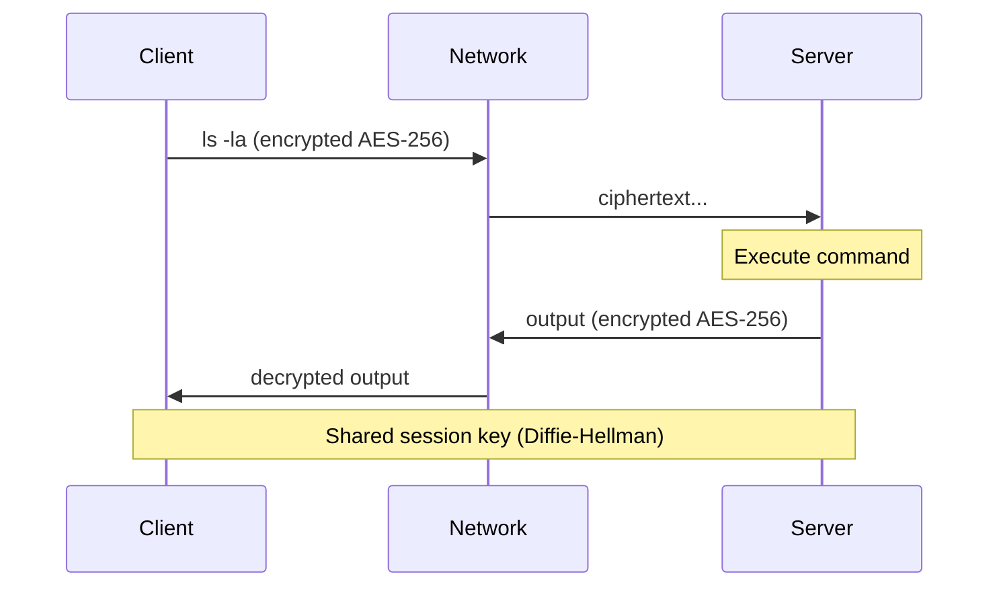


Кроме шифрования SSH добавляет **HMAC** (Hash-based Message Authentication Code) к каждому пакету — так проверяется, что данные не изменили по пути (защита целостности).

---

### Host Key Verification — защита от MITM

При первом подключении к серверу вы увидите:

```bash
The authenticity of host '10.135.71.xx' can't be established.
ED25519 key fingerprint is SHA256:xxxxxxxxxxxxxxxxxxxxxx
Are you sure you want to continue connecting (yes/no)?
```

Это защищает от **man-in-the-middle-атак**:

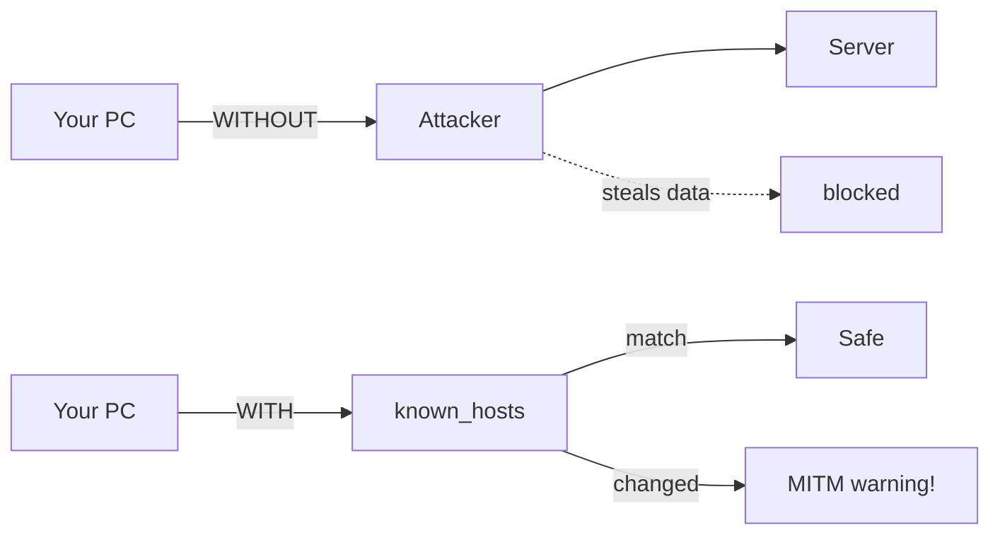


Fingerprint сервера сохраняется в `~/.ssh/known_hosts`. Если он неожиданно меняется, SSH предупредит автоматически.

---

### Ed25519 vs RSA — обзор алгоритмов

| Алгоритм | Размер ключа | Безопасность | Скорость | Рекомендация |
| --- | --- | --- | --- | --- |
| **ed25519** | 256 bit | 🟢 Очень высокая | 🟢 Быстрый | ✅ Используйте это |
| RSA-4096 | 4096 bit | 🟡 Высокая | 🟡 Медленнее | ⚠️ Допустимо |
| RSA-2048 | 2048 bit | 🟡 OK | 🟡 OK | ⚠️ Минимум |
| DSA | 1024 bit | 🔴 Слабый | - | ❌ Не использовать |

**ed25519** использует криптографию на эллиптических кривых (Curve25519). Несмотря на маленький размер ключа, математически он сильнее RSA 3000+ bit и заметно быстрее.

---

### SSH vs устаревшие протоколы

| Протокол | Шифрование | Пароль открытым текстом | Статус |
| --- | --- | --- | --- |
| **SSH** | ✅ AES-256 | ✅ Нет | ✅ Всегда использовать |
| Telnet | ❌ Нет | ❌ Да! | ⛔ Никогда |
| FTP | ❌ Нет | ❌ Да! | ⛔ Используйте SFTP |
| rlogin | ❌ Нет | ❌ Да! | ⛔ Устарел |

---

### Hardening сервера — хорошая конфигурация SSH

На ваших Ubuntu-серверах рекомендуется настроить `/etc/ssh/sshd_config` так:

```bash
# Отключить вход по паролю (только SSH-ключи)
PasswordAuthentication no

# Запретить прямой root-login
PermitRootLogin no

# Ограничить число попыток входа
MaxAuthTries 3

# Разрешить только publickey authentication
PubkeyAuthentication yes
```

После изменений: `sudo systemctl restart sshd`

---

## 🧮 Математика в SSH

SSH — не просто «зашифровано»: он опирается на три разных математических основания: **модульную арифметику**, **эллиптические кривые** и **симметричное блочное шифрование**. Ниже — подробный разбор.

---

### Diffie-Hellman Key Exchange

SSH использует Diffie-Hellman (DH), чтобы установить **общий секрет** по незащищённой сети — без передачи самого секрета напрямую.

**Setup (публично известные параметры):**

- `p` — большое простое число (modulus)
- `g` — генератор (примитивный корень по модулю p)

**Обмен ключами шаг за шагом:**

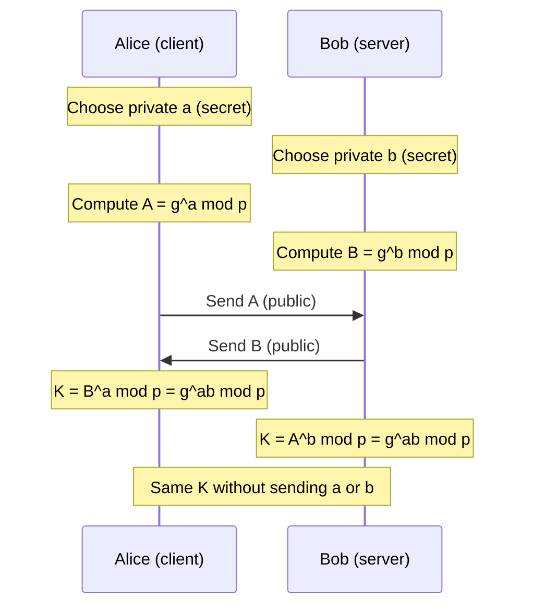


**Конкретный пример с малыми числами:**


**Почему это безопасно?**

Eve видит на сети `g`, `p`, `A` и `B` — но не может вычислить `K`, не решив **задачу дискретного логарифма**:

```
Дано:  g = 5,  p = 23,  A = 8
Найти: a  такое, что  5^a ≡ 8 (mod 23)
```

С большими простыми (2048–4096 bit) при современном железе это **вычислительно непрактично**.

---

### Ed25519 — эллиптические кривые

Для SSH-ключей (public key auth) используется **Ed25519**, основанный на ECC. Curve25519 задаётся над:

```
y^2 = x^3 + 486662x^2 + x  (mod 2^255 - 19)
```

**Сложение точек на эллиптической кривой:**


При базовой точке `B` на кривой:

```
Приватный ключ:    sk  (256-bit случайный scalar)
Публичный ключ:    A = sk · B
                   (sk раз складывает B с собой)
```

---

**Безопасность** опирается на **ECDLP (elliptic curve discrete logarithm problem)**:

```
Дано:  A и B
Найти: sk  такое, что  A = sk · B
```

Это **экспоненциально сложнее**, чем классический DH — ed25519 даёт **128-bit безопасность** при ключах 256 bit, тогда как RSA нужны 3072+ bit для того же уровня.

**Сравнение:**

| Алгоритм | Размер ключа | Бит безопасности | Основа |
| --- | --- | --- | --- |
| Ed25519 | 256 bit | 128 bit | ECDLP |
| RSA | 3072 bit | 128 bit | Факторизация |
| DH | 3072 bit | 128 bit | Дискретный лог |

---

### Подпись EdDSA (Challenge-Response)

Когда сервер отправляет **challenge** `m`, клиент подписывает её через EdDSA:

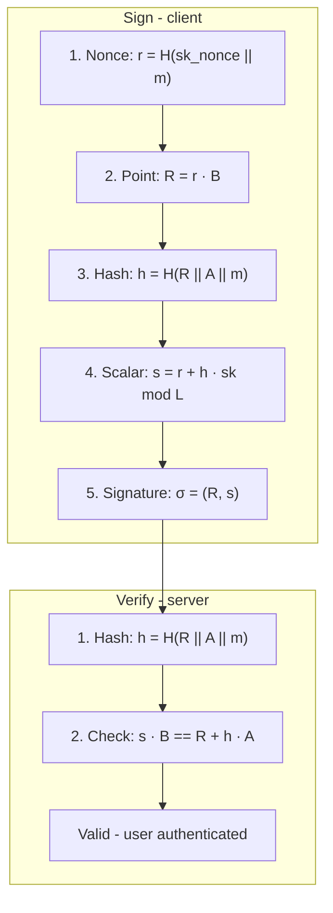


Если равенство выполняется — подпись валидна. Серверу **никогда** не нужен приватный ключ!

---

### Шифрование сессии AES-256-GCM

После DH-exchange session keys получают через **Key Derivation Function (KDF)**:

```
Shared secret K  →  KDF  →  K_enc (ключ шифрования)
                         →  K_mac (ключ HMAC)
                         →  K_iv  (вектор инициализации)
```

Весь трафик шифруется **AES-256-GCM**:

```
C = AES-256-GCM-Encrypt(K_enc, IV, plaintext)
P = AES-256-GCM-Decrypt(K_enc, IV, ciphertext)
```

**GCM (Galois/Counter Mode)** даёт и шифрование, и **аутентификацию** в одном — в современном SSH заменяет отдельный HMAC.

---

### HMAC — защита целостности

В старых SSH-соединениях к каждому пакету добавляют **HMAC**:

```
tag = HMAC-SHA256(K_mac,  seqnr || packet_data)
```

Получатель пересчитывает tag и сразу отбрасывает пакет, если не совпало — защита от **подмены пакетов (packet tampering)**.

### Связь — всё в одной модели

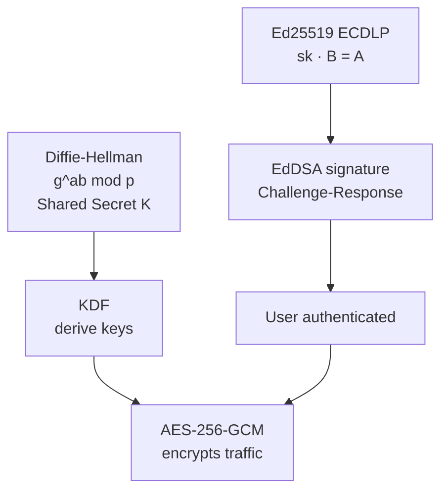


---

## Смена пароля

Рекомендуем сменить пароль со стандартного — стандартный пароль Datahouse (выдаёт школа; хранить только в SERVER_INFO.md локально). Краткая инструкция:

- **Войти на сервер**:
    - По SSH или напрямую под своим пользователем.
- **Сменить свой пароль**:
    - В терминале выполните:
        
        ```bash
        passwd
        ```
        
    - Система попросит текущий пароль, затем новый — два раза для подтверждения.

Сообщите преподавателю новый пароль в личном сообщении, чтобы он мог помочь при проблемах!

---

## Клонирование проектов с GitHub на сервер

Код часто лежит на GitHub — его нужно получить на сервер (или локально). Для этого достаточно одной команды. Рекомендуем папку `GitHub` для репозиториев, если её ещё нет.

```bash
administrator@ubuntu2404:~/GitHub$ git clone example.url
```

Берём URL репозитория на GitHub и клонируем. Если `appsettings.json` или `.env` в `.gitignore`, их нужно перенести на сервер вручную или использовать общий secret manager, например GitHub Secrets.

---

## Установка .NET 8.0/9.0 на Linux

**1. Установить необходимые зависимости**

Убедитесь, что зависимости установлены:

```bash
sudo apt-get update
sudo apt-get install -y wget apt-transport-https
```

**2. Добавить репозиторий пакетов Microsoft**

Импортируйте GPG-ключ Microsoft и добавьте их репозиторий в APT:

```bash
wget https://packages.microsoft.com/config/ubuntu/$(lsb_release -rs)/packages-microsoft-prod.deb -O packages-microsoft-prod.deb
sudo dpkg -i packages-microsoft-prod.deb
```

**3. Обновить индекс пакетов**

```bash
sudo apt-get update
```

**4. Установить .NET SDK**

Установите нужную версию SDK (замените `8.0` на вашу):

```bash
sudo apt-get install -y dotnet-sdk-8.0
```

**5. Проверить установку**

```bash
dotnet --version
```

Должен отобразиться номер версии установленного SDK.

**6. Проверить на вашем .NET-проекте**

Убедитесь, что проект запускается:

```bash
cd ~/GitHub/API
dotnet run
```

---

## Установка Docker

https://docs.docker.com/engine/install/ubuntu/

**1. Обновить систему**

Сначала обновите систему:

```bash
sudo apt-get update
sudo apt-get upgrade
```

**2. Установить зависимости**

```bash
sudo apt-get install apt-transport-https ca-certificates curl software-properties-common
```

**3. Добавить официальный GPG-ключ Docker**

```bash
curl -fsSL https://download.docker.com/linux/ubuntu/gpg | gpg --dearmor -o /usr/share/keyrings/docker-archive-keyring.gpg
```

**4. Добавить репозиторий Docker**

```bash
echo "deb [arch=amd64 signed-by=/usr/share/keyrings/docker-archive-keyring.gpg] https://download.docker.com/linux/ubuntu $(lsb_release -cs) stable" | tee /etc/apt/sources.list.d/docker.list > /dev/null
```

**5. Установить Docker**

```bash
sudo apt-get update
sudo apt-get install docker-ce
```

**6. Подтвердить установку**

```bash
sudo docker --version
```

Должна отобразиться версия Docker на сервере.

**7. Запуск Docker без root**

Чтобы запускать Docker без `sudo`, добавьте пользователя в группу `docker`:

```bash
sudo usermod -aG docker $USER
```

Выйдите и войдите снова (или перезагрузите систему), чтобы изменения применились.

**8. Установить расширение Docker в VS Code**

1. Откройте Marketplace расширений (`Ctrl+Shift+X`).
2. Найдите «Docker» от Microsoft и установите.

**9. Управление контейнерами из VS Code**

С расширением Docker можно:

- видеть запущенные контейнеры;
- управлять ими (старт, стоп, удаление);
- собирать и запускать новые контейнеры;
- управлять images, volumes, networks и т.д.

Панель Docker — по иконке Docker в левой боковой панели.

**10. Перезагрузка сервера (только если с первого раза не заработало)**

Если перезапуск службы Docker не помог, перезагрузите сервер:

```bash
sudo reboot
```

**11. Тест установки**

```bash
docker run hello-world
```

Скачается тестовый image и запустится контейнер с сообщением «Hello from Docker!».

---

## Настройка PostgreSQL на Linux с Docker

**Шаг 1: Скачать Docker-образ PostgreSQL**

```bash
docker pull postgres
```

**Шаг 2: Запустить контейнер PostgreSQL**

Пример запуска:

```bash
docker run --name postgres-container -e POSTGRES_PASSWORD=mysecretpassword -d -p 5432:5432 -v pgdata:/var/lib/postgresql/data postgres
```

- **`-name postgres-container`**: имя контейнера.
- **`e POSTGRES_PASSWORD=mysecretpassword`**: пароль пользователя `postgres` через переменную окружения.
- **`d`**: фоновый режим (detached).
- **`p 5432:5432`**: проброс порта 5432 хоста на 5432 в контейнере (стандартный порт PostgreSQL).
- **`v pgdata:/var/lib/postgresql/data`**: volume `pgdata` для данных, чтобы они не пропали при удалении контейнера.

> 🚨 **Важно:** здесь данные хранятся локально на сервере с ограниченным сроком жизни VM и **без гарантии** сохранности ваших данных!

**Шаг 3: Подключиться к PostgreSQL**

**3.1 `psql` внутри контейнера**

```bash
docker exec -it postgres-container psql -U postgres
```

Откроется интерактивная оболочка PostgreSQL для SQL-команд.

**3.2 Внешний клиент (pgAdmin, DBeaver и т.п.)**

- **Host**: `localhost` (или IP сервера, если Docker на удалённой машине)
- **Port**: `5432`
- **Database**: `postgres` (стандартная БД)
- **Username**: `postgres`
- **Password**: пароль из примера (`mysecretpassword`).

**Шаг 4: Управление контейнером**

- **Остановить**:
    
    ```bash
    docker stop postgres-container
    ```
    
- **Запустить снова**:
    
    ```bash
    docker start postgres-container
    ```
    
- **Логи**:
    
    ```bash
    docker logs postgres-container
    ```
    
- **Удалить**:
    
    ```bash
    docker rm -f postgres-container
    ```
    

**Шаг 5: Безопасность (опционально, но рекомендуется)**

Для продакшена учитывайте:

- **Сменить стандартное имя пользователя** (не `postgres`).
- **Использовать сильные пароли**.
- **Настроить firewall**, ограничив доступ к БД.
- **Использовать SSL** для соединений.

---

# Чеклист — вы готовы?

- [ ]  FortiClient VPN-only установлен, SSO + MFA, статус Connected
- [ ]  Booking открывается (актуальный URL + при необходимости OLC WIFI на школе)
- [ ]  VM забронирована: template **Ubuntu 24.04 Server**, approve от преподавателя
- [ ]  SSH-ключи созданы (`~/.ssh/id_ed25519_mercantec_school`) и публичный ключ добавлен на сервер
- [ ]  Вы входите по `ssh user@SERVER-IP` без пароля
- [ ]  Система обновлена (`apt update && apt upgrade`)
- [ ]  Root-login отключён (`PermitRootLogin no`)
- [ ]  Password-login отключён (`PasswordAuthentication no`)
- [ ]  SSH-сервис перезапущен, вход по-прежнему работает

---

# Что дальше?

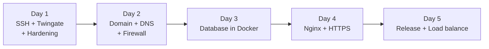


После выполнения этого гайда вы готовы к **Дню 2**, где подключаем домен к серверу и настраиваем firewall через UFW.

---

# Git(Hub) :h1-github:

Git — это **система контроля версий**: она хранит историю изменений кода. GitHub — облачная платформа, где хранятся Git-репозитории, чтобы вся команда могла работать с одним кодом и не перезаписывать изменения друг друга.

> 💡 **Коротко:** Git хранит историю локально. GitHub делится ею с командой. Ваш VPS получает новую версию через `git pull`.
>

---

## Базовые понятия

| Понятие | Объяснение |
| --- | --- |
| **Repository (repo)** | Папка с кодом + история Git |
| **Commit** | "Снимок" кода в определённый момент |
| **Branch** | Параллельная версия кода — для фич или исправлений |
| **Remote** | Удалённый репозиторий, обычно GitHub (`origin`) |
| **Working directory** | Локальные файлы, которые вы редактируете |
| **Staging area** | Файлы, выбранные для следующего commit (`git add`) |

---

## Commits – сохранить изменения

Commit — это сохранённое состояние проекта. Представьте как checkpoint в игре — можно вернуться назад.

```bash
# Показать изменённые файлы
git status

# Добавить конкретные файлы в staging
git add src/app.js

# Добавить ВСЕ изменённые файлы
git add .

# Сохранить commit с сообщением
git commit -m "Add login feature"
```

> ✅ **Хорошее сообщение commit:** используйте повелительную форму и конкретику. `"Fix user validation bug"` лучше, чем `"fixes"`.
>

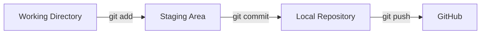


---

## Push – отправить в GitHub

После локального commit вы отправляете изменения в GitHub через `git push`. Сначала нужно добавить remote:

```bash
# Подключить локальный repo к GitHub (один раз)
git remote add origin https://github.com/USERNAME/REPO.git

# Push в main первый раз
git push -u origin main

# Последующие pushes
git push
```

> ⚠️ Если ваш коллега уже отправил изменения, сначала сделайте **`git pull`**, иначе GitHub отклонит push.
>

---

## Branches – параллельная работа

Ветки нужны для изоляции задач. Вы создаёте ветку под фичу, работаете в ней, потом мержите в `main`.

```bash
# Создать и переключиться на новую ветку
git checkout -b feature/user-login

# Показать все ветки
git branch

# Вернуться в main
git checkout main
```

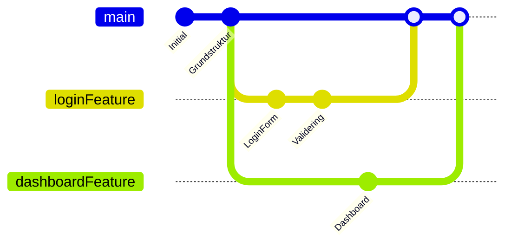

> В реальном git: `feature/login`, `feature/dashboard`. В Mermaid — без `/` и без `tag:` на merge (иначе Syntax Error в preview).


---

## Merge – объединить работу

Когда feature-ветка готова, её мержат в `main`. Это можно сделать локально или через **Pull Request** в GitHub (рекомендуется при командной работе).

**Локальный merge:**

```bash
# Быть в main
git checkout main

# Получить последние изменения из GitHub
git pull

# Merge вашей feature-ветки
git merge feature/user-login

# Отправить объединённый результат
git push
```

**Через Pull Request в GitHub (рекомендуется):**

1. Отправьте ветку: `git push -u origin feature/user-login`
2. В GitHub нажмите **"Compare & pull request"**
3. Опишите изменения и попросите коллегу сделать review
4. Нажмите **Merge pull request** после одобрения

> 💡 **Merge-конфликт:** возникает, когда два человека изменили **одни и те же строки** в файле. Git помечает конфликт через `<<<<<<` и `>>>>>>>`. Вы исправляете вручную, делаете commit и push.
>

---

## Совместная работа с кодом — общий workflow

Если над проектом работает несколько человек, рекомендуется **Feature Branch Workflow**:

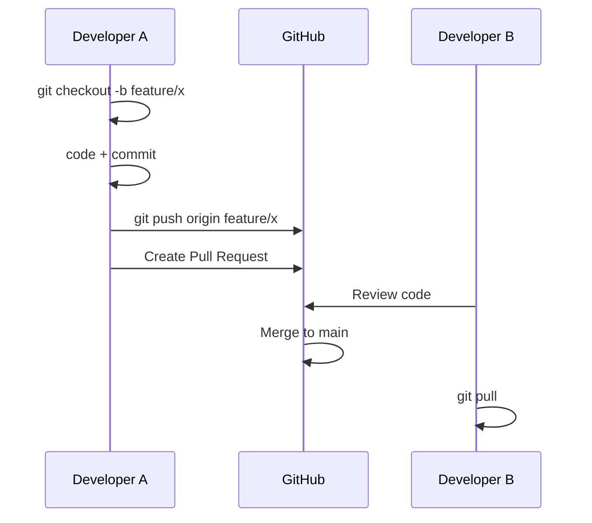


**Ежедневный workflow для каждого участника:**

```bash
# Начало дня: получить последние изменения
git pull

# Работать в своей ветке
git checkout -b feature/my-task

# ... код, код, код ...

# Сохранить работу
git add .
git commit -m "Add search feature"

# Отправить в GitHub
git push -u origin feature/my-task
```

---

## Git на VPS — деплой через git pull

Когда код одобрен и влит в `main` в GitHub, VPS нужно обновить. Проще всего — `git pull` прямо на сервере, без ручной передачи файлов.

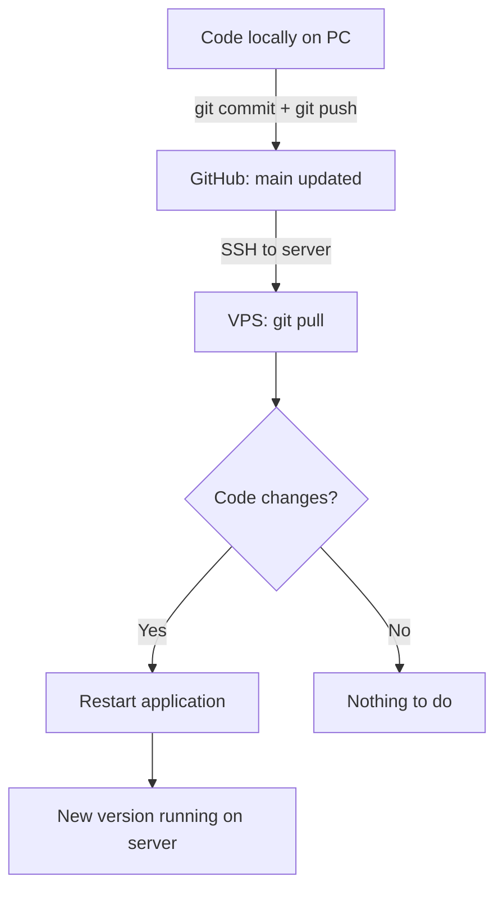


**Настроить GitHub на VPS (один раз):**

```bash
# Войти на сервер
ssh user@SERVER-IP

# Клонировать repo
git clone https://github.com/USERNAME/REPO.git
cd REPO
```

**Деплой новой версии (каждый раз при обновлении):**

```bash
# SSH на сервер
ssh user@SERVER-IP

# Перейти в папку проекта
cd REPO

# Получить и применить последние изменения из GitHub
git pull

# Перезапустить приложение (пример с Node.js)
pm2 restart app
# или с Docker:
docker compose up -d --build
```

> ✅ **Best practice:** перед `git pull` смотрите `git log --oneline -5`, чтобы понимать, какие изменения придут на сервер.
>

---

## Чеклист — совместная работа в Git

- [ ]  Repository создан в GitHub и открыт для команды
- [ ]  Все участники клонировали repo локально (`git clone`)
- [ ]  Работа идёт в feature-ветках, **не** напрямую в `main`
- [ ]  Для объединения используется Pull Request
- [ ]  VPS клонирован и обновляется через `git pull`
- [ ]  Перед началом работы участники делают `git pull`

---

## Команды (практика)

> Конфиг VM (IP, пароли, статус): `SERVER_INFO.md`

### SSH (Mac → server)

```bash
ssh mercantec-andrii
# = ssh -i ~/.ssh/id_ed25519_mercantec_school andrii@10.133.51.122 — вход (порт 22)

ssh mercantec-root
# после hardening: Permission denied (ожидаемо)

exit
# выйти из SSH

ssh-keygen -R 10.133.51.122
# HOST IDENTIFICATION HAS CHANGED / wrong host key (P4Z)

ssh-keyscan -t ed25519 10.133.51.122 2>/dev/null | ssh-keygen -lf -
# MFyp = твоя VM (yes) · P4Z = не yes — только потом ssh
```

### На сервере — базовые

```bash
whoami          # текущий пользователь
hostname        # имя машины (andrii-deploy)
uptime          # uptime и load
pwd             # текущая папка
ls -la          # файлы + права
cd /path        # сменить папку
cd ~            # домашняя папка
exit            # выйти из SSH
```

### Пакеты и hostname

```bash
sudo apt update                              # обновить список пакетов
sudo apt upgrade -y                          # установить обновления
# при вопросе про sshd_config → 2 = keep local

sudo apt update && sudo apt upgrade -y       # одной строкой

sudo hostnamectl set-hostname andrii-deploy  # имя VM
sudo reboot

sudo systemctl restart ssh                   # применить sshd config
sudo systemctl status ssh                    # статус SSH
```

### Пользователь + sudo

```bash
sudo adduser andrii                          # создать пользователя
sudo usermod -aG sudo andrii                 # sudo; -a = append (не снять другие группы)
```

### SSH keys (Mac)

```bash
ssh-keygen -t ed25519 -f ~/.ssh/id_ed25519_mercantec_school -C "anbo0005@edu.mercantec.dk"
# создать ключ на Mac

ssh-copy-id -i ~/.ssh/id_ed25519_mercantec_school.pub andrii@10.133.51.122
# ДО PasswordAuthentication no и ДО apt upgrade на новой VM

cat ~/.ssh/id_ed25519_mercantec_school.pub   # показать публичный ключ
ssh-keygen -lf ~/.ssh/id_ed25519_mercantec_school.pub  # fingerprint ключа
```

### SSH hardening (на сервере)

```bash
sudo nano /etc/ssh/sshd_config
# PermitRootLogin no
# PasswordAuthentication no
# PubkeyAuthentication yes

sudo nano /etc/ssh/sshd_config.d/50-cloud-init.conf
# PasswordAuthentication no  (cloud-init иначе перебивает)

sudo systemctl restart ssh                   # применить
```

Проверка **в новом** терминале на Mac (старую сессию не закрывать):

```bash
ssh mercantec-andrii
ssh mercantec-root                    # Permission denied = ок
```

Host key сервера (web console на VM):

```bash
sudo ssh-keygen -lf /etc/ssh/ssh_host_ed25519_key.pub
# ожидаем SHA256:MFyp...
```

