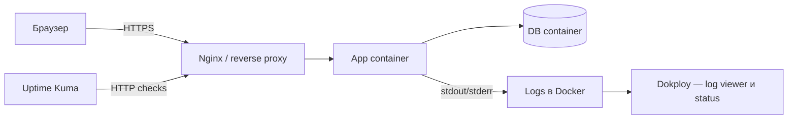
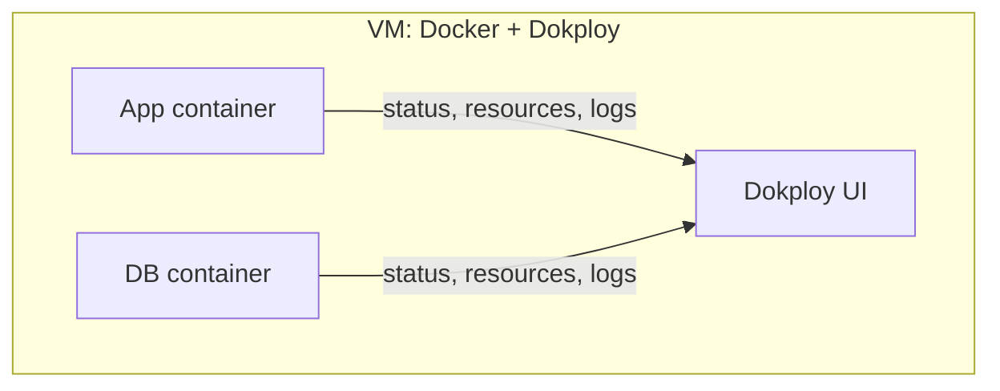
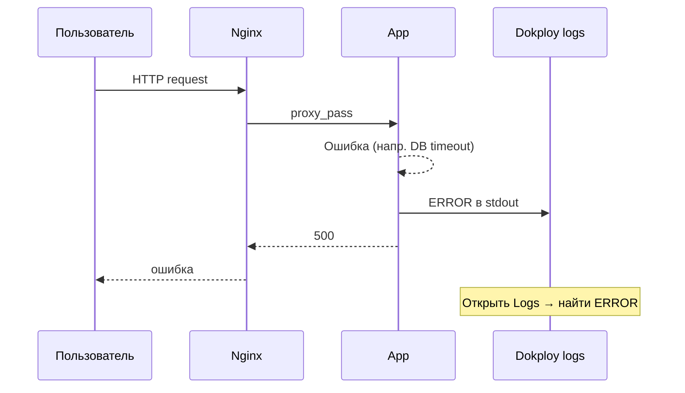
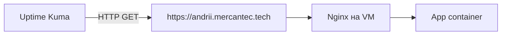
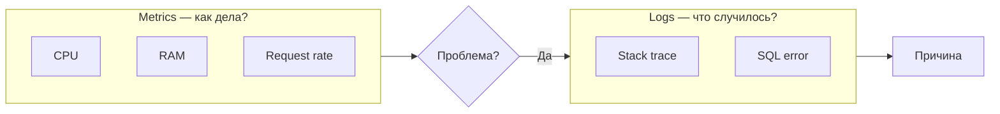
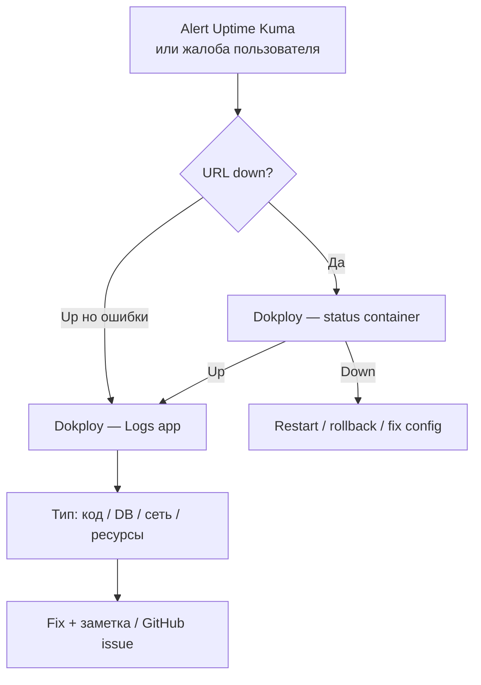
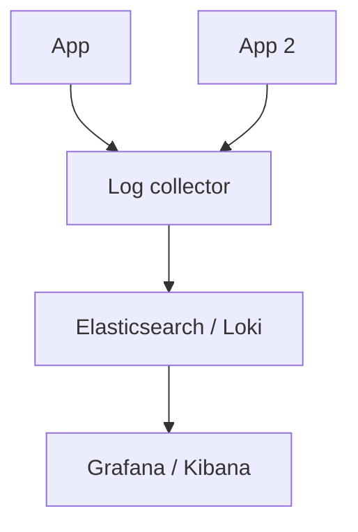

## День 10 — (19 июня) — **Monitoring & Logging**

- Мониторинг в Dokploy — статус apps
- Логи приложения в Dokploy
- Зачем monitoring и logging в production
- **Цель:** видеть статус app · читать logs · понимать observability

**:learning-motives: Цели обучения на день : встреча в Teams в 08:30** :teams_icon: Oplægsholder Paw

1. Я могу включить и использовать мониторинг в Dokploy для статуса своих apps
2. Я могу найти и понять logs приложения в Dokploy
3. Я могу объяснить, зачем monitoring и logging важны в эксплуатации

- :theory-icon: Теория дня

# День 10 – Monitoring & Logging с Dokploy

> Теория к Дню 10 (19 июня). Фокус: **видеть**, **понимать** и **реагировать** на то, что происходит в running app — через Dokploy и внешний uptime-мониторинг.

---

## 📚 Содержание

1. Зачем monitoring и logging
2. Observability: logs, metrics, uptime
3. Встроенный monitoring в Dokploy
4. Application logging через Dokploy
5. Uptime Kuma (UptimeKhana) — внешний мониторинг
6. Logging: уровни, структура, troubleshooting
7. Metrics vs logs
8. Безопасность в logs
9. Best practices
10. Hands-on сценарии
11. Log aggregation (bonus)
12. Практика на нашей setup

---

## 1. Зачем monitoring и logging?

Когда app в production, нужно:

- **Видеть, работает ли она** — container up? отвечает на requests?
- **Находить ошибки** — что было перед crash или 500 у пользователя?
- **Реагировать быстро** — лучше узнать самому, чем от пользователей.

| Термин | Что это |
| --- | --- |
| **Monitoring** | слежение за статусом (CPU, RAM, container Running, app отвечает?) |
| **Logging** | чтение текста из app/container — ошибки, requests, debug |

Без этого работаешь **вслепую**: не знаешь, упала ли app, и сложно чинить.

С monitoring + logs появляется **observability** — понимание, что происходит в системе.

---

## 2. Observability: logs, metrics, uptime

Три вопроса в эксплуатации:

1. **Работает ли?**
2. **Как себя чувствует?**
3. **Что случилось, когда сломалось?**

| Инструмент | Отвечает на |
| --- | --- |
| **Logs** | «что произошло?» — текст от app и инфраструктуры |
| **Metrics** | «как дела?» — CPU, RAM, request rate, error rate |
| **Uptime checks** | «достучится ли пользователь?» — внешний HTTP ping к URL |

У нас: **Dokploy** — deployment + простой мониторинг (status, resources, logs). **Uptime Kuma** — внешний «ping» снаружи.



---

## 3. Dokploy — роль в monitoring

После deploy через Dokploy в UI видно:

- containers **Running** / **Exited** / **Restarting** (crash loop)
- **CPU, RAM** per container
- **Deploy history** — какой commit, когда, успех или нет

Dokploy = **основной dashboard** «внутреннего здоровья» app.  
Uptime Kuma = «доступна ли публичная URL».



**Типичное использование:**

- подозрение на ошибку → открыть app в Dokploy → status + logs
- тормоза → CPU/RAM — код, БД или мало ресурсов VM?
- после deploy → container стартовал без crash loop?

### Что обычно видно в Dokploy

| Элемент | Описание |
| --- | --- |
| **Container status** | Running / Exited / Restarting |
| **Ресурсы** | CPU, RAM |
| **Deploy history** | последние builds/deploys |
| **Health / liveness** | отвечает ли app на health URL (если настроено) |

Активация обычно **без extra config** — после deploy app уже в списке. Если нет CPU/RAM — зависит от версии Dokploy (см. teacher / docs).

### Где искать

- **Обзор проекта** — список apps, статус (зелёный/красный)
- **Внутри app** — resources, deploy, вкладка **Logs**

---

## 4. Application logging через Dokploy

**Logs** — поток текста в **stdout/stderr** container: `Console.WriteLine`, ошибки framework, nginx/backend.

### Типы logs в Dokploy

| Тип | Зачем |
| --- | --- |
| **Build logs** | output `docker build` — когда deploy падает на build |
| **Runtime logs** | что app пишет while running — ошибки, requests |
| **Container logs** | entrypoint, сам container |

Для live app чаще всего: **runtime + container logs**.

### Как открыть logs

1. Dokploy → **проект** → **app**
2. Вкладка **Logs** (или Container logs / Application logs)
3. Выбрать container (app vs db — для ошибок API выбирай **app**)
4. Stream вниз — смотри **последние строки** перед crash

**Совет:** при ошибке смотри конец log. Если мало логов — добавь logging в код и redeploy.



---

## 5. Uptime Kuma — внешний мониторинг

Dokploy может показать **Running**, но пользователь всё равно не достучится — tunnel 530, nginx down, DNS.

**Uptime Kuma** (в программе иногда **UptimeKhana**) — self-hosted: периодически шлёт HTTP на URL и шлёт alert если down.

### Идея

- Monitor с URL (напр. `https://andrii.mercantec.tech/api/weatherforecast`)
- Каждые N секунд — HTTP request
- **200** → up · timeout/ошибка → down → уведомление (email, Discord, Telegram…)

**Независимо** от Dokploy: видишь, доступен ли сайт **снаружи**.

### Короткая установка

1. Docker: image `louislam/uptime-kuma`
2. Первый вход — admin user
3. **Add monitor** — HTTP(s), URL, interval (60s)
4. Notifications — по желанию

Dokploy + Uptime Kuma **дополняют** друг друга:

| Нужно | Где |
| --- | --- |
| Container up? CPU/RAM? | Dokploy |
| Что app писала перед ошибкой? | Dokploy → Logs |
| URL отвечает пользователям? | Uptime Kuma |
| Alert когда down | Uptime Kuma |



---

## 6. Logging — уровни и структура

### Уровни

| Уровень | Когда |
| --- | --- |
| `DEBUG` | детали для разработки |
| `INFO` | нормальные события (старт, request OK) |
| `WARN` | подозрительно, но app живёт |
| `ERROR` | request не обработан |
| `FATAL` | критично, app может упасть |

В production обычно **INFO + WARN + ERROR**; DEBUG — временно.

### Структурированные logs (JSON)

```json
{
  "level": "error",
  "timestamp": "2026-06-19T09:42:13Z",
  "message": "Database connection failed",
  "requestId": "2f9c8e9b"
}
```

Плюсы: фильтр, поиск, позже — Elasticsearch/Loki.

---

## 7. Metrics vs logs



- **Metrics** — **что** что-то не так (тренд, spike)
- **Logs** — **почему** (exception, timeout)

Workflow: Dokploy metrics → аномалия → Logs → root cause.

---

## 8. Паттерны в logs (что искать)

| Паттерн | Возможная причина | Действие |
| --- | --- | --- |
| Много **404** с одного IP | scanning | rate limit / block |
| **401/403** повторяются | auth / brute force | проверить auth |
| **SQL syntax error** + input | injection attempt | parameterized queries |
| **Connection timeout** к DB | db down / overload | status db container |
| **OOM killed** | мало RAM | limits, оптимизация |
| **Restart loop** | bad env, crash при старте | первые строки logs |

---

## 9. Безопасность в logs

- **Не логировать** пароли, tokens, CPR, персональные данные
- Маскировать чувствительное
- Logs могут копироваться — считай их **потенциально чувствительными**

- ✅ `User 123 failed login`
- ❌ `password=hest123`

OWASP: **A09** (мало logging) · **A02** (утечка в logs).

---

## 10. Best practices

1. Структурированные logs (JSON) где возможно
2. Context: `requestId`, `timestamp`, `service`
3. Правильные log levels
4. Ротация logs (Docker имеет limits)
5. Мониторить критичные flows (login, payment…)
6. Alert на **паттерны**, не на одну случайную ошибку

---

## 11. Workflow при инциденте



---

## 12. Hands-on (сценарии teacher)

**Сценарий 1 — DB down**

- `docker stop` db container
- Открыть app в браузере
- Dokploy → Logs → найти connection error
- Обсудить: Uptime Kuma поймал бы 500?

**Сценарий 2 — CPU spike**

- Нагрузка на app → смотреть CPU в Dokploy

**Сценарий 3 — log hunting**

- Баг в коде → deploy → найти в Logs → fix → redeploy

---

## 13. Log aggregation (bonus)

Для больших систем: Fluentd/Promtail → Elasticsearch/Loki → Grafana/Kibana.

На курсе хватает **Dokploy log viewer** + опционально Uptime Kuma.



---

## 14. Наша setup (MercantecApi)

| Компонент | Monitoring / logs |
| --- | --- |
| **Dokploy** | `andriidokploy.mercantec.tech` → project MercantecApi → status, Deployments, **Logs** |
| **Containers** | `mercantecapi-sdn21v-app-1` · `mercantecapi-sdn21v-db-1` |
| **Публичный check** | `curl https://andrii.mercantec.tech/api/weatherforecast` → 200 |
| **Tunnel flake** | домен 530 при живом app → `docker restart cloudflared` |
| **Uptime Kuma** | ⬜ опционально · monitor на API URL |
| **nginx logs** | `/var/log/nginx/access.log` · `error.log` на VM |

Dokploy видит **container**. Uptime Kuma (или ручной curl) — **весь путь** до пользователя.

---

# Чеклист целей обучения

> ⬜ Day 10 — в работе

- [ ] Открыть Dokploy → увидеть status app + db (Running)
- [ ] Посмотреть Deployments / history
- [ ] Открыть **Logs** для app container
- [ ] Объяснить разницу monitoring vs logging vs uptime
- [ ] (Опционально) Uptime Kuma monitor на `andrii.mercantec.tech`
- [ ] Объяснить, зачем это в production (observability)

---

## Ключевые идеи (простыми словами)

| Идея | Коротко |
| --- | --- |
| **Monitoring** | «жива ли?» · CPU/RAM · status |
| **Logging** | «что писала app?» · stdout/stderr |
| **Observability** | monitoring + logs + uptime вместе |
| **Dokploy** | внутри server — containers, logs, deploy |
| **Uptime Kuma** | снаружи — ping URL, alerts |
| **Metrics** | тренды и цифры |
| **Logs** | детали и причина ошибки |

---

## Команды (практика)

> Dokploy UI — основной способ. Ниже — fallback на VM через SSH.

### Проверка «снаружи» (Mac)

```bash
curl -s -o /dev/null -w "%{http_code}\n" https://andrii.mercantec.tech/api/weatherforecast
```

### На VM — status containers

```bash
ssh mercantec-andrii
docker ps --filter name=mercantecapi --format "table {{.Names}}\t{{.Status}}"
```

### Logs без Dokploy UI (fallback)

```bash
# последние 50 строк app
docker logs mercantecapi-sdn21v-app-1 --tail 50

# follow (live)
docker logs -f mercantecapi-sdn21v-app-1

# db
docker logs mercantecapi-sdn21v-db-1 --tail 30
```

### nginx logs на VM

```bash
sudo tail -20 /var/log/nginx/access.log
sudo tail -20 /var/log/nginx/error.log
```

### Симуляция инцидента (осторожно)

```bash
docker stop mercantecapi-sdn21v-db-1
# проверить app / logs → потом:
docker start mercantecapi-sdn21v-db-1
```

---

## Короткий текст для Teams (Day 10)

> **Day 10:** Monitoring = статус app (Running, CPU/RAM) в Dokploy. Logging = Logs app container (stdout) для troubleshooting. Uptime Kuma — внешний HTTP ping URL + alerts. Без этого — «слепая» эксплуатация. Dokploy = внутри VM; uptime = видит ли пользователь сайт. У меня: Dokploy на `andriidokploy…`, проверка API `andrii…/api/weatherforecast`.

---

## Итог по целям обучения

После Day 10 вы должны уметь:

1. **Использовать monitoring в Dokploy** — status, resources, deploy history.
2. **Находить и читать logs** — build vs runtime, последние строки перед ошибкой.
3. **Объяснить важность** monitoring/logging для production.
4. **Различать** внутренний status (Dokploy) и внешнюю доступность (Uptime Kuma).
5. **Не логировать секреты** в production.

---

## Ресурсы

- [Dokploy](https://dokploy.com) — docs для вашей версии
- [Uptime Kuma](https://github.com/louislam/uptime-kuma)
- [Twelve-Factor App — Logs](https://12factor.net/logs)
- Day 14 — Incident Response (продолжение темы)

---

*Обновлено: 2026-06-15 — теория Day 10; Dokploy monitoring/logging, Uptime Kuma, наша setup*
