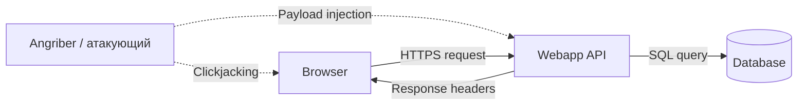
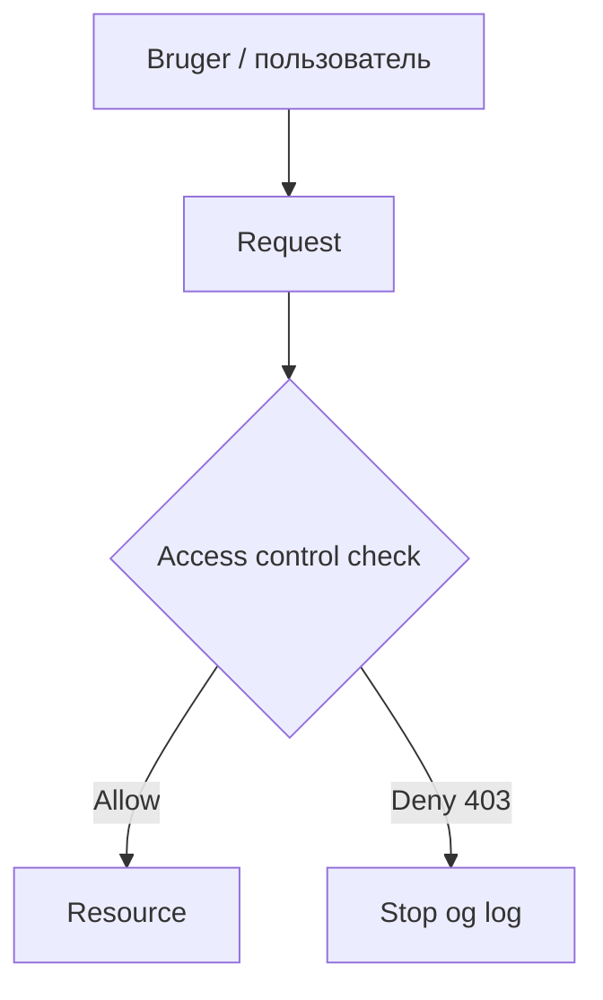
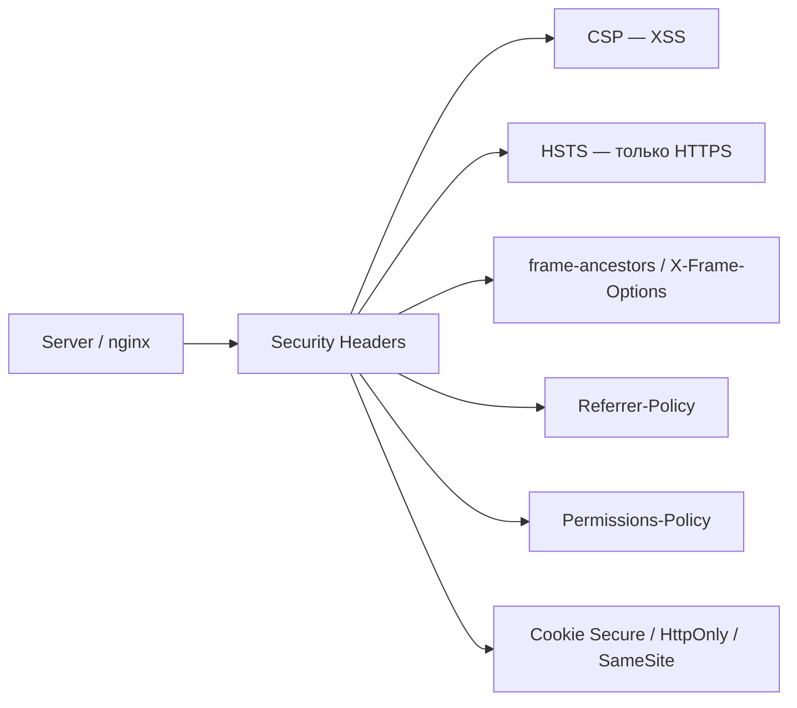

## День 11 — (22 июня) — **OWASP Top 10 & Modern Security Headers**

- OWASP Top 10 (2021) — актуальная учебная версия
- Security headers (CSP, HSTS, X-Frame-Options)
- Input validation и sanitization
- **Цель:** современные практики безопасного кода и конфигурации

**:learning-motives: Цели обучения на день : встреча в Teams в 08:30** :teams_icon:

1. Я могу назвать и объяснить несколько уязвимостей из OWASP Top 10 (2021)
2. Я могу внедрить современные security headers: CSP, HSTS, X-Frame-Options
3. Я могу найти небезопасную обработку input и объяснить, как её избежать

- :theory-icon: Теория дня

# День 11 – OWASP Top 10 & Security Headers

> Теория к Дню 11 (22 июня). Фокус: **знать главные риски веб-приложений**, **уменьшить attack surface через headers** и **правильно обрабатывать пользовательский ввод**.

---

## 📚 Содержание

1. OWASP Top 10 (2021) — обзор
2. Где атаки попадают в наш stack (диаграммы)
3. Broken Access Control (A01)
4. Injection и input (A03)
5. Security Misconfiguration (A05)
6. Modern Security Headers
7. Input validation и sanitization
8. Logging и A09 (связь с Day 10)
9. Security review — рабочая задача
10. Наша setup (MercantecApi)
11. Чеклист и команды

---

## 1. OWASP Top 10 (2021)

**OWASP** (Open Web Application Security Project) ведёт список самых критичных **уязвимостей** веб-приложений. **Top 10 2021** — версия, которую используют в обучении и risk assessment. На курсе нужно **назвать и объяснить несколько** пунктов.

| # | Уязвимость | Коротко |
| --- | --- | --- |
| **A01:2021 – Broken Access Control** | Пользователь получает доступ к данным/функциям, которые ему не положены. Нет проверки «владелец ли этой записи?», угадывание ID в API (IDOR). |
| **A02:2021 – Cryptographic Failures** | Пароли, токены, PII не шифруются, слабое шифрование, утечка ключей/credentials. |
| **A03:2021 – Injection** | Враждебные данные попадают в интерпретатор (SQL, OS, LDAP, шаблоны) и выполняются как код. **SQL injection** — классика: input склеивают в query вместо параметров. |
| **A04:2021 – Insecure Design** | Слабый security design: нет rate limiting, нет защиты от ботов, слишком много доверия к input. |
| **A05:2021 – Security Misconfiguration** | Дефолтные пароли, лишние features включены, **нет security headers**, плохой CORS, verbose errors с утечкой info. |
| **A06:2021 – Vulnerable and Outdated Components** | Библиотеки/frameworks с известными CVE или устаревшие версии. Решение: обновления и сканирование (Day 12 — Trivy/Snyk). |
| **A07:2021 – Identification and Authentication Failures** | Слабые пароли, нет 2FA, session hijacking, credential stuffing. |
| **A08:2021 – Software and Data Integrity Failures** | Нет проверки подписей обновлений, риски CI/CD supply chain, unsafe deserialization. |
| **A09:2021 – Security Logging and Monitoring Failures** | Нет или мало security-логов — атаку не видят и не расследуют. *(Day 10)* |
| **A10:2021 – Server-Side Request Forgery (SSRF)** | App делает HTTP по URL от пользователя → атакующий заставляет сервер звать внутренние сервисы. |

**Для нашей app особенно важны сейчас:** **A01**, **A03**, **A05**, **A06**, **A09**.

---

## 2. Где атаки попадают в stack

### Graf 1: Browser ↔ API ↔ Database




| Стрелка | Что значит |
| --- | --- |
| **Payload → API** | Injection (A03) — опасный input в app |
| **Response headers → Browser** | CSP, HSTS, X-Frame-Options — защита в браузере |
| **Clickjacking → Browser** | Обороняемся X-Frame-Options / CSP `frame-ancestors` |
| **SQL query** | Только параметризованные запросы |

**У нас:** `Browser → Cloudflare → tunnel → nginx :8080 → app :5000 → postgres`.

### Graf 2: Access control «gate»



Правило: **проверка прав только на сервере**, «deny by default», отказ **логировать** (A09).

### Impact для обсуждения в классе


| Риск | Типичный impact (1–5) | Типичная вероятность (1–5) |
| --- | :---: | :---: |
| **Broken Access Control (A01)** | 5 | 4 |
| **Injection (A03)** | 5 | 3 |
| **Security Misconfiguration (A05)** | 4 | 4 |
| **Logging/Monitoring Failures (A09)** | 4 | 3 |

---

## 3. Broken Access Control (A01)

### Как обычно возникает

- API отдаёт чужие данные по ID: `/api/orders/123` без проверки «это мой order?»
- **IDOR** — Insecure Direct Object Reference
- Скрытые admin-URL без auth
- Проверка прав только в UI, не на сервере

### Mitigation

- **Server-side only** — policy check в каждом endpoint
- **Deny by default** — нет явного allow → 403
- RBAC/ABAC по ролям
- Тесты: «пользователь A не видит данные B»

**У нас сейчас:** API публичный (`/api/weatherforecast` без login) — для demo OK, для production нужен auth (A07).

---

## 4. Injection (A03)

### SQL injection

**Плохо:**

```python
# BAD — never concatenate user input into SQL
query = f"SELECT * FROM users WHERE id = {user_id}"
```

Атакующий: `user_id = "1; DROP TABLE users;--"` или читает чужие строки.

**Хорошо:**

```python
# GOOD — parameterized query
cursor.execute("SELECT * FROM users WHERE id = %s", (user_id,))
```

В **ASP.NET / EF Core** — используй LINQ или `FromSqlRaw` **с параметрами**, не string concat.

### Input validation vs output encoding

| Подход | Что решает |
| --- | --- |
| **Input validation** | Не пускать мусор внутрь (тип, длина, allowlist) |
| **Output encoding** | Даже если мусор прошёл — не выполнить как HTML/JS при показе |

Validation — на входе. Escaping — на выходе. **Оба нужны.**

### Command / template injection

Кратко: не передавать user input в `Process.Start`, shell, шаблонизаторы без sandbox.

---

## 5. Security Misconfiguration (A05)

Типичные ошибки:

- Swagger в Production *(у нас выключен через `ASPNETCORE_ENVIRONMENT=Production` ✅)*
- DB на `0.0.0.0` *(у нас `127.0.0.1:5432` ✅)*
- Секреты в git *(пароли в `.env`, не в compose ✅)*
- **Нет security headers** в nginx *(Day 11 — добавить ⬜)*
- Verbose stack traces наружу
- Дефолтные пароли Dokploy/Postgres

**Security headers** — часть A05 mitigation: «secure by default» в HTTP-ответах.

---

## 6. Modern Security Headers

HTTP **security headers** говорят браузеру, как использовать страницу и откуда грузить ресурсы. Снижают XSS, clickjacking, MIME-sniffing. Ставят в **nginx** (наш случай) или в app middleware.

### Graf 3: Security headers как «сетка» в браузере



### CSP (Content Security Policy)

Ограничивает источники script, style, image, connect. Ограничивает **XSS**: даже если script внедрён — браузер может заблокировать.

**Пример (строгий старт):**

```http
Content-Security-Policy: default-src 'self'; script-src 'self'; style-src 'self' 'unsafe-inline';
```

- `default-src 'self'` — ресурсы с того же origin
- `script-src 'self'` — scripts только свои (без inline без nonce/hash)
- Добавляй CDN/domains только когда реально нужны

**Nginx:**

```nginx
add_header Content-Security-Policy "default-src 'self'; script-src 'self'; style-src 'self' 'unsafe-inline';" always;
```

**Для нашего API-only** (JSON, без HTML-страниц) CSP менее критичен, но полезен на static `index.html` и для будущего frontend.

### HSTS (HTTP Strict Transport Security)

Браузер: «этот site только по HTTPS N секунд».

```http
Strict-Transport-Security: max-age=31536000; includeSubDomains; preload
```

- `max-age=31536000` — 1 год
- `includeSubDomains` — и поддомены
- `preload` — список preload в браузерах

**Важно:** включай HSTS только когда HTTPS **везде** работает. У нас HTTPS снаружи — **Cloudflare**; origin nginx на `:8080` HTTP — это нормально за tunnel. HSTS в nginx всё равно полезен для ответов, которые видит браузер (если header проходит через CF).

### X-Frame-Options

Защита от **clickjacking** — нельзя встроить страницу в чужой iframe.

```http
X-Frame-Options: DENY
```

или `SAMEORIGIN` (только свой origin).

**Nginx:**

```nginx
add_header X-Frame-Options "SAMEORIGIN" always;
```

В CSP эквивалент: `frame-ancestors 'self'`.

### Другие полезные headers

| Header | Значение | Зачем |
| --- | --- | --- |
| **X-Content-Type-Options** | `nosniff` | Браузер не угадывает MIME |
| **Referrer-Policy** | `strict-origin-when-cross-origin` | Меньше утечки URL в Referer |
| **Permissions-Policy** | `camera=(), microphone=()` | Отключить лишние browser APIs |

### Пример блока для nginx

Файл на VM: `/etc/nginx/sites-available/andrii.mercantec.tech`

```nginx
# Security headers (Day 11) — внутри server { ... }
add_header X-Frame-Options "SAMEORIGIN" always;
add_header X-Content-Type-Options "nosniff" always;
add_header Referrer-Policy "strict-origin-when-cross-origin" always;
add_header Strict-Transport-Security "max-age=31536000; includeSubDomains" always;
add_header Content-Security-Policy "default-src 'self'; script-src 'self'; style-src 'self' 'unsafe-inline';" always;
```

`always` — добавлять header и на error responses (важно для nginx).

**ASP.NET альтернатива** — middleware в `Program.cs` (если headers не из nginx):

```csharp
app.Use(async (context, next) =>
{
    context.Response.Headers.Append("X-Frame-Options", "SAMEORIGIN");
    context.Response.Headers.Append("X-Content-Type-Options", "nosniff");
    await next();
});
```

Для нашего stack **проще в nginx** — один раз для static + `/api/`.

---

## 7. Input validation и sanitization

### Принципы

1. **Validate** — тип, формат, длина, allowlist; невалидное — ошибка, не глубже в app
2. **Никогда** не склеивать user input в SQL/shell/команды
3. **Sanitize/escape** output по контексту (HTML, JS, URL)
4. **Least privilege** — DB user и app с минимальными правами

### Чеклист input

- [ ] Все user inputs валидируются
- [ ] SQL — только parameterized / ORM
- [ ] Output в HTML — escape (или safe API)
- [ ] Нет секретов в URL и error messages
- [ ] Rate limiting на login/API (A04) — когда появится auth

### Небезопасный vs безопасный (XSS)

**Плохо:** вывести `userComment` в HTML без escape → `<script>...</script>` в чужом браузере.

**Хорошо:** framework escaping (React auto) + CSP `script-src 'self'`.

---

## 8. Logging, monitoring и A09

Связь с **Day 10**:

| Что логировать | Примеры |
| --- | --- |
| Auth events | login fail, logout, password change |
| Access denied | 403, failed policy check |
| Подозрительные паттерны | много 401, scan paths, brute force |

**Не логировать:** пароли, tokens, полные PAN/PII.

**Detect, don’t just prevent:** алерты на паттерны (Kuma — uptime; Dokploy logs — детали).

---

## 9. Pensum — структура занятия

### Del 1 — OWASP Top 10 обзор (intro)

- Пройти все 10 пунктов (таблица выше)
- **Мини-упражнение (15–20 мин):** выбрать 2 пункта и написать:
  - как обычно возникает
  - последствие
  - одну mitigation для своей app

### Del 2 — Практические примеры

- **A03 Injection** — parameterization, ORM
- **A01 Broken Access Control** — IDOR, server-side checks
- **A07 Auth** — hash+salt, rate limit, MFA (обзор), session vs JWT

### Del 3 — Security Headers (чеклист)

- CSP, HSTS, X-Content-Type-Options, X-Frame-Options
- Referrer-Policy, Permissions-Policy (кратко)
- Cookies: `Secure`, `HttpOnly`, `SameSite`

### Del 4 — Logging и incident mindset (A09)

- Что логировать без secrets
- Алерты на 401/403, brute force

### Arbejdsopgave — security review

Выбрать свою app (MercantecApi) и сделать **security review**:

1. Минимум **3 риска** (с mapping на OWASP)
2. Для каждого: описание · likelihood/impact · mitigation
3. **Bonus:** внедрить минимум **1 mitigation** (например headers в nginx) и задокументировать

### Aflevering / output

Короткий отчёт (1–2 страницы):

- 3 риска + mitigations
- 1 рефлексия: «что удивило в headers / access control?»

---

## 10. Security review — шаблон для MercantecApi

| # | Риск | OWASP | Описание | Impact | Mitigation | Статус |
| --- | --- | --- | --- | --- | --- | --- |
| 1 | Публичный API без auth | A01, A07 | Любой может вызвать endpoints | Средний (demo) | JWT/cookies + `[Authorize]` | ⬜ |
| 2 | Нет security headers | A05 | nginx не шлёт CSP/HSTS/X-Frame | Средний | `add_header` в nginx | ⬜ |
| 3 | Будущий SQL без параметров | A03 | При добавлении DB-кода — риск injection | Высокий | EF Core / Dapper parameters | ⬜ |
| 4 | Устаревшие NuGet/base images | A06 | CVE в dependencies | Средний | `dotnet list package --vulnerable`, Day 12 Trivy | ⬜ |
| 5 | Слабое security logging | A09 | Нет логов 403/failed auth | Средний | Structured logging + Dokploy logs | ⬜ |
| 6 | Secrets в git | A02, A05 | `.env` в git, PAT на скринах | Высокий | `.gitignore`, rotate PAT | частично ✅ |

**Уже хорошо:**

- Postgres только `127.0.0.1`
- Swagger только Development
- Пароли БД в `.env`, не в git
- Production env в container
- Monitoring (Day 10): Dokploy logs + Uptime Kuma

---

## 11. Наша setup

| Компонент | Security notes |
| --- | --- |
| **Публичный URL** | `https://andrii.mercantec.tech` — HTTPS от Cloudflare |
| **nginx** | `/etc/nginx/sites-available/andrii.mercantec.tech` — proxy `/api/` → `:5000` |
| **App** | ASP.NET 8 · `WeatherForecastController` · без auth |
| **DB** | Postgres в Docker · `pgdata` volume |
| **Dokploy** | отдельный stack · не смешивать с app secrets |
| **Практика Day 11** | headers в nginx + `curl -I` проверка |

---

# Чеклист целей обучения

> ⬜ Day 11 — в работе

- [ ] Назвать и объяснить ≥3 пункта OWASP Top 10 (A01, A03, A05, A06, A09)
- [ ] Мини-упражнение: 2 пункта — как возникает / последствие / mitigation
- [ ] Проверить текущие headers: `curl -I https://andrii.mercantec.tech/`
- [ ] Добавить security headers в nginx → `nginx -t` → `reload`
- [ ] Повторить проверку headers после изменений
- [ ] Security review: 3 риска + mitigations (отчёт 1–2 стр.)
- [ ] Bonus: минимум 1 mitigation внедрена и описана
- [ ] Рефлексия для Teams / aflevering

---

## Ключевые идеи (простыми словами)

| Идея | Коротко |
| --- | --- |
| **OWASP Top 10** | топ-10 классов уязвимостей веб-приложений |
| **A01** | «не твои данные — не отдавай» |
| **A03** | не склеивай user input в SQL/команды |
| **A05** | дефолты, headers, утечки в errors — закрой |
| **CSP** | браузер: откуда можно грузить scripts |
| **HSTS** | браузер: только HTTPS |
| **X-Frame-Options** | защита от clickjacking |
| **Validation** | проверка на входе |
| **Escaping** | безопасный вывод наружу |

---

## Команды (практика)

### Проверить headers с Mac (до и после nginx)

```bash
# главная страница (static)
curl -sI https://andrii.mercantec.tech/ | grep -iE '^(HTTP|content-security|strict-transport|x-frame|x-content-type|referrer)'

# API
curl -sI https://andrii.mercantec.tech/api/weatherforecast | grep -iE '^(HTTP|content-security|strict-transport|x-frame)'
```

### На VM — backup и правка nginx

```bash
ssh mercantec-andrii

# backup конфига
sudo cp /etc/nginx/sites-available/andrii.mercantec.tech \
  /etc/nginx/sites-available/andrii.mercantec.tech.bak.$(date +%Y%m%d)

sudo nano /etc/nginx/sites-available/andrii.mercantec.tech
# добавить add_header ... always; внутри server { }

sudo nginx -t
sudo systemctl reload nginx

# проверка с VM
curl -sI http://127.0.0.1:8080/ | grep -i x-frame
```

### Проверка Swagger закрыт в Production

```bash
# должен быть 404 (не Development)
curl -s -o /dev/null -w "%{http_code}\n" https://andrii.mercantec.tech/swagger/index.html
```

### Уязвимые пакеты (.NET, локально на Mac)

```bash
cd app/MercantecApi
dotnet list package --vulnerable
```

---

## Короткий текст для Teams (Day 11)

> **Day 11:** OWASP Top 10 (2021) — главные web-риски: access control, injection, misconfiguration, outdated libs, logging. Security headers (CSP, HSTS, X-Frame-Options) в nginx уменьшают XSS/clickjacking. Input: validate + parameterized SQL, never concat. У меня MercantecApi за Cloudflare + nginx; практика — security review и headers на `andrii.mercantec.tech`. Связь с Day 10 (A09 logs) и Day 12 (A06 scanning).

---

## Итог по целям обучения

После Day 11 вы должны уметь:

1. **Назвать и объяснить** несколько пунктов OWASP Top 10 с примерами.
2. **Внедрить** CSP, HSTS, X-Frame-Options (nginx или app).
3. **Найти** небезопасный input (SQL concat, unescaped output) и описать fix.
4. **Сделать** короткий security review с 3 рисками и mitigations.
5. **Связать** headers и logging с реальной эксплуатацией (Day 10).

---

## Ресурсы

- [OWASP Top 10 2021](https://owasp.org/Top10/)
- [OWASP Cheat Sheet Series](https://cheatsheetseries.owasp.org/)
- [Mozilla Observatory / securityheaders.com](https://securityheaders.com) — проверка headers (опционально)
- [Day 10 — Monitoring & Logging](./day10-monitoring-logging.md) — A09
- Day 12 — Container Security, Trivy/Snyk — A06
- Day 13 — CTF с OWASP-техниками

---

*Обновлено: 2026-06-15 — теория Day 11; OWASP Top 10, security headers, input validation, security review для MercantecApi*
