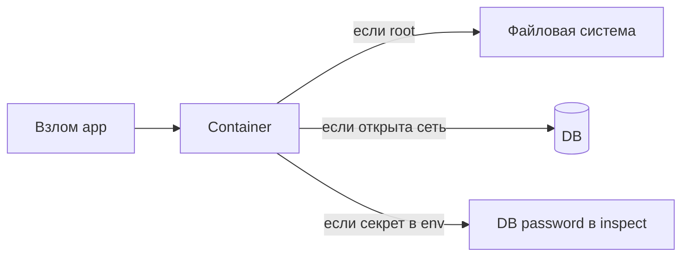
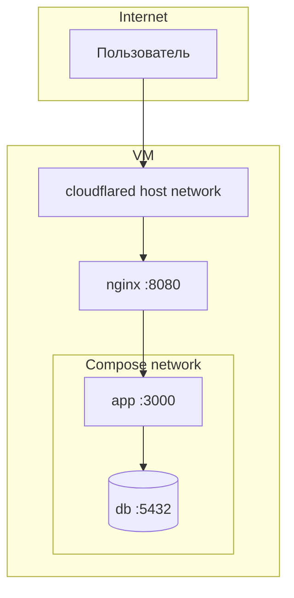
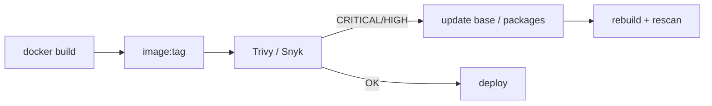

## День 12 — (23 июня) — **Container Security & Secrets Management**

- Docker security best practices
- Environment variables vs secrets
- Container scanning (Trivy, Snyk)
- **Цель:** безопасные containers и управление secrets

**:learning-motives: Цели обучения на день : встреча в Teams в 08:30** :teams_icon: Oplægsholder @MAGS

1. Я могу перечислить security-практики для Docker-containers (users, network, images)
2. Я могу объяснить разницу между environment variables и secrets — и когда что использовать
3. Я могу просканировать Docker-image на известные уязвимости с Trivy или Snyk

- :theory-icon: Теория дня

# День 12 – Container Security & Secrets

> Теория к Дню 12 (23 июня). Фокус: **ограничить ущерб при взломе container**, **правильно хранить секреты** и **находить CVE в images** (OWASP **A06**).

---

## Практика на занятии (сделаем когда дойдём до Day 12)

> Задания по программе. **На занятии Day 12** — проходим по шагам (teacher может дать доп. инструкции).

### Чеклист практики

**1. Docker security — проверить нашу setup на VM**

- [ ] `docker exec mercantecapi-sdn21v-app-1 whoami` — root или нет?
- [ ] `docker ps` — порты только `127.0.0.1` (5000, 5432)?
- [ ] Убедиться: пароли **не** в Dockerfile / git, только `.env` / Dokploy env
- [ ] Кратко объяснить (устно или в заметках): non-root, minimal image, compose-сеть `db`

**2. Environment variables vs secrets**

- [ ] Показать разницу на примере `DB_PASSWORD` в `.env` vs `ASPNETCORE_ENVIRONMENT=Production`
- [ ] Объяснить: почему `docker inspect` опасен для секретов в env
- [ ] Проверить: `.env` в `.gitignore`

**3. Container scanning — Trivy**

- [ ] Установить Trivy (Mac: `brew install trivy` или на VM)
- [ ] `trivy image postgres:16-alpine`
- [ ] `trivy image mcr.microsoft.com/dotnet/aspnet:8.0`
- [ ] `docker compose build app` → `trivy image <имя app image>`
- [ ] Записать: сколько CRITICAL/HIGH, какой пакет, есть ли fixed version
- [ ] (Если teacher просит) обновить base / NuGet → rebuild → **scan снова**

**4. NuGet (app-уровень)**

- [ ] `cd app/MercantecApi && dotnet list package --vulnerable`
- [ ] `dotnet list package --outdated`

**5. Bonus (если успеем)**

- [ ] `trivy config app/MercantecApi/Dockerfile`
- [ ] Идея: шаг Trivy в `.github/workflows/ci.yml`

**Команды:** см. § «Команды (практика)» внизу файла.

---

## 📚 Содержание

1. **Практика на занятии** — чеклист (сделаем когда дойдём до Day 12)
2. Зачем container security
3. Docker best practices — users, images, filesystem
4. Сеть и порты
5. Environment variables vs secrets
6. Secrets в Compose, Dokploy, Swarm, K8s
7. Container scanning — Trivy и Snyk
8. Связь с Day 11 (A06)
9. Наша setup (MercantecApi)
10. Чеклист и команды

---

## 1. Зачем container security

Container — не полная изоляция. Если злоумышленник взломал app **внутри** container, он может:

- читать/менять файлы в container
- стучаться в другие containers в той же сети
- использовать лишние tools (shell, curl) для эскалации

**Цель Day 12:** сделать так, чтобы взлом app давал **минимальный** ущерб.




---

## 2. Docker best practices

### Не запускать app как root

По умолчанию process в container часто **root**. Взлом = root внутри container → больше прав на FS и process.

**Решение:** отдельный user в Dockerfile + `USER`.

**Пример (Node — из программы курса):**

```dockerfile
FROM node:20-alpine
RUN addgroup -g 1001 appgroup && adduser -u 1001 -G appgroup appuser
WORKDIR /app
COPY --chown=appuser:appgroup . .
USER appuser
CMD ["node", "server.js"]
```

**Наш ASP.NET Dockerfile (Day 6)** — multi-stage ✅, но **без `USER`** → app пока как root в runtime image. Улучшение на будущее:

```dockerfile
# в final stage (после COPY publish)
RUN adduser --disabled-password --gecos "" appuser && chown -R appuser /app
USER appuser
CMD ["dotnet", "MercantecApi.dll"]
```

> Официальные `mcr.microsoft.com/dotnet/aspnet` images не всегда настроены под non-root «из коробки» — проверяй после добавления `USER`.

### Минимальный base image


| Подход                | Плюс                                      |
| --------------------- | ----------------------------------------- |
| **alpine / slim**     | меньше пакетов → меньше CVE               |
| **multi-stage build** | в финальный image только runtime, без SDK |


**У нас:**

- App: `sdk:8.0` (build) → `aspnet:8.0` (final) ✅
- DB: `postgres:16-alpine` ✅

Меньше слоёв и лишних `RUN` — меньше attack surface.

### Read-only filesystem и capabilities

```bash
# read-only root FS (для prod при необходимости)
docker run --read-only --tmpfs /tmp ...

# убрать лишние Linux capabilities (продвинутый уровень)
docker run --cap-drop=ALL ...
```

Для многих apps нужен writable `/tmp` или volume для logs — иначе app не стартует. На курсе — **знать концепцию**, не обязательно включать всё на VM.

### Images: что внутри?

- Собирай **свой** Dockerfile с **известным** base
- Держи base и зависимости **обновлёнными**
- **Сканируй** image (Trivy/Snyk) — см. §6

---

## 3. Сеть и порты

### Открывай только нужные порты


| Плохо                    | Хорошо                            |
| ------------------------ | --------------------------------- |
| `5432:5432` на `0.0.0.0` | `127.0.0.1:5432:5432`             |
| Лишние published ports   | Только то, что нужно nginx/админу |


**У нас в `docker-compose.yml`:**

- App: `127.0.0.1:5000:3000` ✅
- Postgres: `127.0.0.1:5432:5432` ✅
- UFW снаружи: 22, 80, 443 — DB и app **не** в интернет

### Пользовательские сети (Compose)

Compose создаёт **свою** bridge-сеть (`mercantecapi_default`):

```text
app  →  hostname "db"  →  postgres container
```

DB не видна random containers на хосте — только сервисы **этого** compose-проекта.

**cloudflared** с `--network host` — отдельный случай (tunnel к localhost nginx), не compose-сеть.




---

## 4. Environment variables vs secrets

Оба передают **конфигурацию** в container. Разница — **насколько данные чувствительны** и **как** их хранят.

### Environment variables

- Задаются: `docker run -e`, `environment:` в Compose, Dokploy UI
- **Видны** в `docker inspect`, в `/proc` на хосте
- Любой с доступом к Docker на VM может прочитать

**Подходит для:** не-секретов — `ASPNETCORE_ENVIRONMENT=Production`, `LOG_LEVEL`, host БД без пароля.

### Secrets

**Секреты** — пароли, API keys, private keys. Не должны быть в image или git.


| Способ                      | Идея                                  |
| --------------------------- | ------------------------------------- |
| **Файл**, mount read-only   | app читает `/run/secrets/db_password` |
| **Docker Secrets** (Swarm)  | encrypted at rest, mount в container  |
| **K8s Secrets**             | аналог в Kubernetes                   |
| **Vault** (HashiCorp и др.) | центральное хранилище + rotation      |


### Compose (standalone) — наш случай

В обычном Compose **нет** Swarm Secrets. Типичный паттерн:

```yaml
env_file:
  - .env   # в .gitignore, только на VM / Mac локально
environment:
  POSTGRES_PASSWORD: ${DB_PASSWORD}
```

**Принцип:** чем чувствительнее — тем ближе к «secret workflow» (файл с правами, Dokploy env UI, CI secrets).

### Сравнение


|                  | Environment variables          | Secrets (файл / backend)             |
| ---------------- | ------------------------------ | ------------------------------------ |
| **Для чего**     | Не-секретная конфигурация      | Пароли, ключи, certs                 |
| **Видимость**    | `docker inspect`, process list | Файл с ограниченными правами / vault |
| **В Compose**    | `environment:` / `env_file:`   | `.env` вне git, file mount           |
| **В production** | feature flags, URLs            | credentials из vault / CI            |


### Чего не делать (A02 + A05)

```dockerfile
# BAD — пароль в image
ENV DB_PASSWORD=supersecret

# BAD — в git
POSTGRES_PASSWORD=andrii
```

**У нас:** `DB_`* в `.env` на VM, `env_file` в compose ✅ · пароли не в Dockerfile ✅

### Логирование

**Никогда** не логировать env vars с паролями. Connection string в stdout = утечка.

---

## 5. Secrets в Dokploy и Swarm

**Dokploy** на VM работает в **Docker Swarm** и сам использует secrets для своей панели (postgres/redis).

**Наш app** — отдельный **Compose**-проект в Dokploy:

- Секреты задаём в **Dokploy UI** (Environment) или `.env` на стороне deploy
- **Не** коммитить в GitHub


| Компонент           | Где секреты                        |
| ------------------- | ---------------------------------- |
| App `DB_PASSWORD`   | `.env` / Dokploy env               |
| GitHub PAT для pull | Dokploy Git tab (rotate если утёк) |
| Dokploy admin       | `SERVER_INFO.md` (local)           |
| Tunnel token        | teacher / local, не в git          |


---

## 6. Container scanning — Trivy и Snyk

**Container scanning** — проверка **image** (слой за слоем) по базам **CVE**.

Связь с **OWASP A06** (Vulnerable and Outdated Components): не деплоить images с известными дырами.

### Workflow




### Trivy (open source, без аккаунта)

```bash
# установка (Mac)
brew install trivy

# Ubuntu VM
sudo apt install trivy
# или binary с github.com/aquasecurity/trivy/releases

# scan image
trivy image postgres:16-alpine
trivy image mcr.microsoft.com/dotnet/aspnet:8.0

# наш собранный app (на VM после build)
cd app/MercantecApi
docker compose build app
trivy image mercantecapi-app   # имя зависит от compose project
```

**Вывод:** CVE-ID, severity (CRITICAL, HIGH, MEDIUM, LOW), пакет, fixed version.

**Приоритет:** закрывать **CRITICAL** и **HIGH** перед production.

Дополнительно:

```bash
# misconfiguration в Dockerfile / compose
trivy config app/MercantecApi/Dockerfile
trivy config app/MercantecApi/docker-compose.yml
```

### Snyk (аккаунт + CLI)

```bash
npm install -g snyk   # или brew install snyk
snyk auth
snyk container test mercantecapi-app:latest
```

Плюсы: remediation, CI integration, мониторинг проекта.  
На курсе: **начни с Trivy** (быстро, локально).

### .NET зависимости (без Docker)

```bash
cd app/MercantecApi
dotnet list package --vulnerable
dotnet list package --outdated
```

Это сканирует **NuGet** в проекте, не весь OS в image. Нужны **оба** уровня: app packages + image (Trivy).

### После scan

1. Обновить base image (`aspnet:8.0` → новый patch)
2. `dotnet restore` / обновить пакеты
3. Пересобрать image
4. **Scan снова** — цель: нет CRITICAL/HIGH (или принятый риск задокументирован)

### Scan в CI (bonus)

```yaml
# идея для .github/workflows/ci.yml
- name: Trivy scan
  run: |
    docker build -t mercantec-api:test app/MercantecApi
    trivy image --severity CRITICAL,HIGH --exit-code 1 mercantec-api:test
```

`--exit-code 1` — pipeline падает при CRITICAL/HIGH.

---

## 7. Связь с Day 11


| Day 11                    | Day 12                               |
| ------------------------- | ------------------------------------ |
| A06 — outdated components | Trivy / Snyk / `dotnet list package` |
| A02 — crypto failures     | secrets не в git/image               |
| A05 — misconfiguration    | non-root, порты, minimal image       |
| Security headers (nginx)  | container layer — отдельный уровень  |


Defense in depth: headers защищают **браузер**, container security — **сервер и images**.

---

## 8. Наша setup — security checklist


| Область             | Сейчас                             | Улучшение                  |
| ------------------- | ---------------------------------- | -------------------------- |
| **Base images**     | `aspnet:8.0`, `postgres:16-alpine` | периодический pull + Trivy |
| **Multi-stage**     | ✅ SDK отдельно от runtime          | —                          |
| **Non-root USER**   | ⬜ не в Dockerfile                  | добавить `appuser`         |
| **Порты**           | `127.0.0.1` only ✅                 | —                          |
| **Compose network** | `db` hostname ✅                    | —                          |
| **Secrets**         | `.env` + Dokploy env ✅             | rotate PAT                 |
| **Секреты в git**   | `.gitignore` ✅                     | не коммитить `.env`        |
| **Scan**            | ⬜ Trivy на images                  | практика Day 12            |
| **Read-only FS**    | не используем                      | опционально prod           |


### Контейнеры на VM (напоминание)


| Container                   | Image                  | Secrets                              |
| --------------------------- | ---------------------- | ------------------------------------ |
| `mercantecapi-sdn21v-app-1` | build из Dockerfile    | `ConnectionStrings__Postgres` из env |
| `mercantecapi-sdn21v-db-1`  | `postgres:16-alpine`   | `POSTGRES_PASSWORD` из env           |
| `uptime-kuma`               | `louislam/uptime-kuma` | отдельный admin                      |
| Dokploy stack               | Swarm images           | внутренние secrets Swarm             |


---

# Чеклист целей обучения

> ⬜ Day 12 — теория готова · практика когда дойдём до дня

> Команды в § «Команды (практика)» — **заготовка**. Запускаем на занятии Day 12.

- [ ] Перечислить 4+ Docker security practices (non-root, minimal image, ports, network)
- [ ] Объяснить env vs secrets на примере `DB_PASSWORD`
- [ ] Показать, что `.env` в `.gitignore`, пароли не в Dockerfile
- [ ] Установить Trivy (Mac или VM)
- [ ] `trivy image postgres:16-alpine`
- [ ] `docker compose build` + `trivy image` на app image
- [ ] `dotnet list package --vulnerable` на Mac
- [ ] Записать: сколько CRITICAL/HIGH, что обновить
- [ ] (Bonus) добавить Trivy step в CI

---

## Ключевые идеи (простыми словами)


| Идея                | Коротко                                         |
| ------------------- | ----------------------------------------------- |
| **Non-root**        | взлом app ≠ root в container                    |
| **Minimal image**   | меньше пакетов → меньше CVE                     |
| **Порты**           | только `127.0.0.1`, что нужно                   |
| **Compose network** | app видит `db`, не весь мир                     |
| **Env**             | конфиг, виден в inspect                         |
| **Secrets**         | пароли/ключи — не в git/image                   |
| **Trivy**           | scan image на CVE                               |
| **A06**             | устаревшие компоненты — сканировать и обновлять |


---

## Команды (практика)

### Проверить user в running container

```bash
ssh mercantec-andrii
docker exec mercantecapi-sdn21v-app-1 whoami
# часто: root — повод добавить USER в Dockerfile
```

### Env виден в inspect (почему secrets осторожно)

```bash
docker inspect mercantecapi-sdn21v-app-1 --format '{{range .Config.Env}}{{println .}}{{end}}' | grep -i postgres
# на VM — не пастить вывод в Teams; там connection string
```

### Trivy — установка и scan (Mac)

```bash
brew install trivy

trivy image postgres:16-alpine
trivy image mcr.microsoft.com/dotnet/aspnet:8.0

cd app/MercantecApi
docker compose build app
docker images | grep mercantec
trivy image <IMAGE_NAME_FROM_ABOVE>
```

### Trivy — только CRITICAL/HIGH

```bash
trivy image --severity CRITICAL,HIGH postgres:16-alpine
```

### Trivy — Dockerfile / compose config

```bash
trivy config app/MercantecApi/Dockerfile
trivy config app/MercantecApi/docker-compose.yml
```

### NuGet vulnerabilities (.NET)

```bash
cd app/MercantecApi
dotnet list package --vulnerable
dotnet list package --outdated
```

### Snyk (если есть аккаунт)

```bash
snyk auth
snyk container test <your-image:tag>
```

---

## Короткий текст для Teams (Day 12)

> **Day 12:** Container security = non-root user, minimal base image, только нужные порты (`127.0.0.1`), compose-сеть для app↔db. Env vars для обычной конфигурации (видны в inspect); secrets (пароли, PAT) — в `.env`/Dokploy, не в git/image. Trivy/Snyk сканируют image на CVE (A06). У меня: `postgres:16-alpine` + multi-stage ASP.NET; практика — `trivy image` и `dotnet list package --vulnerable`.

---

## Итог по целям обучения

После Day 12 вы должны уметь:

1. **Перечислить** Docker security practices: user, image, network, ports.
2. **Различать** environment variables и secrets — и выбирать правильный способ для паролей.
3. **Запустить** Trivy (или Snyk) на image, прочитать CVE/severity и предложить fix (update + rebuild).
4. **Связать** scanning с OWASP A06 и secrets с A02/A05.

---

## Ресурсы

- [Trivy](https://github.com/aquasecurity/trivy)
- [Snyk Container](https://docs.snyk.io/scan-with-snyk/snyk-container)
- [Docker security](https://docs.docker.com/engine/security/)
- [OWASP Docker Security Cheat Sheet](https://cheatsheetseries.owasp.org/cheatsheets/Docker_Security_Cheat_Sheet.html)
- [Day 11 — OWASP](./day11-owasp-security-headers.md) — A06, secrets
- Day 13 — CTF

---

*Обновлено: 2026-06-15 — теория Day 12; container security, env vs secrets, Trivy/Snyk под MercantecApi*