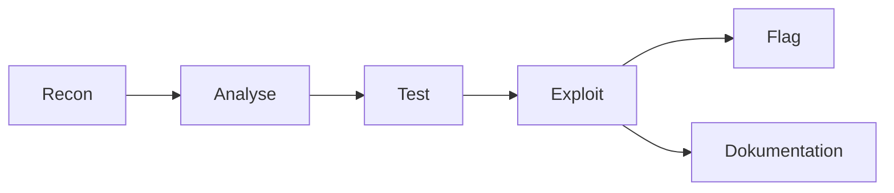

## День 13 — (24 июня) — **CTF Challenge — «Hack en app»**

- Практическая security-тестирование через CTF
- **Цель:** применить OWASP-техники на уязвимой app

**:learning-motives: Цели обучения на день** :teams_icon: MAGS

1. Я могу использовать техники из OWASP для поиска уязвимостей в приложении
2. Я могу задокументировать и объяснить, как была эксплуатирована уязвимость
3. Я могу работать в группе — этично и целенаправленно анализировать и «атаковать» app

- :theory-icon: Теория дня

# День 13 – CTF (Capture The Flag)

> Теория к Дню 13 (24 июня). Фокус: **практика атаки** на специально уязвимую app — чтобы лучше **защищать** свои системы.

---

## Практика на занятии (сделаем когда дойдём до Day 13)

> **CTF-app выдаёт teacher (MAGS)** — URL/доступ получим на занятии. До этого только теория и инструменты.

### Чеклист практики (на занятии Day 13)

**Подготовка (когда дали CTF URL)**

- [ ] Записать URL, правила, дедлайн flags
- [ ] Разделить роли в группе: recon / test / documentation

**1. Recon**

- [ ] Карта: все страницы, формы, API endpoints
- [ ] DevTools Network — какие запросы, cookies, headers
- [ ] `curl -I` на главную — security headers?
- [ ] (Опционально) `gobuster dir` — скрытые пути (`/admin`, `/api`, `/.env`)

**2. Тесты по OWASP (на CTF-app, не на `andrii.mercantec.tech`)**

- [ ] **A03 SQLi** — `'`, `' OR '1'='1`, UNION (где есть input/DB)
- [ ] **A03 XSS** — `<script>alert(1)</script>`, reflected в URL
- [ ] **A01 IDOR** — смена ID в URL `/users/1` → `/users/2`
- [ ] **A05 misconfig** — `/robots.txt`, verbose errors, открытые файлы

**3. Exploit + flags**

- [ ] Для каждого flag: довести exploit до конца
- [ ] Записать payload, который сработал

**4. Документация (обязательно — læringsmål 2)**

Для **каждого** flag / finding заполнить шаблон из §5:
- тип уязвимости · OWASP · URL · payload · impact · recommended fix

**5. Группа**

- [ ] Общий write-up или merge findings
- [ ] Кратко в Teams: сколько flags, главный урок

> ⚠️ Только выданная CTF-среда. **Не** sqlmap/Burp на production Mercantec.

**Команды:** см. § «Команды (практика)» внизу файла.

---

## 📚 Содержание

0. **Практика на занятии** — CTF чеклист (когда teacher выдаст app)
1. Что такое CTF
2. OWASP-техники в CTF
3. Методика: recon → exploit → документ
4. Инструменты
5. Шаблон документации находки
6. Связь с нашим курсом (Day 11–12)
7. Чеклист и этика

---

## 1. Что такое CTF

**CTF (Capture The Flag)** — учебная security-игра: вы **атакуете** app, которую специально сделали уязвимой.

| Понятие | Значение |
| --- | --- |
| **Flag** | скрытая строка, напр. `FLAG{hemmelighed123}` — доказательство успешного exploit |
| **Цель** | понять уязвимость изнутри → лучше защищать production |
| **Этика** | только на выданной app/сервере; **никогда** на чужих системах без разрешения |



**Идея:** сегодня вы — «хакер с разрешением». Завтра — разработчик, который закрывает те же дыры.

---

## 2. OWASP-техники в CTF

### SQL Injection (A03)

User input попадает в SQL без параметров.

**Тесты:**

```text
'                          → SQL error?
' OR '1'='1                → login bypass?
' UNION SELECT null,... --  → данные из других таблиц
```

**Инструменты:** браузер, Burp, `sqlmap` (только на CTF-app).

---

### XSS — Cross-Site Scripting (A03)

Output не escaped → JavaScript в чужом браузере.

**Тесты:**

```html
<script>alert('XSS')</script>

```

- **Reflected XSS** — input из URL сразу в HTML
- **Stored XSS** — payload сохраняется в БД

**Защита (вспомнить Day 11):** escape output + CSP `script-src 'self'`.

---

### Broken Access Control (A01) / IDOR

Нет проверки прав на ресурс.

**Тесты:**

```text
/api/users/1  →  /api/users/2     (чужие данные?)
/admin          без login
/dashboard      с подменой cookie/token
```

Связь с Day 11: у нас `/api/weatherforecast` открыт всем — в CTF ищете **скрытые** endpoints.

---

### Security Misconfiguration (A05)

**Тесты:**

```bash
curl -I https://target/                    # нет security headers?
curl https://target/robots.txt
curl https://target/.env                    # не должно отдаваться!
curl https://target/backup.sql
```

- Verbose errors со stack trace → утечка путей и технологий
- Swagger в Production открыт

---

### Path Traversal / IDOR (файлы)

```text
/download?file=../../etc/passwd
/download?file=....//....//etc/passwd
```

Base64-параметры — декодировать, менять, кодировать снова.

---

## 3. Методика — recon до exploit

| Шаг | Что делать |
| --- | --- |
| **1. Recon** | Карта app: формы, endpoints, cookies, технологии |
| **2. Analyse** | Какой OWASP-класс для каждого endpoint? |
| **3. Test** | Одна гипотеза за раз; записывать payload и ответ |
| **4. Exploit** | Довести до flag / полного доступа |
| **5. Dokumenter** | Тип, URL, payload, impact, fix |

**Не паниковать** — идти по списку, не хаотично кликать.

### Recon — что записать

- Все URL и HTTP methods (GET/POST/PUT/DELETE)
- Input fields и query params
- Cookies, headers, auth scheme
- Технологии (ASP.NET, PHP, заголовок `Server`)

---

## 4. Инструменты

| Инструмент | Зачем |
| --- | --- |
| **Browser DevTools** | Network, cookies, HTML/JS |
| **Burp Suite Community** | Intercept, Repeater, повтор запросов |
| **curl** | Кастомные HTTP-запросы из терминала |
| **sqlmap** | Авто SQLi (только CTF!) |
| **gobuster / dirb** | Brute-force путей `/admin`, `/api`, `/backup` |

### curl — примеры для CTF

```bash
# GET с параметром
curl -s "https://ctf.example.com/search?q=test"

# POST login
curl -s -X POST "https://ctf.example.com/login" \
  -d "user=admin&pass=' OR '1'='1" \
  -H "Content-Type: application/x-www-form-urlencoded"

# с cookie
curl -s -b "session=abc123" "https://ctf.example.com/api/profile"
```

### gobuster (если разрешено)

```bash
gobuster dir -u https://ctf.example.com -w /usr/share/wordlists/dirb/common.txt -t 20
```

---

## 5. Документация находки (шаблон)

Для каждого flag / уязвимости:

```markdown
## Finding: [название]

- **Тип:** SQL Injection / IDOR / XSS / Misconfiguration
- **OWASP:** A03 / A01 / A05
- **Где:** URL, поле, endpoint
- **Payload:** точная строка или запрос
- **Результат:** какие данные / flag получили
- **Impact:** что бы случилось в production
- **Fix:** parameterized SQL / [Authorize] / escape / headers / убрать .env из web root
```

Это формат **penetration test report** — учебная версия.

### Пример (выдуманный)

| Поле | Значение |
| --- | --- |
| Тип | SQL Injection |
| Где | `POST /login` поле `username` |
| Payload | `admin' OR '1'='1' --` |
| Результат | вход без пароля, flag `FLAG{sqli_win}` |
| Fix | prepared statements, никогда concat SQL |

---

## 6. Связь с нашим курсом

| День | CTF |
| --- | --- |
| **Day 11 A01** | IDOR, open endpoints |
| **Day 11 A03** | SQLi, XSS |
| **Day 11 A05** | missing headers, exposed files |
| **Day 12** | secrets в `.env` — в CTF часто «найди `.env`» |
| **Day 10** | после CTF — смотреть logs в Dokploy: видны ли атаки? |

**Наша MercantecApi** — не CTF-target (нет намеренных дыр). CTF — **отдельная** app от teacher.

---

## 7. Этика и правила

- Только выданная CTF-среда
- Не DoS — не ломать инфраструктуру для всех
- Делиться находками в **группе** (learning goal 3)
- Не постить flags публично до дедлайна (если teacher так сказал)
- Техники из CTF → **fix** в своём проекте, не атака на `andrii.mercantec.tech` без разрешения

---

# Чеклист целей обучения

> ⬜ Day 13 — теория готова · CTF когда teacher выдаст app

> Burp / sqlmap / gobuster — только на **CTF URL teacher**, не на production.

- [ ] Recon: карта endpoints и input
- [ ] Минимум 2 OWASP-категории протестированы (SQLi, IDOR, XSS, misconfig)
- [ ] Найден ≥1 flag (если teacher выдал CTF)
- [ ] Документация по шаблону для каждого finding
- [ ] Группа: роли (recon / test / write-up)
- [ ] Рефлексия: «какой fix в нашем MercantecApi?»

---

## Ключевые идеи

| Идея | Коротко |
| --- | --- |
| **CTF** | учебная атака за flag |
| **Recon first** | сначала карта, потом exploit |
| **OWASP в практике** | A01, A03, A05 чаще всего |
| **Документация** | payload + impact + fix |
| **Этика** | только с разрешения |

---

## Команды (практика)

> Команды ниже — для **CTF-app teacher**, не для production `andrii.mercantec.tech`.

```bash
# recon headers
curl -sI https://CTF_URL/

# скрытые пути (осторожно с rate)
gobuster dir -u https://CTF_URL/ -w common.txt

# sqlmap (только CTF)
sqlmap -u "https://CTF_URL/page?id=1" --batch

# Burp — вручную через GUI
```

---

## Короткий текст для Teams (Day 13)

> **Day 13 CTF:** Capture The Flag — этичная атака на уязвимую app. Метод: recon → analyse → test → exploit → dokumenter. Техники OWASP: SQLi, XSS, IDOR, misconfiguration (exposed files, verbose errors). Инструменты: DevTools, Burp, curl. Для каждого flag: тип, payload, impact, fix. Цель — понять атаку, чтобы лучше защищать свой deploy.

---

## Итог по целям обучения

1. **Применить OWASP** на практике в CTF.
2. **Задокументировать** каждый exploit по шаблону.
3. **Работать в группе** структурированно и этично.

---

## Ресурсы

- [OWASP Web Security Testing Guide](https://owasp.org/www-project-web-security-testing-guide/)
- [OWASP Juice Shop](https://owasp.org/www-project-juice-shop/) (популярная учебная vulnerable app)
- [PortSwigger Web Security Academy](https://portswigger.net/web-security)
- [Day 11 — OWASP](./day11-owasp-security-headers.md)

---

*Обновлено: 2026-06-15 — теория Day 13; CTF, OWASP exploit techniques, документация*
