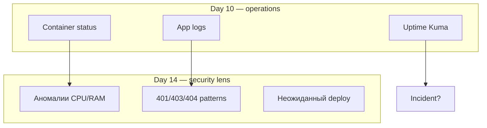
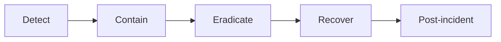

## День 14 — (25 июня) — **Monitoring & Incident Response**

- Security monitoring с Dokploy
- Log analysis и alerting
- Incident response plan
- **Цель:** наблюдение и реакция на security-события

**:learning-motives: Цели обучения на день : встреча в Teams в 08:30** :teams_icon: Morten

1. Я могу использовать logs и monitoring для обнаружения аномалий и ошибок
2. Я могу объяснить, что такое incident response plan и зачем он нужен
3. Я могу составить простой план реакции на security-инцидент
4. Я могу применять базовую risk assessment в повседневных ситуациях

- :theory-icon: Теория дня

# День 14 – Security Monitoring & Incident Response

> Теория к Дню 14 (25 июня). Фокус: **те же инструменты Day 10**, но с «security-очками» + **план действий**, когда что-то пошло не так.

---

## Практика на занятии (сделаем когда дойдём до Day 14)

> Используем **Dokploy + Uptime Kuma** (Day 10) с security-взглядом. На занятии Day 14 заполняем план и разбираем logs.

### Чеклист практики

**1. Security monitoring — Dokploy**

- [ ] Открыть MercantecApi → status app + db (CPU/RAM, Running?)
- [ ] Logs app container — искать: много ошибок, 401/403, SQL exceptions, stack traces
- [ ] Deploy history — был ли deploy без вашего push? (если только вы в Git)

**2. Log analysis**

- [ ] `sudo tail -100 /var/log/nginx/access.log` — много 404? один IP?
- [ ] Связать с Uptime Kuma: был ли Down недавно?
- [ ] Записать 1–2 «подозрительных» паттерна (даже если benign)

**3. Incident response plan (обязательно — læringsmål 3)**

- [ ] Заполнить шаблон IR plan в §7 (definition, detection, first steps, contain, recover, documentation)
- [ ] Указать **имена/роли** в группе: кто logs, кто Dokploy, кто пишет timeline
- [ ] Сохранить: `docs/incidents/IR-plan-mercantecapi.md` или shared doc (по teacher)

**4. Risk assessment (læringsmål 4)**

- [ ] Разобрать **2 ситуации** из §8 (phishing GitHub, failed logins, deploy вечером…) — риск + что делаем

**5. Симуляция (опционально, если teacher разрешит)**

- [ ] `docker stop mercantecapi-sdn21v-app-1` → пройти IR: Detect (Kuma red) → Contain → Recover → Post-incident note

**6. Aflevering / Teams**

- [ ] Кратко: что смотрите при incident, где IR plan лежит, один пример risk assessment

**Команды:** см. § «Команды (практика)» внизу файла.

---

## 📚 Содержание

0. **Практика на занятии** — IR plan + logs (сделаем когда дойдём до Day 14)
1. Security monitoring в Dokploy (продолжение Day 10)
2. Что смотреть с точки зрения безопасности
3. Log analysis и alerting
4. Incident response plan (IRP)
5. Фазы: Detect → Contain → Eradicate → Recover → Post-incident
6. Простой план для нашей группы
7. Risk assessment в быту
8. Наша setup
9. Чеклист и команды

---

## 1. От Day 10 к Day 14

**Day 10:** monitoring + logging — «жива ли app?», «что в logs?»  
**Day 14:** те же данные — **признаки атаки, abuse, misconfiguration**



Dokploy **не** отдельный «security SIEM» — вы **интерпретируете** status и logs.

---

## 2. Что мониторить (security)

| Наблюдение | Где | Почему важно |
| --- | --- | --- |
| **Высокий CPU/RAM** | Dokploy resources | mining, loop, DDoS на app |
| **Crash loop** | Dokploy status | exploit крашит process |
| **Много ошибок в logs** | Dokploy Logs | injection attempts, brute force |
| **Странные IP / paths** | nginx access.log, app logs | scanning, bots |
| **Deploy без вашего push** | Dokploy deploy history | compromised Git/CI (если есть чужой доступ) |
| **Сайт Down** | Uptime Kuma | инцидент доступности (Day 10) |

### Наша цепочка при подозрении

```text
Uptime Kuma Down?  →  tunnel? nginx? app container?
Много 500 в logs?  →  Dokploy Logs app → DB up?
Много 404?         →  scanning (часто норма в интернете)
```

---

## 3. Log analysis

**Log analysis** = читать logs и искать **паттерны**, не одну строку.

### Признаки «ненормального»

| Паттерн | Возможное значение |
| --- | --- |
| Много **404** с одного IP | scanning `/admin`, `/.env` |
| Много **401/403** | brute force, IDOR attempts |
| **SQL errors** с user input в тексте | SQL injection attempts (A03) |
| Strange **User-Agent** | sqlmap, nikto, bots |
| Резкий рост трафика | viral или abuse/DDoS |

### Где смотреть у нас

| Источник | Команда / UI |
| --- | --- |
| **Dokploy** | Project → Logs `mercantecapi-sdn21v-app-1` |
| **nginx access** | `/var/log/nginx/access.log` на VM |
| **nginx error** | `/var/log/nginx/error.log` |
| **Uptime Kuma** | Events — Down/Up |

### Что не логировать (A02, A09)

- пароли, tokens, full connection strings
- PII без необходимости

---

## 4. Alerting

**Alerting** = автоматическое **уведомление**, когда правило сработало.

| Уровень | У нас |
| --- | --- |
| **Uptime** | Uptime Kuma → Down на API URL (Day 10) |
| **Dokploy** | deploy failed, container exited |
| **Продвинутый** | «>100 404/min» — нужен log aggregation (ELK, Loki) — теория |

**Идея Day 14:** monitoring + logs + alerts = **быстрее detect** → дальше IR plan.

---

## 5. Incident response plan (IRP)

**IRP** — заранее согласованный план: **что делать**, когда обнаружен security-инцидент или серьёзный сбой.

### Зачем

Без плана — хаос: неясно кто что делает, забывают сменить пароли, нет таймлайна для teacher/NIS2.

С планом:
- общее определение «incident»
- роли и шаги
- документация для разбора и отчёта

### Что считать incident (примеры для курса)

- App недоступна дольше N минут (Kuma red)
- Подозрение на взлом / утечку данных
- Credentials утекли (PAT на скрине, `.env` в git)
- В logs — успешный SQLi или массовый unauthorized access

---

## 6. Фазы incident response

| Фаза | Содержание |
| --- | --- |
| **1. Detect** | Kuma, Dokploy, logs, жалоба пользователя |
| **2. Contain** | stop container, block IP (UFW), rotate passwords, отключить webhook |
| **3. Eradicate** | patch CVE, fix misconfig, remove malware |
| **4. Recover** | redeploy, restore from backup (`pg_dump` Day 9), verify |
| **5. Post-incident** | write-up: что случилось, уроки, обновить план |



Не нужен юридический том — **короткий чеклист** уже IRP.

---

## 7. Простой IR plan — шаблон для группы

Скопируй и заполни под MercantecApi:

### 1. Definition — что такое incident у нас?

- [ ] Сайт `andrii.mercantec.tech` недоступен > 5 мин
- [ ] Подозрение на утечку `DB_PASSWORD` / PAT
- [ ] Неожиданный redeploy в Dokploy без push

### 2. Detection — где смотрим?

| Кто | Инструмент |
| --- | --- |
| Person A | Uptime Kuma + `curl` домена |
| Person B | Dokploy status + Logs |
| Person C | `sudo tail nginx access.log` |

### 3. First steps (первые 15 мин)

1. Записать **время** и симптомы
2. `docker ps` — что running?
3. Dokploy Logs — последние ошибки
4. `curl -I https://andrii.mercantec.tech/api/weatherforecast`
5. Если tunnel 530 → `docker restart cloudflared`

### 4. Contain — сдержать ущерб

```bash
# остановить только app (если compromised)
docker stop mercantecapi-sdn21v-app-1

# сменить пароль БД в .env + Dokploy env + redeploy
# revoke GitHub PAT если утёк
# UFW deny from SUSPICIOUS_IP (если teacher разрешит)
```

### 5. Recover

```bash
docker start mercantecapi-sdn21v-app-1
# или Dokploy Redeploy
# restore DB из backup если нужно:
# cat ~/backup_YYYYMMDD.sql | docker exec -i mercantecapi-sdn21v-db-1 psql -U andrii -d postgres
```

### 6. Documentation

- Файл: `docs/incidents/YYYY-MM-DD-short-title.md` (или shared doc)
- Поля: timeline, impact, actions, root cause, follow-up

### 7. Follow-up

- Fix уязвимость (Day 11–13)
- Trivy scan (Day 12)
- Обновить IR plan

---

## 8. Risk assessment в повседневности

Не большой отчёт — **мышление**: что может пойти не так → насколько вероятно → что делаем?

| Ситуация | Риск | Разумный tiltag |
| --- | --- | --- |
| Shared doc link публичный | утечка данных | ограничить доступ, revoke link |
| Deploy в пятницу вечером | downtime без поддержки | deploy утром или rollback plan |
| Phishing «verify GitHub» | кража credentials | не кликать, 2FA, official URL only |
| Много failed logins в logs | brute force | rate limit, block IP, alert |
| Нет backup БД | потеря данных при сбое | `pg_dump` cron (Day 9) |

Связь с **NIS2/CRA** (Day 2 теория): отчётность об инцидентах в организациях — IR plan + документация.

---

## 9. Наша setup

| Компонент | Day 10 | Day 14 use |
| --- | --- | --- |
| **Dokploy** | status, logs, deploy history | security patterns, unexpected deploy |
| **Uptime Kuma** | HTTP 200 check | detect outage |
| **nginx logs** | — | scanning, 4xx patterns |
| **Backup** | `~/backup_20260615.sql` | recover phase |
| **cloudflared** | tunnel flake 530 | contain: restart |

### Пример сценария (учебный)

**Симптом:** Kuma red, API 502.

```text
Detect  → Kuma Down, curl 502
Contain → проверить cloudflared, nginx, app container (не «удалить всё»)
Eradicate → restart cloudflared / app если crash
Recover   → curl 200, Kuma green
Post      → записать: «530 tunnel, fix restart cloudflared»
```

---

# Чеклист целей обучения

> ⬜ Day 14 — теория готова · практика когда дойдём до дня

- [ ] Открыть Dokploy Logs с «security lens» — найти 4xx/5xx/error patterns
- [ ] Просмотреть `sudo tail -50 /var/log/nginx/access.log`
- [ ] Объяснить IRP своими словами
- [ ] Заполнить простой IR plan для группы (шаблон §7)
- [ ] Назвать 5 фаз: detect → contain → eradicate → recover → post
- [ ] 2 примера risk assessment из §8
- [ ] (Опционально) симуляция: `docker stop` app → пройти IR шаги

---

## Ключевые идеи

| Идея | Коротко |
| --- | --- |
| **Security monitoring** | те же logs/status, другой взгляд |
| **Log analysis** | паттерны, не одна строка |
| **Alerting** | Kuma + глаза на Dokploy |
| **IRP** | план до катастрофы |
| **Contain** | сначала остановить ущерб |
| **Post-incident** | записать и улучшить |
| **Risk assessment** | что может пойти не так + что делаем |

---

## Команды (практика)

### Dokploy — fallback logs

```bash
ssh mercantec-andrii
docker logs mercantecapi-sdn21v-app-1 --tail 100
docker logs mercantecapi-sdn21v-db-1 --tail 50
```

### nginx access — частые 404 (scanning)

```bash
sudo tail -200 /var/log/nginx/access.log | awk '{print $1, $7, $9}' | sort | uniq -c | sort -rn | head -20
```

### Проверка доступности

```bash
curl -s -o /dev/null -w "%{http_code}\n" https://andrii.mercantec.tech/api/weatherforecast
docker ps --filter name=mercantecapi --format "table {{.Names}}\t{{.Status}}"
```

### Contain (учебно)

```bash
docker stop mercantecapi-sdn21v-app-1
# investigate...
docker start mercantecapi-sdn21v-app-1
```

### Recover DB из backup (если нужно)

```bash
# осторожно — перезапишет данные
cat ~/backup_20260615.sql | docker exec -i mercantecapi-sdn21v-db-1 psql -U andrii -d postgres
```

---

## Короткий текст для Teams (Day 14)

> **Day 14:** Security monitoring = Dokploy status/logs + Uptime Kuma + nginx access, но смотрим на аномалии (4xx/5xx, crash loop, странные IP). Incident response plan — заранее: detect → contain → eradicate → recover → post-incident. У нас: Kuma на API, Dokploy logs, backup pg_dump, tunnel restart при 530. Risk assessment — думать «что если» до инцидента.

---

## Итог по целям обучения

1. **Обнаруживать** аномалии через logs и monitoring.
2. **Объяснить** IRP и зачем он нужен.
3. **Составить** короткий план для группы.
4. **Применять** базовую risk assessment в типичных ситуациях.

---

## Ресурсы

- [NIST Incident Response](https://csrc.nist.gov/publications/detail/sp/800-61/rev-2/final)
- [SANS Incident Handler's Handbook](https://www.sans.org/white-papers/33901/)
- [Day 10 — Monitoring](./day10-monitoring-logging.md)
- [Day 11 — A09 Logging](./day11-owasp-security-headers.md)
- [Day 13 — CTF](./day13-ctf-hack-app.md)

---

*Обновлено: 2026-06-15 — теория Day 14; security monitoring, IR plan, risk assessment под Mercantec setup*
