## Dag 2 - (9. juni) - **Домен, DNS и Firewall**

- Купить домен (или использовать subdomain)
- Настройка DNS (A, CNAME records)
- Настройка Cloudflare
- Настройка UFW/iptables
- **Цель**: домен указывает на ваш сервер, firewall настроен

**:learning-motives: Цели обучения на день : встреча в Teams в 08:30** :teams_icon: Докладчик @Paw

1. Я могу настроить DNS-records (A, CNAME) и привязать домен к серверу
2. Я могу настроить и протестировать firewall с UFW или iptables
3. Я могу использовать Cloudflare для защиты и управления трафиком к моему домену
- :theory-icon: Теория дня

    # День 2 – Домен, DNS и Firewall

    ---

    ## 📚 Содержание

    1. Домены и Subdomains
    2. DNS - Domain Name System (подробно)
    3. DNS Records - подробное руководство
    4. Cloudflare - Setup и архитектура
    5. Firewall - UFW и iptables
    6. NIS2 и CRA - рамки безопасности

    ---

    ## Домены и Subdomains

    ### Что такое домен?

    **Домен** (например `mitprojekt.dk`) — имя, которое пользователи вводят в браузере, чтобы найти ваш сервер. Можно купить домен у registrar (One.com, GoDaddy, Simply и т.д.) или использовать **subdomain** под доменом, к которому у вас есть доступ.

    **Subdomains для курса:** Преподаватель выдаёт subdomain под домены — например `jeresprojekt.mercantec.tech`, `gruppe2.gf2.dk` или `app.mags.dk`. Домены: **mercantec.tech**, **gf2.dk** и **mags.dk**. Куплены у **Simply**, **DNS перенесён в Cloudflare** — все DNS-records настраиваются в Cloudflare, регистрация домена остаётся у Simply. Одно место, чтобы направить subdomain на ваш сервер.

    - Домен сам по себе **не** указывает на сервер — нужен **DNS**.
    - При покупке домена вы получаете доступ к редактированию DNS (у registrar или у того, куда перенесли DNS — здесь Cloudflare).

    ---

    ## DNS (Domain Name System)

    **DNS** переводит доменные имена в IP-адреса и другую информацию. Когда кто-то вводит `https://minside.dk`, браузер спрашивает DNS: «Какой IP у minside.dk?» — и получает, например, `192.0.2.42`. Затем создаётся соединение с этим IP. DNS отвечает на: *Где находится этот сервер?* и *Какой сервер обрабатывает почту для этого домена?* и т.д.

    DNS состоит из **records** (записей) в **zone** вашего домена. У каждой записи есть **тип**, **имя** (host), **значение** и часто **TTL** (Time To Live — как долго ответ может храниться в кэше).

    ### DNS-records — обзор

    | Record type | Назначение | Пример |
    | --- | --- | --- |
    | **A** | Имя host → **IPv4-адрес**. | `app` → `192.0.2.42` |
    | **AAAA** | Как A, но для **IPv6**. | `app` → `2001:db8::1` |
    | **CNAME** | Имя → **другое доменное имя** (alias). DNS затем разрешает A/AAAA для того имени. Нельзя на root (apex) зоны. | `www` → `app.mercantec.tech` |
    | **MX** | **Почтовые серверы** домена (приоритет + host). | `10 mail.provider.com` |
    | **TXT** | Произвольный текст. Верификация владельца, SPF/DKIM для почты и др. | `v=spf1 include:_spf.google.com ~all` |
    | **NS** | **Nameserver** для (sub)домена. Делегирование или перенос DNS. | `ns1.cloudflare.com`, `ns2.cloudflare.com` |
    | **CAA** | Какие **CA** могут выдавать сертификаты для домена. | `0 issue "letsencrypt.org"` |

    В Cloudflare **имя** обычно — subdomain (например `app` для `app.mercantec.tech`) или `@` для root (`mercantec.tech`).

    ### Практика: A и CNAME для deployment

    - **Root-домен** (например `mercantec.tech`): **A-record** с именем `@` на публичный IP сервера.
    - **Subdomain** (например `jeresprojekt.mercantec.tech`): **A-record** с именем `jeresprojekt` и IP сервера — или **CNAME** на другой host, у которого уже есть A-record (обновляете IP в одном месте).

    **TTL:** После сохранения records изменения распространяются от минут до 48 часов. Короткий TTL (например 300 секунд) — быстрее при смене IP, но больше DNS-запросов. Перед сменой сервера многие ставят TTL низко; потом можно поднять.

    ### Роль DNS при deployment

    DNS **связывает доменное имя с инфраструктурой**:

    1. **Go-live / смена сервера:** Меняете A или CNAME на IP нового сервера. Пока DNS не обновился, часть пользователей видит старый IP (кэш).
    2. **HTTPS и сертификаты:** Let's Encrypt (и др.) часто проверяют домен через DNS (TXT для HTTP-01 или DNS-01). Без правильного DNS автоматический SSL не работает.
    3. **Load balancing и CDN:** При Cloudflare proxy A/CNAME может указывать на IP Cloudflare; дальше трафик идёт на ваш сервер. DNS задаёт *первый hop*.
    4. **Отладка:** Если «домен не работает» — `dig` / `nslookup`: DNS на нужный IP? TTL истёк?

    Кратко: DNS — *карта*, где лежит ваш сервис. Без правильных records трафик не дойдёт — или дойдёт не туда.

    ---

    ## Перенос DNS в Cloudflare (nameservers)

    Домены mercantec.tech, gf2.dk и mags.dk куплены у **Simply**, но **DNS в Cloudflare**:

    - **Simply** — *регистрация* (продление домена).
    - **Cloudflare** — *какие records у домена* — куда указывают `mercantec.tech`, `app.mercantec.tech` и т.д.

    ### Зачем DNS в Cloudflare?

    - **Одно место для всех records:** A, CNAME, TXT в dashboard.
    - **Proxy и безопасность:** трафик через Cloudflare (orange sky) — DDoS, кэш, SSL к посетителям.
    - **Скрытый IP сервера:** при proxy видны IP Cloudflare, не ваш.
    - **Быстрая propagation:** глобальная сеть Cloudflare.

    ### Как «перенести» DNS в Cloudflare

    1. **Добавить домен в Cloudflare** (Add site). Cloudflare может просканировать существующие records.
    2. **Cloudflare показывает два nameserver**, например `ada.ns.cloudflare.com` и `bob.ns.cloudflare.com` — используйте те, что дали вам!
    3. **У registrar (Simply)** — **Nameservers** / **DNS-servere**. Заменить Simply NS на Cloudflare.
    4. **Сохранить у Simply.** Cloudflare обрабатывает DNS для домена; records редактируются в Cloudflare.
    5. **Ждать propagation** (15 мин – 24 ч). Статус **Active**, когда NS переключились.

    После переноса **все** DNS-records — в Cloudflare, не у Simply. Subdomains для проектов — A или CNAME в Cloudflare.

    ---

    ## Cloudflare – DNS и proxy

    **Cloudflare** — DNS-провайдер и **proxy** перед сервером: трафик может идти через сеть Cloudflare, затем на сервер. mercantec.tech, gf2.dk, mags.dk уже в Cloudflare — см. раздел выше.

    - **DNS в Cloudflare:** все records (A, CNAME, TXT…) в dashboard; здесь же subdomains проектов.
    - **Proxy:** для каждой записи **Proxied** (orange sky) или **DNS only** (grey sky). При Proxied:
        - трафик через Cloudflare (DDoS, caching);
        - посетители получают SSL/TLS к Cloudflare;
        - реальный IP сервера скрыт.

    **Практика:** A или CNAME на subdomain → IP сервера; **Proxied** для защиты и SSL Cloudflare; **DNS only**, если SSL сами на сервере (например Let's Encrypt на Nginx).

    ---

    ## Firewall – UFW и iptables

    **Firewall** решает, какие входящие и исходящие соединения проходят. В Linux внизу часто **iptables** (или nftables). **UFW** (Uncomplicated Firewall) — проще: правила вроде «разрешить SSH», «разрешить HTTP/HTTPS» без ручного iptables.

    ### UFW – основное

    - **Включить firewall:** `sudo ufw enable`
    - **Разрешить SSH (до enable!):** `sudo ufw allow 22/tcp` или `sudo ufw allow ssh`
    - **HTTP и HTTPS:** `sudo ufw allow 80/tcp` и `sudo ufw allow 443/tcp`
    - **Статус:** `sudo ufw status` (или `status verbose`)
    - **Default policy:** `sudo ufw default deny incoming` и `sudo ufw default allow outgoing`

    Закрыли SSH (порт 22) без другого доступа — **lockout**. Всегда разрешайте SSH перед `ufw enable`.

    ### iptables (кратко)

    **iptables** — более низкоуровневые правила. UFW записывает iptables за вас. На новых системах может быть **nftables**, смысл тот же: порт, протокол, source IP.

    ---

    ## Информационная безопасность – NIS2 и CRA

    На Дне 2 нужно объяснить **основы NIS2 и CRA** — цель и применение в компании.

    ### NIS2 (Network and Information Security Directive 2)

    - **Цель:** EU-директива о **сетевой и информационной безопасности**. Требования к риск-менеджменту, отчётам об инцидентах, техническим и организационным мерам.
    - **В компании:** организации под NIS2 (энергетика, транспорт, здравоохранение, цифровая инфраструктура, часть госсектора) — меры безопасности и отчётность о серьёзных инцидентах. Влияет на приоритеты безопасности, документацию, incident handling.

    ### CRA (Cyber Resilience Act)

    - **Цель:** EU-регуляция **безопасности продуктов с цифровым содержимым** (ПО, IoT). Продукты безопасны «из коробки», уязвимости обрабатываются по жизненному циклу.
    - **В компании:** разработчики/продавцы ПО — риск-оценка, обновления безопасности, документация. Влияет на разработку, цепочку поставок, патчи.

    Кратко: **NIS2** — безопасность **организации**; **CRA** — безопасность **продукта**. Оба поддерживают firewall, обновления, контроль рисков — как на сервере и домене сейчас.

    ---

    ## Цели обучения (итог)

    1. Настроить DNS-records (A, CNAME) и привязать домен к серверу.
    2. Настроить и протестировать firewall (UFW / iptables).
    3. Использовать Cloudflare для защиты и трафика.
    4. Объяснить основы NIS2 и CRA в компании.

# День 2 – Домен, DNS и Firewall

---

# 1. Домены и Subdomains

## Что такое домен?

**Домен** — понятный адрес в браузере. DNS переводит его в IP, по которому компьютеры находят сервер.

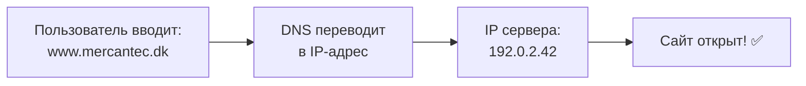

## Иерархия доменов

Домены — дерево от root до subdomains:

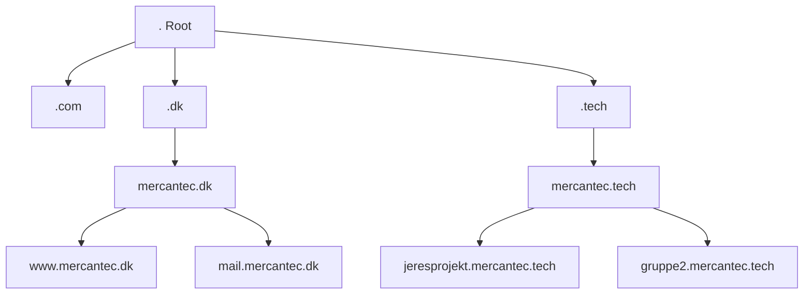

**TLD** = Top-Level Domain (например `.dk`, `.com`, `.tech`)

**SLD** = Second-Level Domain (например `mercantec`)

**Subdomain** = часть спереди (например `www`, `mail`, `jeresprojekt`)

---

# 2. DNS – Domain Name System

## Полный DNS-запрос

Когда вы вводите `jeresprojekt.mercantec.tech` в браузере:

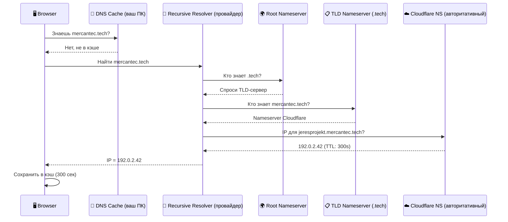

## DNS Cache и TTL

**TTL (Time To Live)** — как долго ответ DNS хранится в кэше:

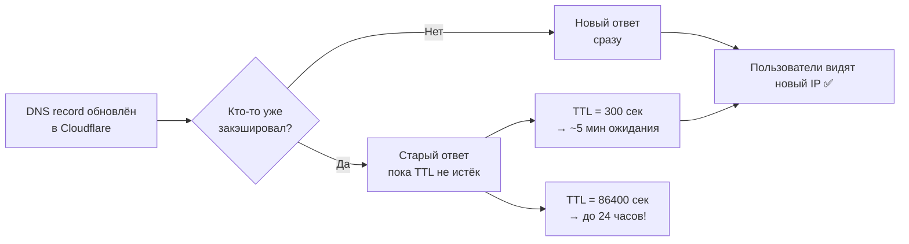

**Совет для deployment:** Поставьте TTL низко (300) **ДО** смены IP сервера — обновление быстрее!

📺 **Video: What is DNS? – NetworkChuck**

https://www.youtube.com/watch?v=NiQTs9DbtW4

---

# 3. DNS Records – подробно

## Типы records — обзор

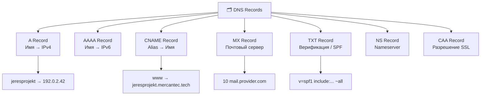

## A Record vs CNAME – когда что

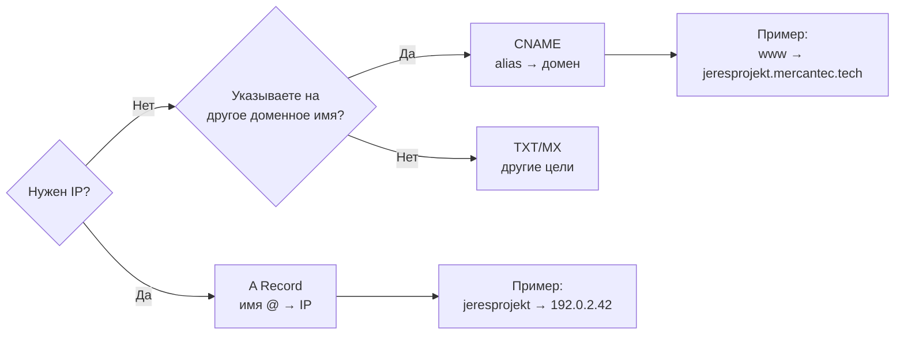

**Важно:** CNAME **нельзя** на root (`@`) — нужен A Record!

---

# 4. Cloudflare – Setup и архитектура

## Роль Cloudflare как proxy и DNS

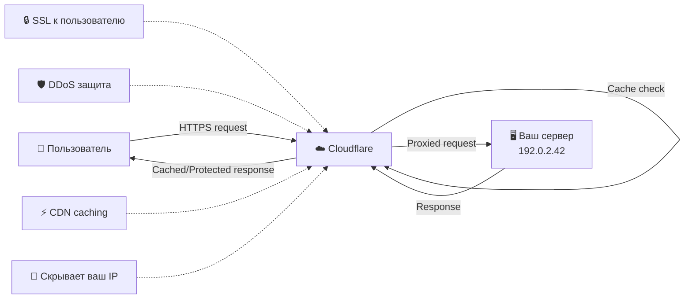

## Proxied (🟠) vs DNS Only (⚫)

```mermaid
graph TD
    subgraph Proxied ["🟠 Proxied – Orange sky"]
        P1["Трафик через Cloudflare"]
        P2["DDoS защита ✅"]
        P3["SSL к пользователям ✅"]
        P4["Ваш IP скрыт ✅"]
        P5["Caching ✅"]
    end
    subgraph DNSOnly ["⚫ DNS Only – Grey sky"]
        D1["Трафик напрямую на сервер"]
        D2["Нет DDoS защиты ❌"]
        D3["SSL настраиваете сами"]
        D4["Ваш IP виден ❌"]
        D5["Нет caching ❌"]
    end
    Rec["💡 Рекомендация: Proxied,<br>если нет веской причины для DNS Only"]
    Proxied --> Rec
    DNSOnly --> Rec
```

## Перенос nameserver: Simply → Cloudflare

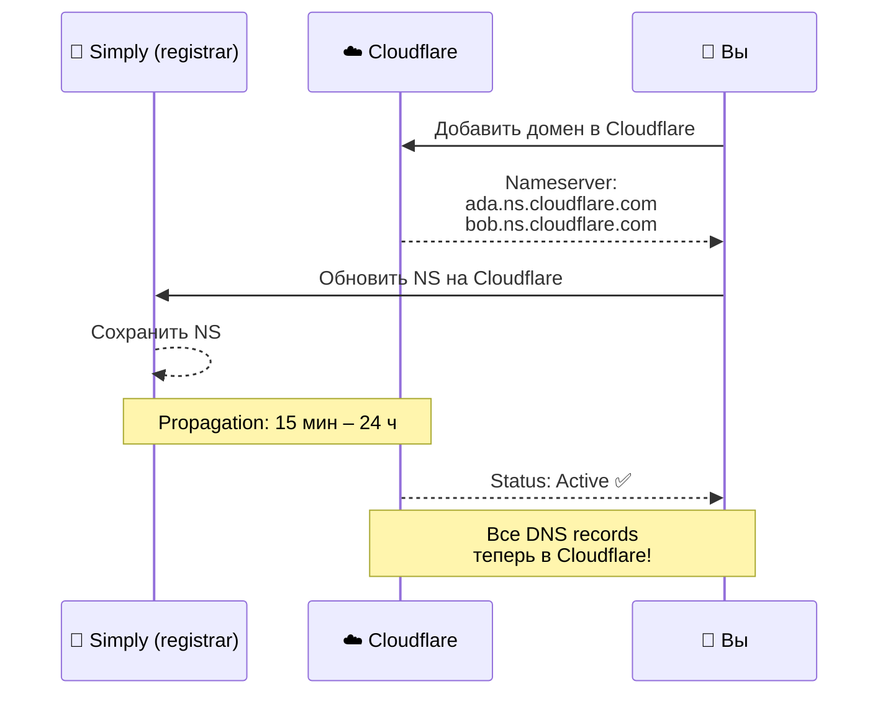

## DNS в Cloudflare – workflow

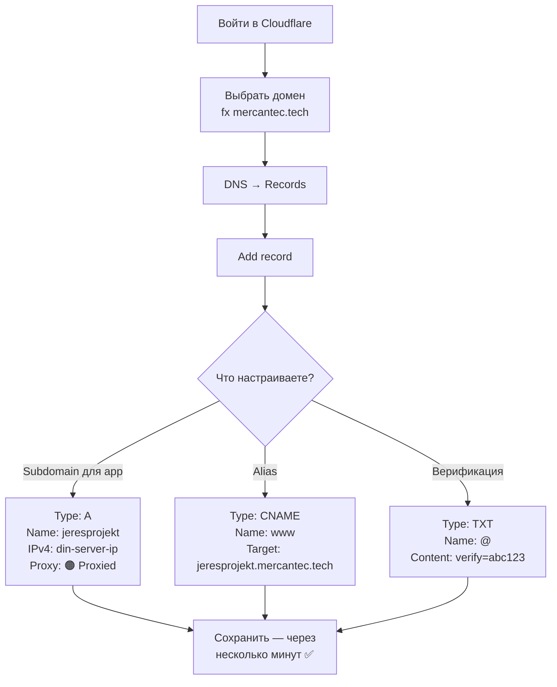

---

# 5. Firewall – UFW и iptables

## Что такое firewall?

Firewall — «охранник» сетевого трафика:

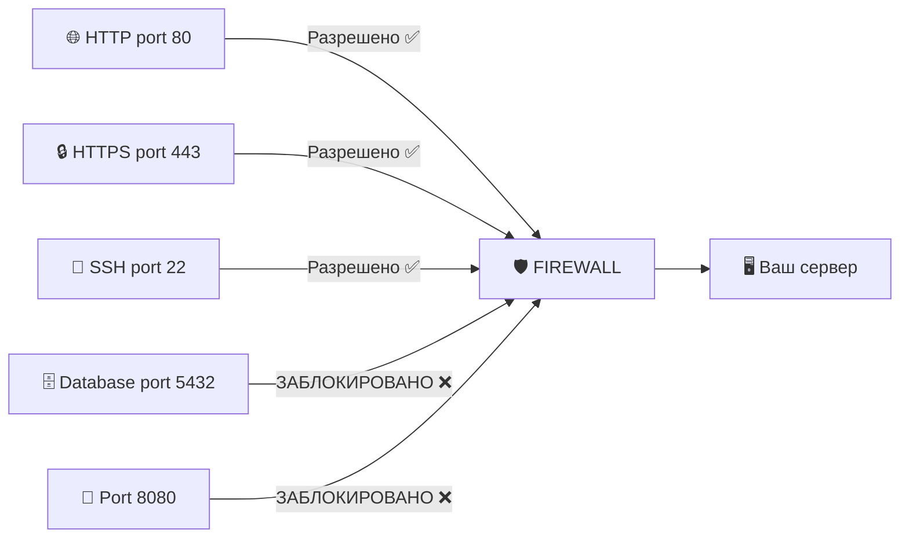

## UFW – workflow команд

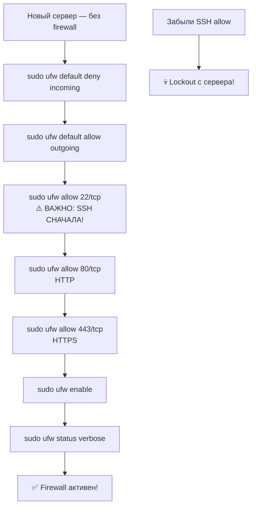

## UFW – входящий трафик

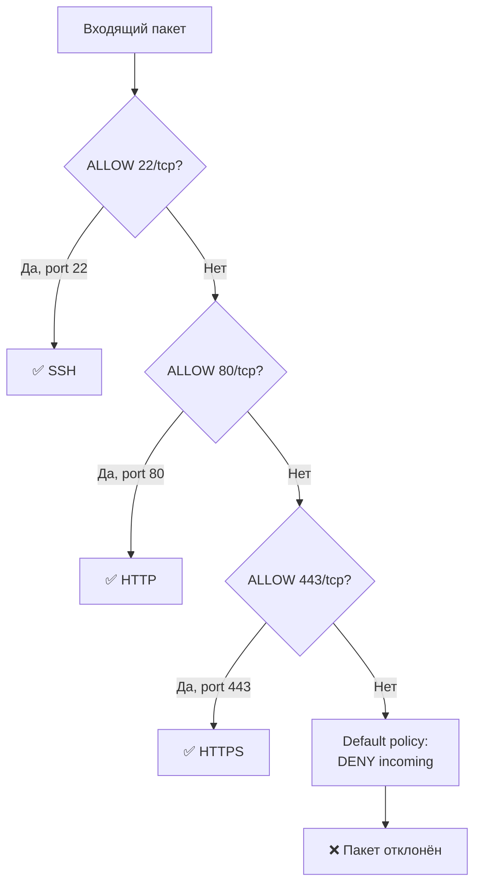

## Структура iptables (для любопытных)

UFW пишет правила iptables за вас:

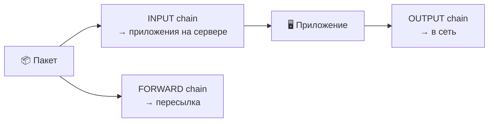

**Вывод:** UFW — простой интерфейс к iptables. Синтаксис iptables для UFW не обязателен.

📺 **Video: What is a Firewall?**

https://www.youtube.com/watch?v=kDEX1HXybrU

---

# 6. NIS2 и CRA – рамки безопасности

## NIS2 vs CRA

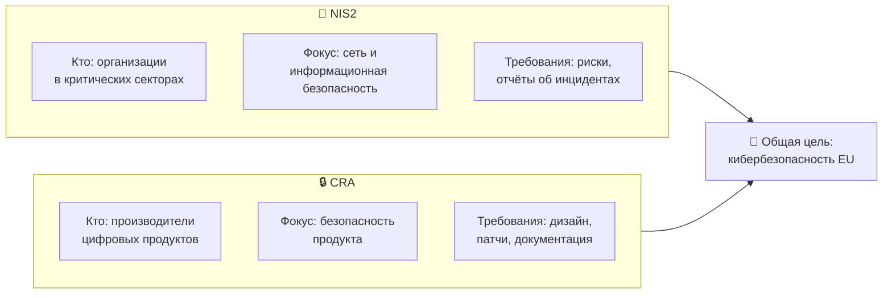

**Правило:**

- **NIS2** = безопасность **организации** (процессы, сеть, инциденты)
- **CRA** = безопасность **продукта**, который вы делаете/продаёте (код, обновления, документация)

---

# 7. Общая картина – Deployment Flow

Как связаны DNS, Cloudflare и Firewall:

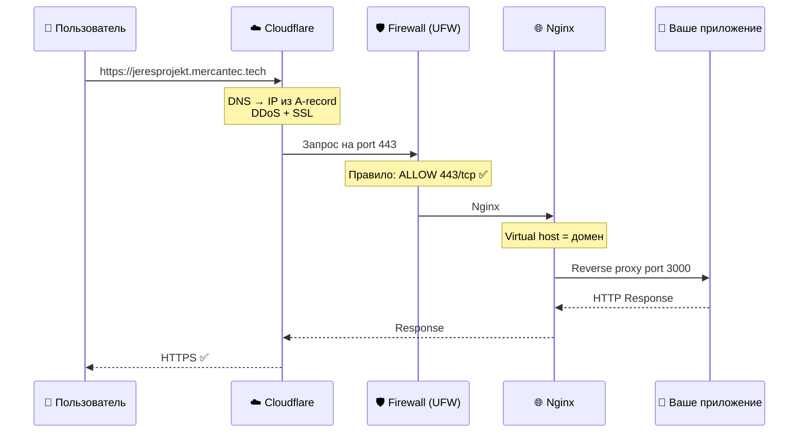

---

# 8. Отладка – «Домен не работает!»

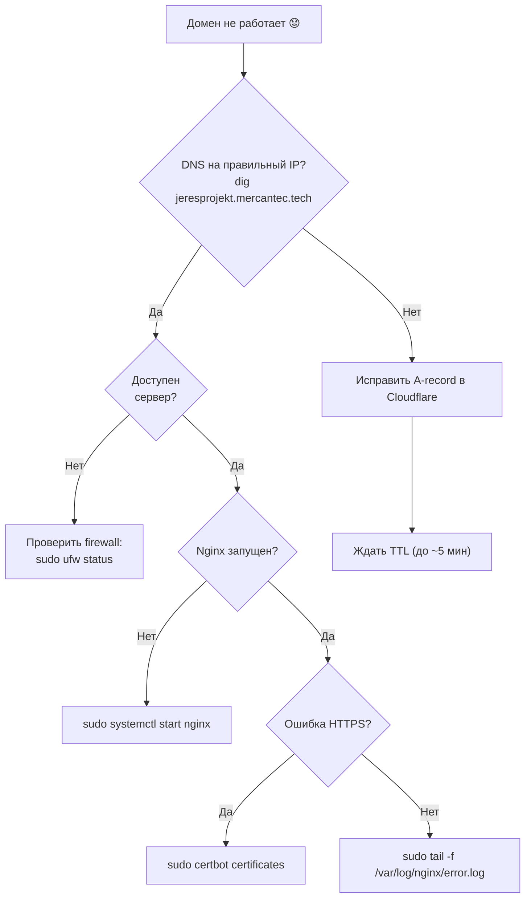

---

# ✅ Чеклист целей обучения

- [ ]  Могу объяснить, что такое домен и subdomain
- [ ]  Могу объяснить DNS-запрос (browser → resolver → авторитативный NS)
- [ ]  Могу объяснить A и CNAME и когда их использовать
- [ ]  Могу настроить A-record в Cloudflare на мой сервер
- [ ]  Понимаю разницу Proxied и DNS Only в Cloudflare
- [ ]  Могу включить UFW и базовые правила
- [ ]  Могу объяснить default deny incoming и почему SSH **до** enable
- [ ]  Могу кратко объяснить NIS2 и CRA и разницу между ними

---

## Команды (практика)

> Конфиг VM (IP, пароли, статус): `SERVER_INFO.md`

### UFW (на сервере, как `andrii`)

```bash
# Сначала allow 22, потом enable — иначе lockout SSH

sudo ufw status verbose
# Status: inactive = выключен · Status: active = правила работают

sudo ufw default deny incoming    # блокировать вход снаружи (кроме allow)
sudo ufw default allow outgoing   # исходящие (apt, DNS) — разрешены

sudo ufw allow 22/tcp             # SSH — обязательно до enable
sudo ufw allow 80/tcp             # HTTP
sudo ufw allow 443/tcp            # HTTPS

sudo ufw enable                   # включить (подтвердить y)
sudo ufw status verbose           # ожидаем: active + 22/80/443 ALLOW
```

Проверка с Mac **в новом** терминале:

```bash
ssh mercantec-andrii
```

### DNS / домен (Mac)

```bash
dig +short andrii.mercantec.tech
# tunnel: часто IP Cloudflare — нормально; A-record не настраиваем сами

curl -I https://andrii.mercantec.tech
# работает когда cloudflared + сервис на localhost:8080
```
