## Dag 4 - (11. juni) - **Web Server Setup (Nginx) + HTTPS & SSL**

- Установка и конфигурация Nginx
- Virtual hosts (server blocks)
- Раздача статических файлов
- Сертификат Let's Encrypt
- Auto-renewal
- Редирект HTTP → HTTPS
- **Цель**: «Hello World» работает и защищён HTTPS

**:learning-motives: Цели обучения на день : встреча в Teams в 08:30** :teams_icon: Докладчики @MAGS и @Paw

1. Я могу установить и настроить Nginx для раздачи статических файлов через virtual host
2. Я могу выдать и включить сертификат Let's Encrypt с auto-renewal (Certbot)
3. Я могу принудительно направлять HTTP на HTTPS и объяснить, почему это важно
- :theory-icon: Теория дня

    # День 4 – Nginx, HTTPS и SSL

  > Теория к Дню 4 (11 июня). От «пустого» сервера к веб-серверу с Nginx, Let's Encrypt и редиректом на HTTPS.
  >

    ---

    ## Nginx — что и зачем

    **Nginx** — веб-сервер и reverse proxy: принимает HTTP(S)-запросы, может отдавать статические файлы, проксировать на приложение (порт 3000, 5000 и т.д.) или балансировать нагрузку. Быстрый, популярный, настраивается через **virtual hosts** (один домен/subdomain на конфиг).

    - **Установка (Linux):** `sudo apt update`, `sudo apt install nginx`. Включить: `sudo systemctl enable nginx`, `sudo systemctl start nginx`. Проверка: `curl http://localhost` — default «Welcome to nginx!».
    - **Конфиг:** `/etc/nginx/` — `nginx.conf`, `sites-available/` (все сайты), `sites-enabled/` (symlink на активные). После правок: `sudo nginx -t`, `sudo systemctl reload nginx`.

    ---

    ## Virtual hosts и static file serving

    **Virtual host** (server block) говорит Nginx: «когда запросят *этот* домен — делай так».

    ```
    server {
        listen 80;
        server_name jeresprojekt.mercantec.tech;
        root /var/www/jeresprojekt;
        index index.html;
        location / {
            try_files $uri $uri/ =404;
        }
    }
    ```

    - `listen 80` — порт HTTP.
    - `server_name` — домен блока (должен совпадать с DNS).
    - `root` — папка со статикой (HTML, CSS, JS).
    - `index` — файл по умолчанию для `/`.
    - `try_files` — отдать файл или 404.

    Практика: `sudo mkdir -p /var/www/jeresprojekt`, положить `index.html`, конфиг в `sites-available` + symlink в `sites-enabled`.

    ---

    ## HTTPS и Let's Encrypt

    **HTTPS** — HTTP + TLS: трафик между браузером и сервером шифруется. Браузер показывает замок.

    **Let's Encrypt** — бесплатные доверенные сертификаты на 90 дней. Продление — **Certbot**.

    - Установка: `sudo apt install certbot python3-certbot-nginx`
    - Выдача: `sudo certbot --nginx -d jeresprojekt.mercantec.tech`
    - Требования: DNS указывает на **ваш** сервер, порт **80** открыт (HTTP-01 challenge), Nginx запущен.

    ---

    ## Auto-renewal

    Certbot создаёт timer/cron. Проверка:

    ```bash
    sudo certbot renew --dry-run
    ```

    ---

    ## HTTP → HTTPS redirect

    ```
    server {
        listen 80;
        server_name jeresprojekt.mercantec.tech;
        return 301 https://$server_name$request_uri;
    }
    ```

    Без redirect пользователь может случайно остаться на HTTP — пароли и cookies в открытом виде. **301** — постоянный redirect (браузер запоминает HTTPS).

    ---

    ## Цели обучения (итог)

    1. Установить Nginx и virtual host для статики.
    2. Выдать Let's Encrypt через Certbot и проверить auto-renewal.
    3. Настроить HTTP → HTTPS и объяснить зачем.

# День 4 – Nginx, HTTPS и SSL (углублённая теория)

---

## 📚 Содержание

1. Что такое веб-сервер и почему Nginx
2. Архитектура Nginx
3. Virtual Hosts (Server Blocks)
4. Static file serving и HTTP-flow
5. HTTPS, TLS и SSL
6. Let's Encrypt и Certbot
7. Auto-renewal и best practices
8. HTTP → HTTPS redirect
9. Troubleshooting
10. **Наша setup: Cloudflare Tunnel** *(отличие от учебника)*

---

## 1. Что такое веб-сервер — и почему Nginx?

**Веб-сервер** слушает порт 80 (HTTP) и/или 443 (HTTPS), принимает запросы от браузера и отвечает — статикой или через backend.

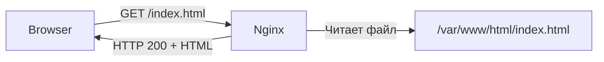

**Nginx** («engine-x»):

- **Производительность:** асинхронная event-driven модель — много соединений, мало памяти
- **Reverse proxy:** трафик на Node.js, Python, .NET и т.д.
- **Load balancing:** несколько backend-серверов
- **Let's Encrypt:** Certbot часто правит конфиг Nginx сам

**Альтернативы:** Apache (старше, тяжелее), Caddy (auto-SSL), Traefik (контейнеры).

📺 **Video: What is Nginx? – TechWorld with Nana**

https://www.youtube.com/watch?v=iInUBOVeBCc

---

## 2. Архитектура Nginx

### Master и Worker

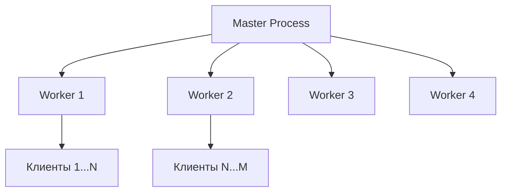

- **Master:** читает config, биндит порты, управляет workers
- **Workers:** обрабатывают запросы асинхронно

### Файловая структура (Ubuntu/Debian)

```
/etc/nginx/
├── nginx.conf              # главный конфиг
├── sites-available/        # все site-config
│   ├── default
│   └── andrii.mercantec.tech
└── sites-enabled/          # symlink → активные
    └── andrii.mercantec.tech -> ../sites-available/...
```

**Workflow:**

1. Создать config в `sites-available/`
2. `sudo nginx -t`
3. `sudo ln -s ... sites-enabled/`
4. `sudo systemctl reload nginx`

---

## 3. Virtual Hosts (Server Blocks)

```nginx
server {
    listen 80;
    server_name andrii.mercantec.tech;

    root /var/www/andrii;
    index index.html index.htm;

    location / {
        try_files $uri $uri/ =404;
    }
}
```

### Как Nginx выбирает блок

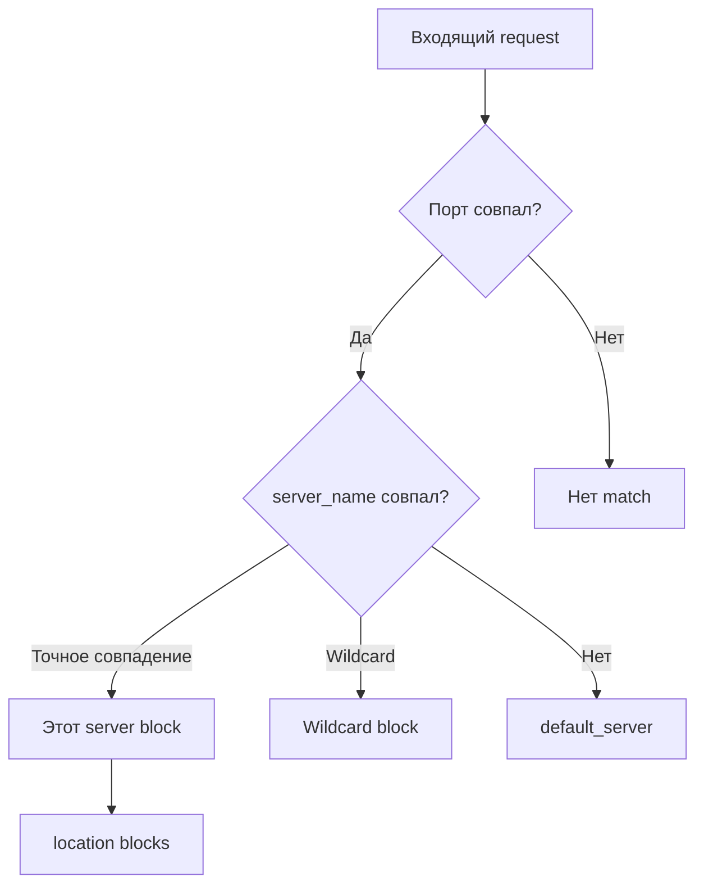

- DNS должен указывать на сервер (или tunnel — см. §10)
- `listen 80 default_server` — ловит «чужие» запросы на порт 80
- Точное `server_name` важнее wildcard

---

## 4. Static file serving

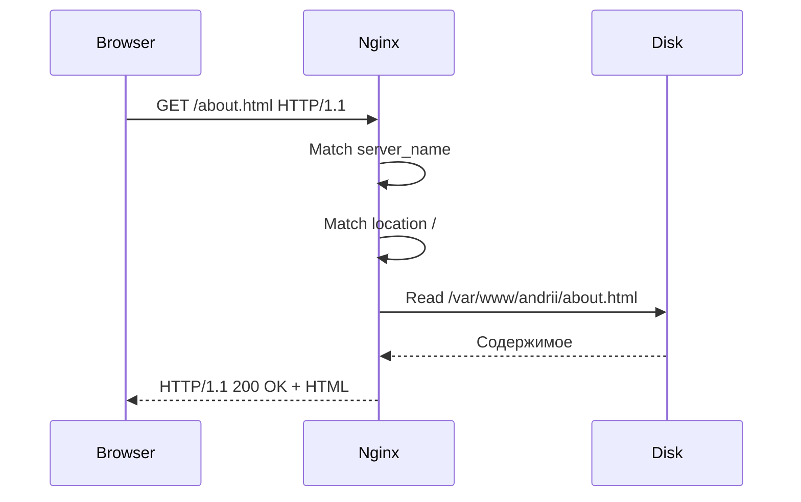

### Location blocks

```nginx
location = / { }                    # точное совпадение
location /images/ { }              # prefix (часто)
location ~* \.(jpg|jpeg|png)$ { }  # regex
```

Приоритет: `=` > prefix (длиннее) > regex (первый match)

---

## 5. HTTPS, TLS и SSL

### HTTP vs HTTPS

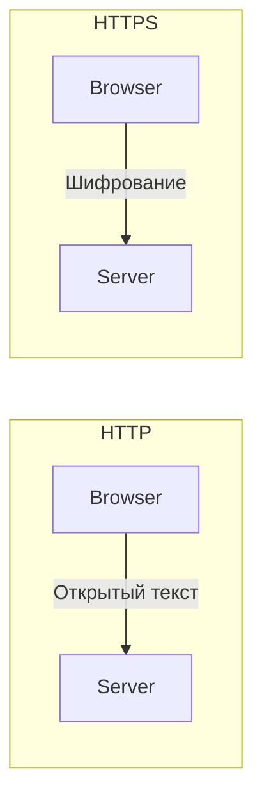

**TLS handshake** (упрощённо):

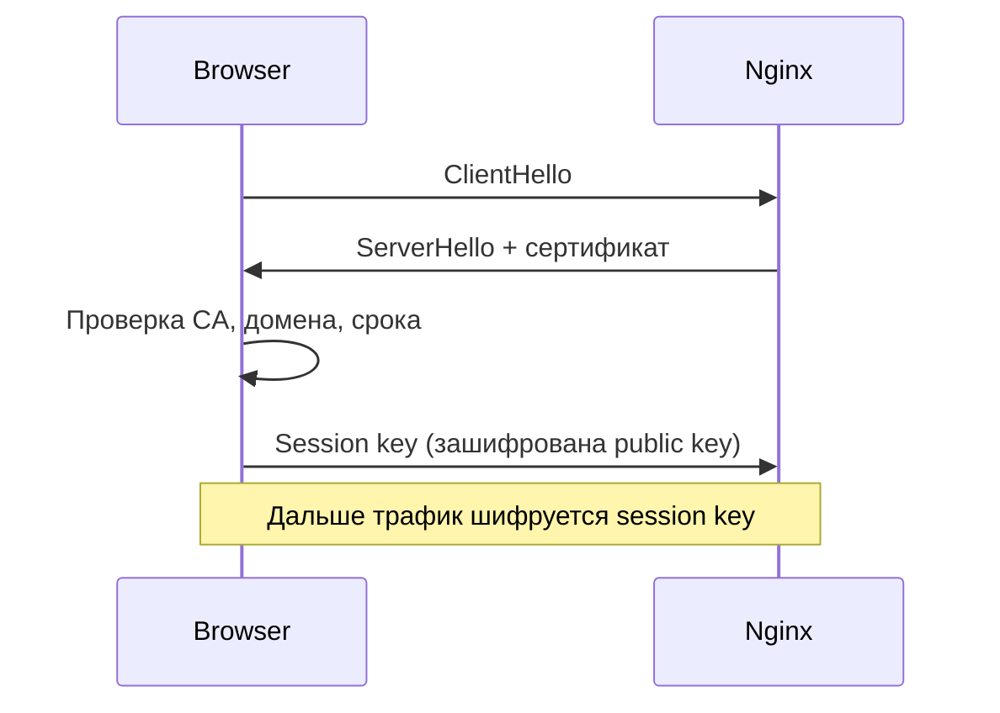

- **Сертификат** — доказательство, что public key принадлежит домену
- **CA** — доверенный издатель (Let's Encrypt)
- **Private key** — только на сервере, секрет

📺 **Video: TLS Handshake – Computerphile**

https://www.youtube.com/watch?v=86cQJ0MMses

---

## 6. Let's Encrypt и Certbot

- Срок: **90 дней** → нужен auto-renewal
- **DV** (Domain Validation) — проверка владения доменом
- Доверяют все современные браузеры

### ACME HTTP-01 challenge

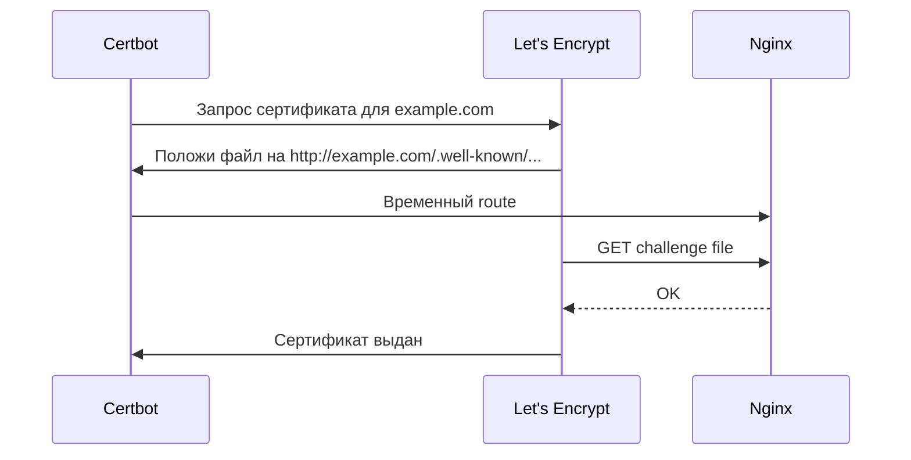

Нужно: порт 80, DNS на **IP сервера**, Nginx работает.

### После `certbot --nginx`

Certbot добавляет блок на 443 с `ssl_certificate` / `ssl_certificate_key` и часто redirect с 80.

---

## 7. Auto-renewal

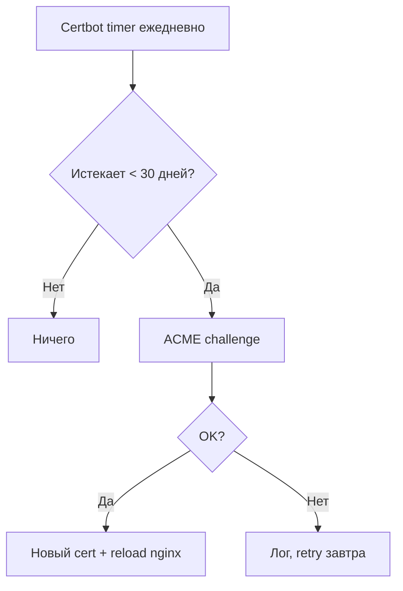

```bash
sudo systemctl status certbot.timer
sudo certbot renew --dry-run
sudo certbot certificates
```

---

## 8. HTTP → HTTPS redirect

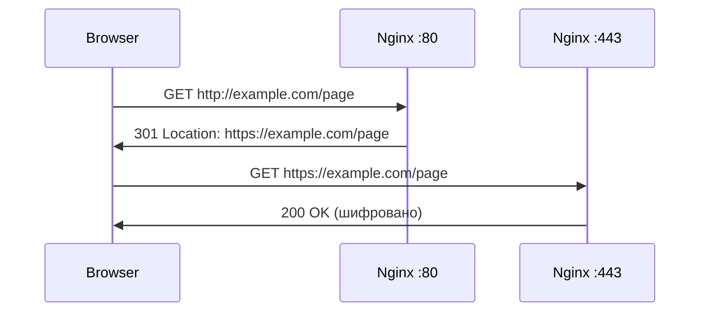

- **301** — permanent (браузер кэширует HTTPS)
- **302** — temporary (каждый раз спрашивает HTTP)

**HSTS** — заголовок «используй только HTTPS год»:

```nginx
add_header Strict-Transport-Security "max-age=31536000; includeSubDomains" always;
```

Включать только когда HTTPS стабилен на 100%.

---

## 9. Troubleshooting

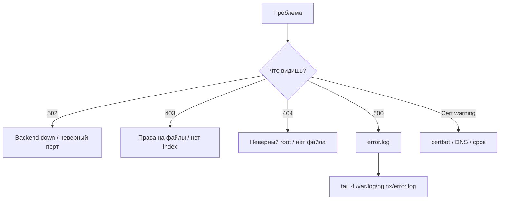

---

## 10. Наша setup: Cloudflare Tunnel *(важно)*

Учебник предполагает: **A-record → IP сервера** → Nginx на 80/443 → Certbot на VM.

**У нас (Day 2–3):**

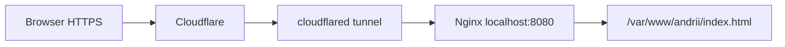

| | Учебник | Наша VM |
|---|---|---|
| Public IP | есть | **нет** |
| DNS | A → IP сервера | teacher → **Cloudflare Tunnel** |
| HTTPS снаружи | Certbot на VM | **Cloudflare** (уже замок в браузере) |
| Origin | Nginx :80 / :443 | Nginx **`127.0.0.1:8080`** (маршрут tunnel) |
| `web-test` (Day 3) | — | временный nginx в Docker → **убрать** на Day 4 |

**Вывод:**

1. **Nginx на VM** — учим и делаем (virtual host, static, systemd).
2. **Слушать 8080** — tunnel teacher уже смотрит на `http://localhost:8080`.
3. **Certbot на VM** для `andrii.mercantec.tech` обычно **не сработает** без прямого A-record на IP VM: Let's Encrypt стучится в домен → попадает в Cloudflare, не в ваш challenge на сервере. **Теорию** Certbot всё равно учим; на практике HTTPS даёт Cloudflare. Уточни у teacher, если нужен cert именно на origin.
4. **HTTP→HTTPS redirect** снаружи уже делает Cloudflare; на VM origin может оставаться HTTP на 8080 (нормально за tunnel).

### web-test vs nginx на VM (Day 3 → Day 4)

| | `web-test` (Docker) | Nginx (`apt`) |
|---|---|---|
| Где | контейнер | система + systemd |
| Конфиг | внутри image | `/etc/nginx/sites-available/` |
| После reboot | вручную (`restart=no`) | `systemctl enable nginx` |
| Цель | проверить tunnel | постоянный веб-сервер |

---

## Весь flow (учебник)

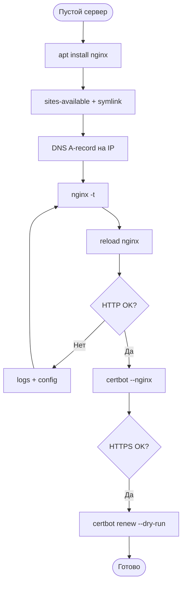

**Наш сокращённый flow:** убрать `web-test` → nginx на 8080 → Hello World → `curl` localhost + домен **200**.

---

# Чеклист целей обучения

> ✅ Практика выполнена 2026-06-08 · Certbot на VM — теория (tunnel)

- [x] Могу установить Nginx и проверить `systemctl status nginx`
- [x] Понимаю `sites-available` / `sites-enabled` и зачем `sudo nginx -t`
- [x] Создал virtual host с `root`, `index`, `try_files`
- [x] Статическая «Hello World» открывается локально и через домен
- [ ] Понимаю TLS handshake и роль CA / Let's Encrypt *(теория)*
- [ ] Знаю команды Certbot и `renew --dry-run` *(теория; на VM не запускали)*
- [ ] Могу объяснить HTTP → HTTPS redirect (301) и HSTS *(теория)*
- [x] Понимаю отличие **tunnel + Cloudflare HTTPS** от **Certbot на VM**
- [x] Убрал временный `web-test` после перехода на nginx на хосте

---

## Команды (практика)

> Домен: `andrii.mercantec.tech` · SSH: `mercantec-andrii` · конфиг: `SERVER_INFO.md`  
> Tunnel → `localhost:8080` · **не** открывать 8080 в UFW · postgres/cloudflared не трогать

**Порядок шагов:** 0 → 1 → 2 → 3 → 4 ✅ (2026-06-08). Шаг 5–6 — теория / если teacher даст A-record на IP VM.

> **`nginx -t` без sudo** → `Permission denied` · всегда **`sudo nginx -t`**

---

### 0. Подготовка — убрать web-test (Day 3)

Временный nginx в Docker занимает **8080**. Nginx на хосте тоже должен слушать 8080 — порт один.

```bash
docker ps --filter name=web-test
# пусто = уже убран · Up = нужно stop/rm ниже

docker stop web-test
# остановить контейнер — освободить порт 8080

docker rm web-test
# удалить контейнер (image nginx:alpine на диске останется)

ss -tlnp | grep 8080
# нет вывода = порт 8080 свободен · OK перед шагом 3
```

---

### 1. Установить Nginx на сервере (`apt`)

Nginx ставится **на Ubuntu**, не в Docker. После установки default-сайт слушает **порт 80**.

```bash
sudo apt update
# обновить списки пакетов (как перед любым apt install)

sudo apt install -y nginx
# установить nginx с Ubuntu repos · -y = без вопросов

sudo systemctl enable nginx
# автозапуск nginx после reboot VM

sudo systemctl start nginx
# запустить службу сейчас

sudo systemctl status nginx
# ожидаем: active (running) · q = выход

curl -I http://127.0.0.1/
# проверка default site на порту 80 · HTTP/1.1 200 OK · Server: nginx

sudo nginx -t
# тест синтаксиса конфига · syntax is ok · test is successful

which nginx
# /usr/sbin/nginx — бинарник на хосте, не в контейнере
```

**Важно:** порт **80** ≠ **8080**. Tunnel teacher смотрит на **8080** — настраивается в шаге 3.

---

### 2. Static site — Hello World

Папка со статикой + `index.html`. Nginx отдаёт файлы из `root`.

```bash
sudo mkdir -p /var/www/andrii
# создать папку сайта (-p = создать родителей если нет)

sudo chown -R www-data:www-data /var/www/andrii
# владелец www-data = пользователь, под которым работает nginx
# без этого возможен 403 Forbidden

echo '<!DOCTYPE html><html><head><title>Hello</title></head><body><h1>Hello World</h1><p>andrii.mercantec.tech</p></body></html>' | sudo tee /var/www/andrii/index.html
# записать index.html · tee = вывод в файл + на экран

ls -la /var/www/andrii/
# должен быть index.html · владелец www-data
```

---

### 3. Virtual host на порту 8080 (tunnel origin)

**Server block** — конфиг «когда запросят этот домен — отдай файлы из `/var/www/andrii`».

Teacher: tunnel → `http://localhost:8080` → слушаем **8080** на localhost (IPv4 + IPv6).

```bash
sudo tee /etc/nginx/sites-available/andrii.mercantec.tech <<'EOF'
server {
    listen 127.0.0.1:8080;
    listen [::1]:8080;
    server_name andrii.mercantec.tech;

    root /var/www/andrii;
    index index.html;

    location / {
        try_files $uri $uri/ =404;
    }
}
EOF
# sites-available = черновик конфига
# listen 127.0.0.1:8080 — только localhost, не весь интернет
# listen [::1]:8080 — IPv6 (cloudflared может ходить сюда)
# server_name — домен этого блока
# root — папка со статикой
# try_files — найти файл или 404

sudo ln -sf /etc/nginx/sites-available/andrii.mercantec.tech /etc/nginx/sites-enabled/
# symlink = включить сайт · -f = перезаписать если был

# опционально: убрать default «Welcome to nginx» на :80 (для tunnel не обязательно)
# sudo rm /etc/nginx/sites-enabled/default

sudo nginx -t
# проверить конфиг перед reload

sudo systemctl reload nginx
# применить конфиг без остановки nginx (мягче чем restart)

ss -tlnp | grep nginx
# ожидаем LISTEN 127.0.0.1:8080 и [::1]:8080
```

**Строки конфига:**

| Директива | Значение |
|-----------|----------|
| `listen 127.0.0.1:8080` | HTTP только с localhost IPv4 |
| `listen [::1]:8080` | то же для IPv6 |
| `server_name` | `andrii.mercantec.tech` |
| `root` | `/var/www/andrii` |
| `try_files` | файл → папка → 404 |

---

### 4. Проверка

```bash
# --- на VM ---
curl -I http://127.0.0.1:8080/
# HTTP/1.1 200 OK · твой Hello World (не default Welcome)

curl -I -g http://[::1]:8080/
# -g = отключить glob в curl · проверка IPv6 localhost

curl -I http://127.0.0.1/
# всё ещё 200 — default site на :80 (можно оставить)

docker ps --filter name=cloudflared
# STATUS = Up · без --network host был бы 502

# --- с Mac (новый терминал) ---
curl -I https://andrii.mercantec.tech
# HTTP/2 200 — HTTPS от Cloudflare · контент от nginx :8080
# 502 = нет сервиса на 8080 или cloudflared down
```

---

### 5. Certbot / Let's Encrypt (учебник — A-record на IP сервера)

**На нашей VM с tunnel — обычно не запускать** без teacher: DNS → Cloudflare, не IP VM.

```bash
sudo apt install -y certbot python3-certbot-nginx
# certbot + плагин для автоконфига nginx

# стандарт курса (сервер с public IP, A-record на VM):
# sudo certbot --nginx -d andrii.mercantec.tech
# спросит email · согласие ToS · redirect HTTP→HTTPS — Yes (рекомендуется)

sudo certbot renew --dry-run
# тест auto-renewal без реального продления (если cert уже есть)

sudo certbot certificates
# список сертификатов и даты истечения

sudo systemctl status certbot.timer
# systemd timer для автопродления каждые ~90 дней
```

**Почему HTTPS уже работает у нас:** браузер → Cloudflare (TLS) → tunnel → HTTP `localhost:8080` → nginx. Certbot на VM — **другой слой** (сертификат на origin). Для устного — объясни оба варианта.

---

### 6. HTTP → HTTPS redirect (конфиг — сценарий с Certbot)

Пример **после** `certbot --nginx` или вручную. С tunnel redirect снаружи делает Cloudflare.

```nginx
# server block :80 — только редирект
server {
    listen 80;
    server_name andrii.mercantec.tech;
    return 301 https://$host$request_uri;
    # 301 = permanent · браузер запомнит HTTPS
}

# server block :443 — HTTPS + статика
server {
    listen 443 ssl http2;
    server_name andrii.mercantec.tech;
  # ssl_certificate /etc/letsencrypt/live/andrii.mercantec.tech/fullchain.pem;
  # ssl_certificate_key /etc/letsencrypt/live/andrii.mercantec.tech/privkey.pem;
    root /var/www/andrii;
    index index.html;
    location / {
        try_files $uri $uri/ =404;
    }
}
```

---

### 7. Логи и отладка

```bash
sudo nginx -t
# первое при любой ошибке — синтаксис конфига

sudo tail -20 /var/log/nginx/error.log
# ошибки nginx (bind failed, permission denied)

sudo tail -20 /var/log/nginx/access.log
# кто и что запрашивал (200, 404, …)

sudo ss -tulpn | grep nginx
# какие порты слушает nginx (80, 8080, 443)

dig +short andrii.mercantec.tech
# IP Cloudflare — нормально для tunnel · не IP VM 10.133.51.122

docker logs cloudflared --tail 20
# ERR dial [::1]:8080 refused = нет nginx на 8080
```

---

### Типичные ошибки (наша setup)

| Симптом | Причина | Действие |
|--------|---------|----------|
| 502 на домене | ничего на 8080 / cloudflared down | шаг 3 · `docker ps` cloudflared |
| 502 после nginx | слушает только :80 | `listen 127.0.0.1:8080` в site config |
| `bind() failed` | web-test или другой процесс на 8080 | `ss -tlnp \| grep 8080` · stop контейнер |
| 403 Forbidden | права на `/var/www/andrii` | `chown www-data:www-data` |
| 404 Not Found | нет index.html или неверный `root` | `ls /var/www/andrii/` |
| certbot fail | DNS не на IP VM | tunnel — спросить teacher |

---

### Nginx — шпаргалка

```bash
sudo systemctl status nginx       # running?
sudo systemctl reload nginx       # применить config без простоя
sudo systemctl restart nginx      # полный перезапуск (если reload не помог)
sudo nginx -t                     # тест синтаксиса — всегда перед reload
ls -la /etc/nginx/sites-enabled/  # какие сайты активны
cat /etc/nginx/sites-available/andrii.mercantec.tech   # посмотреть конфиг
```
