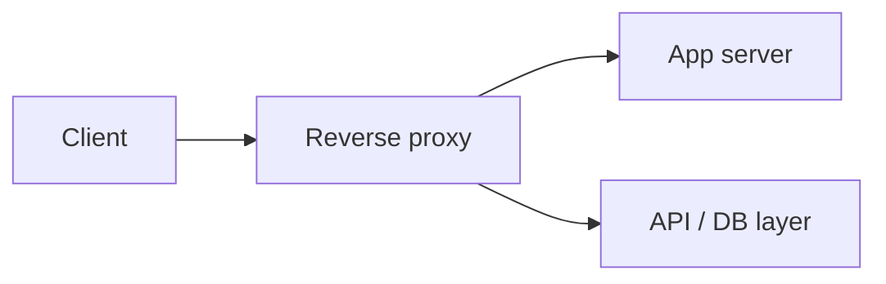
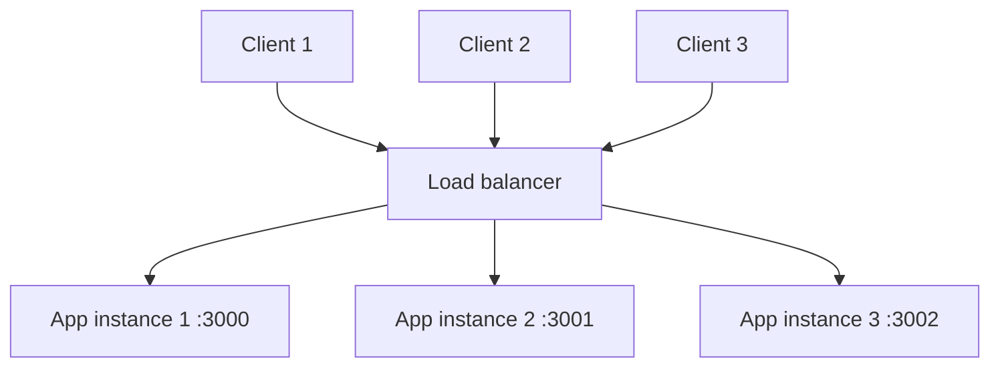
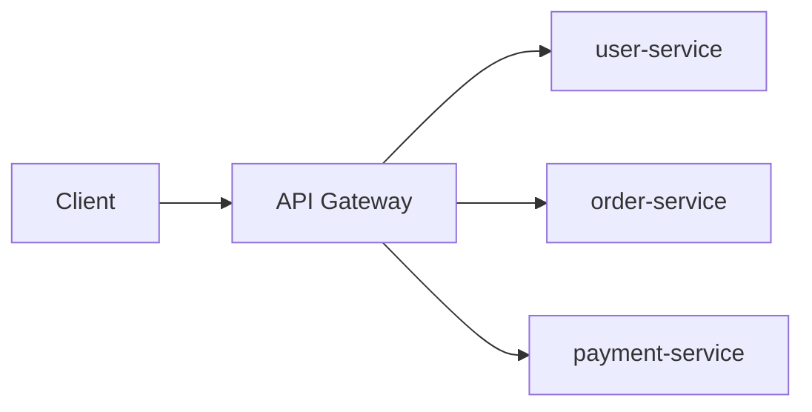
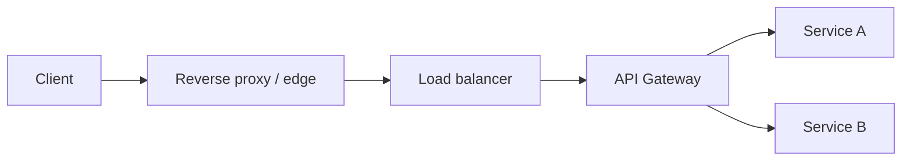
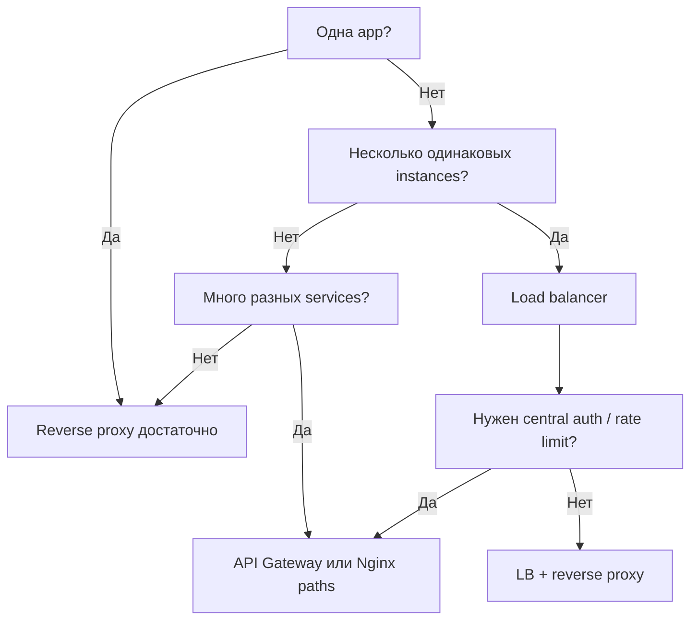
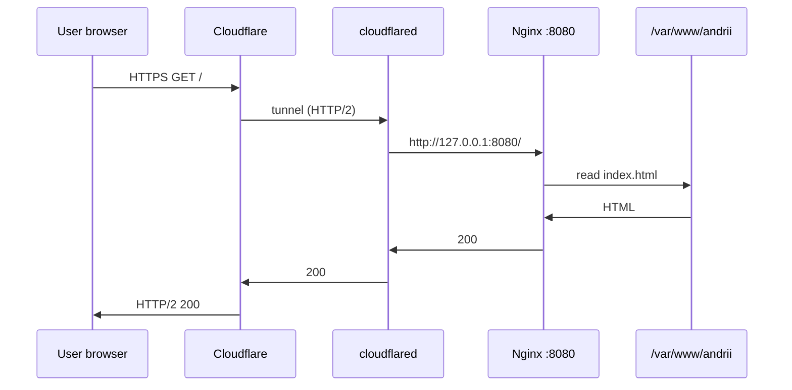
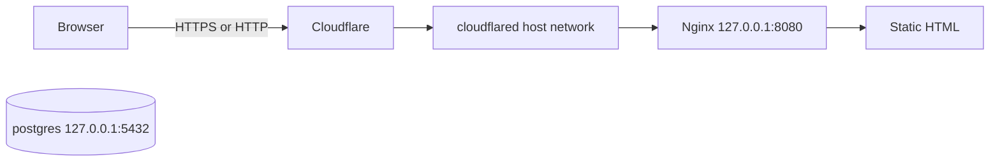

## День 5 — (12 июня) — **Release, reverse proxy, load balancing и API gateway**

- Тест полного setup
- Документирование процесса
- Рефлексия над обучением
- Подготовка к неделе 2
- **Цель**: у вас работающий setup и вы отрефлексировали процесс

**:learning-motives: Цели обучения на день : встреча в Teams в 08:30** :teams_icon: Докладчик @MAGS

1. Я могу задокументировать весь процесс настройки от сервера до HTTPS в техническом обзоре
2. Я могу назвать главные улучшения безопасности, которые мы внедрили
3. Я могу объяснить, какие части курса были самыми сложными — и почему
4. Я могу объяснить, что такое reverse proxy, load balancer и API gateway — и как Nginx в это вписывается

- :theory-icon: Теория дня

# День 5 – Reverse Proxy, Load Balancing, API Gateway & Release

> Теория к Дню 5 (12 июня). Закрепление недели 1: reverse proxy, балансировка, API gateway, **документация** и **рефлексия** перед неделя 2 (.NET app, Docker Compose, CI/CD).

---

## 📚 Содержание

1. Reverse proxy — идея и use cases
2. Load balancing — масштаб и доступность
3. API Gateway — центральная точка для API
4. Как три концепции работают вместе
5. Nginx как reverse proxy и load balancer
6. Примеры API gateway (Kong, Traefik, cloud)
7. Когда что выбирать
8. Документация и технический обзор *(практика Day 5)*
9. Рефлексия и улучшения безопасности
10. **Наша setup: что уже есть и что дальше** *(andrii.mercantec.tech)*

---

## 1. Reverse proxy — базовая идея

**Reverse proxy** — сервер **между клиентом и backend**. Клиент говорит только с proxy; не знает, кто реально отдаёт контент.



### Зачем

| Задача | Как помогает reverse proxy |
|--------|---------------------------|
| **Один вход** | Статика, app :3000, API :8080 — один домен, разные `location` |
| **SSL termination** | HTTPS на proxy; внутри может быть HTTP (или снова HTTPS) |
| **Скрыть backend** | App/DB не торчат наружу — меньше attack surface |
| **Кэш и сжатие** | Nginx кэширует статику, gzip — меньше нагрузка на app |

### Nginx — минимальный пример

```nginx
location /api/ {
    proxy_pass http://127.0.0.1:5000/;
    proxy_set_header Host $host;
    proxy_set_header X-Real-IP $remote_addr;
    proxy_set_header X-Forwarded-For $proxy_add_x_forwarded_for;
    proxy_set_header X-Forwarded-Proto $scheme;
}
```

| Директива | Назначение |
|-----------|------------|
| `proxy_pass` | Куда переслать request (backend URL) |
| `Host` | Оригинальный host — для redirects и routing в app |
| `X-Real-IP` | IP клиента (иначе app видит только 127.0.0.1) |
| `X-Forwarded-For` | Цепочка IP через proxy |
| `X-Forwarded-Proto` | `http` или `https` — app знает, как пришёл пользователь |

📺 **Video: What is a Reverse Proxy? – IBM Technology**

[https://www.youtube.com/watch?v=4NB4N7l9F2Y](https://www.youtube.com/watch?v=4NB4N7l9F2Y)

---

## 2. Load balancing — масштаб и высокая доступность

**Load balancer** распределяет входящий трафик между **несколькими экземплярами** одного сервиса — ни один сервер не становится единственной «бутылочной горлышком».



### Алгоритмы

| Алгоритм | Описание |
|----------|----------|
| **Round-robin** | По очереди на каждый server |
| **Least connections** | На server с меньшим числом активных соединений |
| **IP hash** | Один клиент → один server (sticky sessions без session store) |
| **Weighted** | Более мощный server получает больше трафика |

### Nginx upstream

```nginx
upstream app_backend {
    least_conn;
    server 127.0.0.1:3000;
    server 127.0.0.1:3001;
    server 127.0.0.1:3002;
}

server {
    location / {
        proxy_pass http://app_backend;
        proxy_set_header Host $host;
        proxy_set_header X-Real-IP $remote_addr;
        proxy_set_header X-Forwarded-Proto $scheme;
    }
}
```

**Health checks:** в open-source Nginx нет автоматического «выключить мёртвый backend» — в Nginx Plus или оркестраторе (K8s, Dokploy). Без health check трафик может идти на упавший instance, пока его не уберут вручную.

### Зачем

- **Scaling:** больше трафика → больше контейнеров/процессов за одним адресом
- **Availability:** один instance упал — остальные работают
- **неделя 2+:** несколько pod'ов / контейнеров — load balancer часто встроен в платформу

---

## 3. API Gateway — центральный вход для API

**API Gateway** — специализированная **точка входа** для API: клиент бьёт в один endpoint, gateway маршрутизирует на microservices и может делать auth, rate limiting, logging.



### Типичные задачи

| Задача | Пример |
|--------|--------|
| **Routing** | `/users` → user-service, `/orders` → order-service |
| **Auth** | API keys, JWT, OAuth — только валидные запросы дальше |
| **Rate limiting** | Max N requests/min per IP/user |
| **Logging / metrics** | Центральный лог всех API-вызовов |
| **Transformation** | BFF: несколько backend → один ответ клиенту |

### Nginx как «лёгкий» gateway

```nginx
location /api/v1/users {
    proxy_pass http://127.0.0.1:4000;
}
location /api/v1/orders {
    proxy_pass http://127.0.0.1:5000;
}
```

Это **routing по path** — не полноценный gateway (нет встроенного JWT plugin, dashboard). Для маленьких проектов часто **достаточно**.

### Dedicated products

| Open source | Cloud |
|-------------|-------|
| Kong, Tyk, Traefik | AWS API Gateway |
| Nginx API Gateway (enterprise) | Azure API Management, Apigee |

**На курсе:** понять **идею**; полный Kong — overkill для одного .NET API.

---

## 4. Как три концепции работают вместе

В production часто все три слоя:



| Слой | Роль |
|------|------|
| **Reverse proxy (edge)** | HTTPS, caching, базовая безопасность |
| **Load balancer** | Несколько одинаковых app instances |
| **API Gateway** | Много разных services, auth, throttling |

На **маленьком проекте** один **Nginx** может совмещать все три роли частично.

---

## 5. Nginx в контексте курса

### Reverse proxy для одной .NET app (неделя 2 preview)

```nginx
server {
    listen 127.0.0.1:8080;
    listen [::1]:8080;
    server_name andrii.mercantec.tech;

    root /var/www/andrii;
    index index.html;

    # Статика — напрямую nginx
    location / {
        try_files $uri $uri/ =404;
    }

    # API — proxy на Kestrel
    location /api/ {
        proxy_pass http://127.0.0.1:5000/;
        proxy_http_version 1.1;
        proxy_set_header Host $host;
        proxy_set_header X-Real-IP $remote_addr;
        proxy_set_header X-Forwarded-For $proxy_add_x_forwarded_for;
        proxy_set_header X-Forwarded-Proto $scheme;
    }
}
```

**Flow:** Browser → Cloudflare HTTPS → tunnel → nginx `:8080` → `/` static · `/api/` → Kestrel `:5000`.

### Сравнение: Day 4 vs Day 5+

| | Day 4 (сейчас) | Day 5+ / неделя 2 |
|---|----------------|----------------|
| Nginx role | Static file server | **Reverse proxy** + static |
| Backend | только `root` / HTML | .NET Kestrel на `:5000` |
| Load balance | 1 instance | теория; позже — несколько контейнеров |
| API gateway | — | простой routing `/api/` через nginx |

---

## 6. Когда что выбирать?

| Потребность | Reverse proxy | Load balancer | API gateway |
|-------------|:-------------:|:-------------:|:-----------:|
| Скрыть internal servers | ✅ | частично | косвенно |
| Распределить трафик | ограничено | ✅ | внутри может |
| Central auth / throttling | вручную | ❌ | ✅ |
| Routing many services | paths/hosts | ❌ | ✅ |
| Cache static | ✅ | ❌ | некоторые |



---

## 7. Документация — технический обзор *(практика Day 5)*

Day 5 просит **задокументировать** путь от сервера до HTTPS. Не обязательно 50 страниц — нужно **что** и **как связано**.

### Что включить

**1. Компоненты**

| Где | Что | Порт / путь |
|-----|-----|-------------|
| Host Ubuntu | SSH, UFW, Docker Engine, Nginx | 22, 80, 127.0.0.1:8080 |
| Docker | `postgres`, `cloudflared` | 127.0.0.1:5432, host network |
| Cloudflare | DNS, TLS edge, Tunnel | `andrii.mercantec.tech` |
| Static | Hello World | `/var/www/andrii/index.html` |

**2. Request flow**



**3. Конфигурация (пути, не секреты)**

| Файл | Назначение |
|------|------------|
| `/etc/nginx/sites-available/andrii.mercantec.tech` | Virtual host |
| `/etc/nginx/sites-enabled/` | Symlink — активные сайты |
| `~/.ssh/authorized_keys` | SSH keys only |
| Docker volume `pgdata` | Данные PostgreSQL |
| `SERVER_INFO.md` (local) | Пароли, token tunnel — **не в git** |

**4. Безопасность (краткий список для рефлексии)**

| Категория | Что сделали |
|-----------|-------------|
| **Access** | SSH key-only, UFW 22/80/443, VPN/Twingate к VM |
| **Traffic** | HTTPS на edge (Cloudflare); origin HTTP за tunnel |
| **Services** | Postgres `127.0.0.1:5432`; app за nginx, не наружу |
| **Secrets** | Пароли в env / SERVER_INFO, не в git |

**5. Следующие шаги (неделя 2)**

- .NET app + `proxy_pass` на Kestrel
- Docker Compose для app
- CI/CD (GitHub Actions)
- Опционально: второй app instance → upstream load balance

---

## 8. Рефлексия — вопросы для Teams / сдачи

Ответь **конкретно** (с примерами из своего деплоя):

1. **Что прошло хорошо?** *(ex: tunnel заработал после `--network host` + `--protocol http2`)*
2. **Что было сложнее всего?** *(ex: 502 пока web-test занимал 8080; IPv6 `[::1]:8080`)*
3. **Почему именно это было сложно?** *(ex: localhost в Docker ≠ localhost на host)*
4. **Какие security improvements самые важные?** *(минимум 3 с обоснованием)*
5. **Как масштабировать при 10× трафике?** *(больше app instances + upstream; Cloudflare caching static)*
6. **Что бы сделал иначе?** *(ex: сразу nginx на host вместо web-test)*

Шаблон для `DEPLOY_RESULTS_LOG.md` / README / Teams — см. **Команды §1**.

---

## 9. Наша setup — итог недели 1



| Проверено | Результат |
|-----------|-----------|
| `curl -I http://127.0.0.1:8080/` | 200 |
| `curl -I https://andrii.mercantec.tech` | HTTP/2 200 |
| `curl -I http://andrii.mercantec.tech` | 200 (Always Use HTTPS off) |
| `docker ps` | postgres, cloudflared Up |
| UFW | 22, 80, 443 — **не** 5432, 8080 |

**Nginx сегодня:** static server на `:8080`.  
**Nginx завтра (неделя 2):** **reverse proxy** — `/` static, `/api/` → .NET.

**Reverse proxy уже частично есть:** Cloudflare Tunnel тоже proxy между интернетом и твоим origin — но **nginx reverse proxy** нужен для routing внутри VM (static vs app vs несколько services).

---

## 10. Полный flow (учебник vs наша VM)

| | Учебник | Наша VM |
|---|---------|---------|
| Entry | Nginx :443 + Certbot | Cloudflare + tunnel |
| Reverse proxy | Nginx → app :3000 | Nginx → static *(скоро → Kestrel)* |
| Load balance | upstream 3× app | 1 instance (теория Day 5) |
| API gateway | path routing | `/api/` в nginx (неделя 2) |
| HTTPS | Let's Encrypt на VM | Cloudflare edge |

---

# Чеклист целей обучения

> ✅ Day 5 · 2026-06-09 · test setup прогнан · `/api/` в nginx (502 до .NET)

- [x] Могу объяснить **reverse proxy** и зачем nginx перед app  
  → Клиент бьёт в одну дверь (CF + nginx); app на `:5000` спрятан. Nginx: `/` static, `/api/` → Kestrel. Tunnel уже на `:8080`.

- [x] Могу объяснить **load balancing** (round-robin, least_conn)  
  → **Round-robin:** по очереди на каждый server. **least_conn:** куда меньше соединений. `upstream` = **копии одного app** (:3000–3002), не разные проекты. У меня 1 instance — upstream не нужен.

- [x] Могу объяснить **API gateway** vs простой nginx routing  
  → Gateway: одна URL + auth + rate limit + routing на microservices. Nginx: только **routing** (`location /api/`). Для одного .NET auth в app; Kong — overkill.

- [x] Заполнил **технический обзор** (компоненты + flow + security)  
  → См. § «Day 5 — ответы» ниже · `DEPLOY_RESULTS_LOG.md`

- [x] Ответил на **вопросы рефлексии** (сложное / хорошее / security)  
  → См. § «Рефлексия» ниже

- [x] Прогнал **test af komplet setup** (curl, docker, nginx)  
  → `docker ps` Up · nginx active · `curl :8080` 200 · UFW 22/80/443 · домен 200 (иногда 530 — tunnel)

- [x] Понимаю **следующий шаг**: .NET + `location /api/` + proxy headers  
  → `location /api/` **уже в nginx**; headers Host, X-Real-IP, X-Forwarded-For, X-Forwarded-Proto. Осталось: запустить .NET на `:5000`.

- [x] Готов к **неделя 2** (app container, Compose, CI/CD)  
  → Фундамент готов: VM, DB, tunnel, nginx. Дальше: .NET → Docker → Compose → GitHub Actions.

---

## Команды (практика)

> Домен: `andrii.mercantec.tech` · SSH: `mercantec-andrii` · секреты: `SERVER_INFO.md`  
> Day 5 = **проверка setup + документирование** · `location /api/` уже в nginx (502 до .NET на :5000)

---

### 1. Test af komplet setup (verification)

Полная проверка того, что построили в Days 1–4:

```bash
# --- на VM ---
docker ps
# ожидаем: postgres Up · cloudflared Up

systemctl status nginx
# active (running)

curl -I http://127.0.0.1:8080/
# HTTP/1.1 200 · Hello World

curl -I -g http://[::1]:8080/
# IPv6 localhost — cloudflared может идти сюда

curl -I http://127.0.0.1/
# default nginx :80 — опционально 200 Welcome

sudo ufw status
# 22, 80, 443 ALLOW · 5432 и 8080 НЕ открыты наружу

docker exec -it postgres psql -U andrii -d postgres -c 'SELECT 1;'
# ?column? = 1 · БД жива

# --- с Mac ---
curl -I https://andrii.mercantec.tech
# HTTP/2 200 · server: cloudflare

curl -I http://andrii.mercantec.tech
# 200 или 301→https — зависит от Always Use HTTPS в CF
```

Запиши результаты в `docs/DEPLOY_RESULTS_LOG.md` (секция Day 5).

---

### 2. Документация — черновик технического обзора

Скопируй в свой репо / Teams (без паролей и token):

```bash
# на Mac в папке проекта — проверить что в git нет секретов
grep -r "POSTGRES_PASSWORD\|tunnel.*token" docs/ README.md 2>/dev/null
# пусто = OK · пароли только в SERVER_INFO.md (gitignored)

cat docs/DEPLOY_RESULTS_LOG.md
# уже есть Day 1–4 — допиши Day 5 verification

cat docs/SESSION_HANDOFF.md
# handoff для следующей сессии
```

**Мини-шаблон** (добавь в DEPLOY_RESULTS_LOG или README):

```markdown
## Architecture (Week 1)

- VM: andrii-deploy (private IP, no public IP)
- Edge: Cloudflare Tunnel + HTTPS
- Web: Nginx on host → 127.0.0.1:8080 → static /var/www/andrii
- DB: PostgreSQL in Docker → 127.0.0.1:5432
- Security: SSH keys, UFW, DB localhost-only, secrets not in git

## Request flow

Browser → Cloudflare (TLS) → cloudflared → nginx:8080 → static files

## Next (Week 2)

- .NET API on :5000
- nginx location /api/ → proxy_pass Kestrel
```

---

### 3. Рефлексия — заполнить (локально или в git)

В `MY_NOTES.md` или отдельном блоке в DEPLOY_RESULTS_LOG:

```markdown
### Day 5 — Refleksion

**Gik godt:**
- ...

**Mest udfordrende:**
- ... (hvorfor: ...)

**Vigtigste sikkerhedsforbedringer:**
1. ...
2. ...
3. ...

**10× trafik:**
- ...
```

---

### 4. Reverse proxy — подготовка конфига (когда будет .NET app)

**Не применять**, пока Kestrel не слушает `:5000`. Это preview для неделя 2.

```bash
# backup текущего конфига перед правками
sudo cp /etc/nginx/sites-available/andrii.mercantec.tech \
  /etc/nginx/sites-available/andrii.mercantec.tech.bak.$(date +%Y%m%d)

sudo nano /etc/nginx/sites-available/andrii.mercantec.tech
# добавить location /api/ { proxy_pass ... } — см. §5 выше

sudo nginx -t
# syntax ok — обязательно перед reload

sudo systemctl reload nginx
```

Пример **только** `location /api/` (остальной server block как на Day 4):

```nginx
    location /api/ {
        proxy_pass http://127.0.0.1:5000/;
        proxy_http_version 1.1;
        proxy_set_header Host $host;
        proxy_set_header X-Real-IP $remote_addr;
        proxy_set_header X-Forwarded-For $proxy_add_x_forwarded_for;
        proxy_set_header X-Forwarded-Proto $scheme;
    }
```

Проверка **после** запуска app:

```bash
curl -I http://127.0.0.1:8080/api/health
# или /api/weatherforecast — зависит от .NET template

curl -I https://andrii.mercantec.tech/api/health
# через tunnel · 200 если app Up
```

---

### 5. Load balancing — учебный пример (не на prod VM)

Два одинаковых контейнера на разных портах — **только для понимания**, не обязательно на VM сейчас:

```bash
# пример: два nginx-alpine на 3001 и 3002 (теория)
# docker run -d -p 127.0.0.1:3001:80 nginx:alpine
# docker run -d -p 127.0.0.1:3002:80 nginx:alpine
```

```nginx
upstream demo_backend {
    least_conn;
    server 127.0.0.1:3001;
    server 127.0.0.1:3002;
}

location /demo/ {
    proxy_pass http://demo_backend/;
}
```

На **Dokploy/Kubernetes** load balance часто делает orchestrator — идея та же.

---

### 6. Логи и отладка reverse proxy

```bash
sudo tail -30 /var/log/nginx/error.log
# upstream connection refused = app не слушает порт proxy_pass

sudo tail -30 /var/log/nginx/access.log
# 502 на /api/ = backend down · 404 = wrong path

curl -v http://127.0.0.1:5000/weatherforecast
# напрямую на Kestrel — минуя nginx (debug)

ss -tlnp | grep -E '8080|5000'
# кто слушает порты
```

---

### Типичные ошибки (reverse proxy)

| Симптом | Причина | Действие |
|---------|---------|----------|
| 502 на `/api/` | Kestrel не запущен / wrong port | `ss -tlnp \| grep 5000` · start app |
| 404 на `/api/` | trailing slash в `proxy_pass` | `/api/` → `http://127.0.0.1:5000/` |
| App думает HTTP | нет `X-Forwarded-Proto` | добавить proxy headers |
| Redirect loop | app redirect на https, nginx http | настроить ForwardedHeaders в .NET |
| 502 только с домена | tunnel ok, nginx ok, app bind 127.0.0.1 | app слушает `0.0.0.0:5000` или `127.0.0.1:5000` |

---

### Nginx reverse proxy — шпаргалка

```bash
sudo nginx -t                              # перед reload
sudo systemctl reload nginx
cat /etc/nginx/sites-available/andrii.mercantec.tech
curl -I http://127.0.0.1:8080/api/         # через nginx
curl -I http://127.0.0.1:5000/             # напрямую app
```

---

## Короткий текст для Teams (Day 5)

> **Неделя 1:** SSH/UFW → Docker/Postgres → Cloudflare Tunnel → Nginx :8080 (static + `/api/` proxy) → HTTPS via Cloudflare.  
> **Reverse proxy:** CF edge + nginx `location /api/` → Kestrel :5000 (неделя 2).  
> **Load balance / gateway:** теория; `upstream` — копии одного app; полный gateway — overkill для одного API.  
> **Security:** SSH keys, UFW 22/80/443, DB localhost, secrets не в git, HTTPS на edge.  
> **Сложнее всего:** tunnel 502/530, `--network host`, IPv6 `[::1]:8080`.

---

## Day 5 — ответы на цели обучения (кратко)

### 1. Технический обзор: server → HTTPS

```text
SSH (ключ) → VM Ubuntu (10.133.51.122, без public IP)
  → UFW: 22, 80, 443
  → Docker: postgres (127.0.0.1:5432), cloudflared (--network host, http2)
  → Nginx на VM: 127.0.0.1:8080
       /      → /var/www/andrii (Hello World)
       /api/  → proxy_pass 127.0.0.1:5000 (неделя 2, сейчас 502)
  → Tunnel: andrii.mercantec.tech → localhost:8080
  → HTTPS: Cloudflare edge (не Certbot на VM)
```

**Flow:** Browser → Cloudflare (TLS) → cloudflared → nginx :8080 → static / app.

---

### 2. Главные улучшения безопасности

| Мера | Зачем |
|------|--------|
| **SSH key-only** | вход без пароля по сети |
| **UFW** | только 22, 80, 443; **не** 5432, 8080 |
| **Postgres localhost** | БД не с интернета |
| **Cloudflare Tunnel** | сайт без public IP на VM |
| **Secrets не в git** | пароли/token в `SERVER_INFO.md` |
| **HTTPS на edge** | TLS для пользователя (Cloudflare) |

---

### 3. Самое сложное — и почему

| Часть | Почему сложно |
|-------|----------------|
| **Tunnel + 502/530** | localhost в Docker ≠ host; нужен `--network host`, `http2`; обрывы edge |
| **Nginx на :8080 + IPv6** | cloudflared ходит на `[::1]:8080` — без `listen [::1]:8080` → 502 |
| **web-test → nginx** | один порт 8080 — сначала контейнер, потом nginx на хосте |
| **sites-available / enabled** | symlink + не путать с устаревшей вкладкой в редакторе |

---

### 4. Reverse proxy, load balancer, API gateway + nginx

| Концепция | Суть | Nginx / у меня |
|-----------|------|----------------|
| **Reverse proxy** | клиент снаружи → proxy → backend внутри | **CF edge** + nginx `/api/` → :5000 |
| **Load balancer** | один app, **несколько копий** (scale) | теория: `upstream` + `least_conn`; у меня **1** instance |
| **API Gateway** | одна дверь для API: routing + auth + rate limit | nginx — только **routing** `/api/`; auth в .NET |

**Малый проект:** один nginx частично совмещает reverse proxy + routing; CF — edge. Load balance и полный gateway — когда microservices и больше трафика.

---

### 5. Рефлексия (хорошее / сложное / security)

**Gik godt / что прошло хорошо:**
- SSH + VM доступны, UFW настроен
- Postgres + cloudflared стабильно Up
- Nginx Hello World **200** локально и через домен
- Понятна цепочка: browser → CF → tunnel → nginx → static/API

**Mest udfordrende / что было сложнее всего:**
- **502** пока web-test занимал 8080 → нужен nginx на host
- **`--network host`** для cloudflared — иначе localhost ≠ VM
- **IPv6** `[::1]:8080` — без него tunnel не достучался
- **530** — нестабильный tunnel (`Lost connection with edge`), origin при этом OK
- **sites-available vs enabled** — symlink, не две копии файла

**Security (top 3):**
1. SSH keys + UFW (минимум портов)
2. DB и origin только localhost (5432, 8080 не в UFW)
3. HTTPS на edge + secrets не в git

---

### 6. Test af komplet setup (результаты 2026-06-09)

| Проверка | Результат |
|----------|-----------|
| `docker ps` | postgres Up · cloudflared Up |
| `systemctl status nginx` | active (running) |
| `sudo nginx -t` | syntax ok |
| `curl -I http://127.0.0.1:8080/` | **200** |
| `sudo ufw status` | 22, 80, 443 ALLOW |
| `curl -I https://andrii.mercantec.tech` | **200** (иногда **530** — tunnel) |
| `curl -I http://127.0.0.1:8080/api/` | **502** — OK, .NET ещё нет |

---

## Цели обучения (итог)

1. ✅ Технический обзор server → HTTPS (§1 выше).
2. ✅ Security improvements (§2).
3. ✅ Рефлексия: сложное + хорошее (§5).
4. ✅ Reverse proxy / LB / gateway + nginx (§4 + чеклист).
5. ✅ Test setup прогнан (§6).
6. ⬜ неделя 2: .NET на :5000 → `/api/` **200**.
