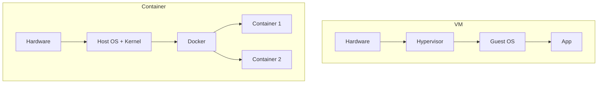
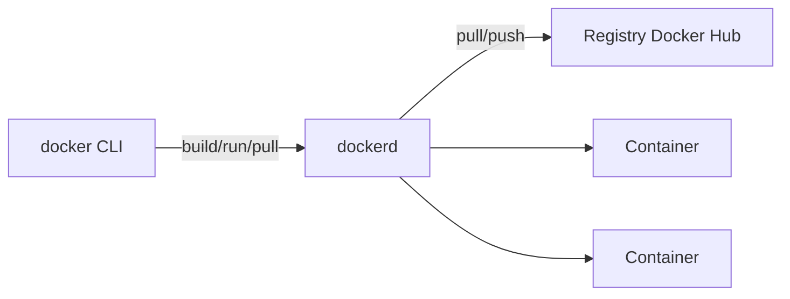
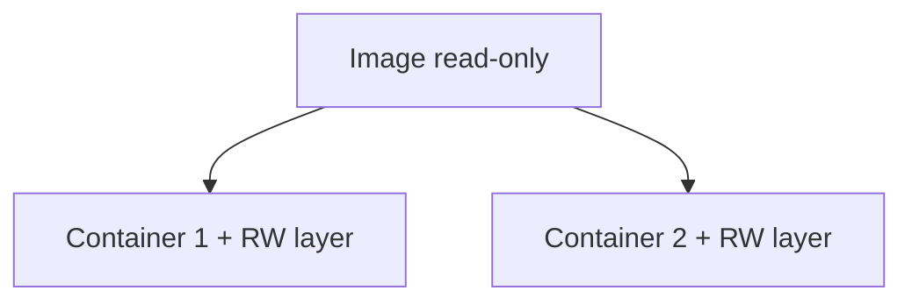
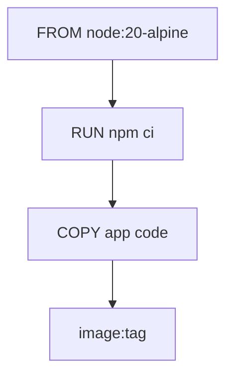

## Dag 6 - (15. juni) - **Docker Grundlæggende**

- Docker installation
- Dockerfile skrivning
- Container build og run
- **Mål**: Simpel app i container

**:learning-motives: Цели обучения на день : встреча в Teams в 08:30** :teams_icon: Докладчик @MAGS

1. Я могу установить Docker на сервере и проверить, что он работает
2. Я могу написать и собрать Dockerfile для простого приложения
3. Я могу объяснить разницу между image и container и как они связаны

- :theory-icon: Теория дня

# День 6 – Docker: Dockerfile, build & run

> Теория к Дню 6 (15 июня). От «Docker Engine уже есть» (Day 3) к **своему image** и **app в контейнере**.

---

## 📚 Содержание

1. Container vs VM
2. Архитектура Docker (client, daemon, registry)
3. Image vs container
4. Слои (layers) и кэш
5. Dockerfile — инструкции
6. `.dockerignore`
7. Build & run workflow
8. Volumes (кратко — Day 9 глубже)
9. Tags и registry
10. **Наша setup: Day 3 vs Day 6** *(andrii-deploy)*

---

## 1. Container vs VM

| | VM | Container |
|---|-----|-----------|
| Kernel | свой guest OS | **общий** kernel хоста |
| Старт | медленно | быстро |
| Размер | тяжёлые | легче |
| Изоляция | сильная | process + filesystem |



**Проверка:** `docker run -it --rm alpine sh` → `uname -a` — kernel как на host, процессы свои.

---

## 2. Архитектура Docker



| Компонент | Роль |
|-----------|------|
| **Client** | команды `docker ...` в терминале |
| **Daemon (dockerd)** | build images, run containers |
| **Registry** | хранилище images (Docker Hub, GHCR) |

**Flow:** `docker build` → daemon строит image · `docker run` → daemon стартует container · нет image локально → `pull`.

```bash
docker version    # Client + Server
docker info       # images, containers, storage
```

---

## 3. Image vs container

| | Image | Container |
|---|-------|-----------|
| Что | **шаблон** (read-only) | **запущенный** экземпляр |
| Аналогия | чертёж / рецепт | дом по чертежу |
| Изменения | только новый `build` | RW-слой поверх image |
| Сколько | один image | **много** containers из одного image |



```bash
docker pull nginx
docker run -d --name web1 nginx
docker run -d --name web2 nginx
docker ps          # 2 containers
docker images      # 1 nginx image
```

**Важно:** изменения **в container** не меняют **image**. Обновление app = `docker build` → новый container.

---

## 4. Слои и кэш

Каждый шаг Dockerfile → новый **layer**. Неизменённые слои **кэшируются** при повторном build.

**Best practice:** редко меняющееся **сначала** (base, dependencies), **код — в конце**.



При втором `docker build` увидишь **Using cache** — быстрее.

---

## 5. Dockerfile — инструкции

| Инструкция | Когда | Значение |
|------------|-------|----------|
| **FROM** | build | base image (`node:20-alpine`, `mcr.microsoft.com/dotnet/aspnet:8.0`) |
| **WORKDIR** | build | рабочая папка внутри image |
| **COPY** | build | файлы из build-контекста (папка `.`) в image |
| **RUN** | build | команда при сборке (`npm ci`, `dotnet publish`) |
| **EXPOSE** | docs | какой порт слушает app — **не открывает** порт снаружи |
| **CMD** / **ENTRYPOINT** | start | что запустить при `docker run` |

**Build-контекст:** `docker build -t myapp:1.0 .` — точка `.` = папка с Dockerfile; `COPY` берёт файлы оттуда.

### Пример: Node

```dockerfile
FROM node:20-alpine
WORKDIR /app
COPY package*.json ./
RUN npm ci --only=production
COPY . .
EXPOSE 3000
CMD ["node", "server.js"]
```

### Пример: Python / FastAPI

```dockerfile
FROM python:3.12-slim
WORKDIR /app
COPY requirements.txt .
RUN pip install --no-cache-dir -r requirements.txt
COPY . .
EXPOSE 8000
CMD ["uvicorn", "app.main:app", "--host", "0.0.0.0", "--port", "8000"]
```

`--host 0.0.0.0` — слушать **все** interfaces внутри container (не только localhost).

### Пример: .NET *(наш путь, uge 2 preview)*

```dockerfile
FROM mcr.microsoft.com/dotnet/sdk:8.0 AS build
WORKDIR /src
COPY *.csproj ./
RUN dotnet restore
COPY . .
RUN dotnet publish -c Release -o /app

FROM mcr.microsoft.com/dotnet/aspnet:8.0-alpine
WORKDIR /app
COPY --from=build /app .
EXPOSE 5000
ENV ASPNETCORE_URLS=http://0.0.0.0:5000
CMD ["dotnet", "MyApp.dll"]
```

**Multi-stage:** build в одном слое, в runtime — только опубликованные файлы (меньше image).

---

## 6. `.dockerignore`

Как `.gitignore` — что **не** отправлять в build-контекст:

```
.git
node_modules
bin
obj
.env*
*.md
.dockerignore
```

Меньше контекст → быстрее build · secrets не попадают в image.

---

## 7. Build & run

```bash
docker build -t minapp:latest .
# -t = tag (имя:версия) · . = контекст

docker run -d -p 127.0.0.1:5000:5000 --name minapp minapp:latest
# -d фон · -p host:container · только localhost (как postgres)

docker ps
docker logs minapp
docker stop minapp && docker rm minapp
```

**После смены кода:** `docker build` снова → stop/rm старый container → `docker run` новый.

**Связь с nginx (Day 5):** app на `127.0.0.1:5000` → `location /api/` перестаёт давать 502.

---

## 8. Volumes (кратко)

Без volume данные в container **пропадают** при `docker rm`.

| Тип | Пример | У нас |
|-----|--------|-------|
| **Named volume** | `-v pgdata:/var/lib/postgresql/data` | postgres Day 3 |
| **Bind mount** | `-v ./data:/app/data` | реже на курсе |

Day 9 — Compose + volumes подробнее.

---

## 9. Tags и registry

```text
имя:тег   →   minapp:1.0.0 · minapp:latest
```

```bash
docker tag minapp:latest USER/minapp:1.0.0
docker login
docker push USER/minapp:1.0.0
# на другой машине:
docker pull USER/minapp:1.0.0
```

Основа для CI/CD (GitHub Actions) позже.

---

## 10. Наша setup — Day 3 vs Day 6

| | Day 3 ✅ | Day 6 ⬜ |
|---|----------|----------|
| `docker.io` на VM | ✅ | проверить |
| `hello-world` | ✅ | — |
| `usermod -aG docker` | ✅ | — |
| **Чужие** images (`postgres`, `cloudflared`) | ✅ | — |
| **Свой** Dockerfile + `docker build` | — | **цель дня** |
| App в container → nginx `:5000` | — | uge 2 |

**Не трогать без нужды:** `postgres`, `cloudflared`, nginx config на host.

**Порты app на VM:** как postgres — `127.0.0.1:5000:5000`, **не** открывать 5000 в UFW.

```text
Browser → CF → tunnel → nginx :8080
                           /api/ → 127.0.0.1:5000 → container (app)
```

**Сеть:** app + postgres позже в одной **docker network** → host `postgres:5432` (не localhost из container).

---

# Чеклист целей обучения

> ⬜ Day 6 — Dockerfile + первая своя app в container

- [ ] Docker на VM работает (`docker --version`, `hello-world` или уже было Day 3)
- [ ] Понимаю **image** vs **container**
- [ ] Понимаю **client / daemon / registry**
- [ ] Написал **Dockerfile** (FROM, WORKDIR, COPY, RUN, EXPOSE, CMD)
- [ ] Есть **`.dockerignore`**
- [ ] `docker build -t ... .` успешен
- [ ] `docker run -d -p 127.0.0.1:PORT:PORT ...` — container Up
- [ ] `curl` на порт app → **200** (или ответ API)
- [ ] (опционально) `curl http://127.0.0.1:8080/api/...` через nginx → не 502

---

## Команды (практика)

> SSH: `mercantec-andrii` · не ломать postgres/cloudflared · секреты не в image

---

### 0. Проверка Docker (Day 3 — повтор)

```bash
docker --version
docker info | head -20
docker ps
# postgres · cloudflared Up

groups
# должна быть docker — иначе: sudo usermod -aG docker andrii && re-login

docker run --rm hello-world
# Hello from Docker! — OK
```

---

### 1. Минимальный пример — свой image (Node или static)

На VM в домашней папке:

```bash
mkdir -p ~/docker-demo && cd ~/docker-demo
```

**`server.js`:**

```javascript
const http = require('http');
const port = 3000;
http.createServer((req, res) => {
  res.writeHead(200, {'Content-Type': 'text/plain'});
  res.end('Hello from Docker container\n');
}).listen(port, '0.0.0.0');
```

**`Dockerfile`:**

```dockerfile
FROM node:20-alpine
WORKDIR /app
COPY server.js .
EXPOSE 3000
CMD ["node", "server.js"]
```

**`.dockerignore`:**

```
.git
node_modules
```

```bash
docker build -t docker-demo:latest .
# успех → image docker-demo:latest

docker run -d --name docker-demo -p 127.0.0.1:3000:3000 docker-demo:latest

curl http://127.0.0.1:3000/
# Hello from Docker container

docker logs docker-demo
docker stop docker-demo && docker rm docker-demo
```

---

### 2. .NET app в container *(когда будет проект — uge 2)*

```bash
cd ~/my-dotnet-app   # папка с .csproj

# Dockerfile — см. §5 multi-stage выше

docker build -t andrii-app:latest .

docker run -d \
  --name andrii-app \
  -p 127.0.0.1:5000:5000 \
  --restart unless-stopped \
  andrii-app:latest

curl -I http://127.0.0.1:5000/weatherforecast
curl -I http://127.0.0.1:8080/api/weatherforecast
# второй — через nginx (Day 5 location /api/)
```

**Connection string к БД из container** (позже, docker network):

```text
Host=postgres;Port=5432;...
```

не `localhost` — имя service/container.

---

### 3. Отладка build / run

```bash
docker images
# список local images

docker ps -a
# Exited — смотри docker logs

docker logs CONTAINER --tail 50

docker exec -it CONTAINER sh
# внутри container: ls, env, curl localhost:PORT

docker build --no-cache -t myapp:latest .
# игнорировать cache — если что-то «залипло»

docker rm -f CONTAINER
docker rmi IMAGE
# удалить container / image
```

---

### 4. Image vs container — учебная демонстрация

```bash
docker run -d -p 127.0.0.1:8888:80 --name web-temp nginx:alpine
docker exec web-temp sh -c 'echo test > /usr/share/nginx/html/test.html'
curl http://127.0.0.1:8888/test.html
# test

docker rm -f web-temp
docker run -d -p 127.0.0.1:8888:80 --name web-temp2 nginx:alpine
curl -I http://127.0.0.1:8888/test.html
# 404 — файл жил только в RW-слое старого container, не в image
```

---

### Типичные ошибки

| Симптом | Причина | Действие |
|---------|---------|----------|
| `permission denied` docker.sock | не в группе docker | `usermod -aG docker` · re-login |
| `COPY failed` | файла нет в контексте | путь · `.dockerignore` |
| container Exited сразу | CMD падает | `docker logs` |
| curl connection refused | app слушает 127.0.0.1 внутри | `0.0.0.0` в CMD |
| 502 на `/api/` | app не на :5000 | `docker ps` · `-p 127.0.0.1:5000:5000` |
| image огромный | без multi-stage / node_modules в COPY | `.dockerignore` · multi-stage |

---

### Docker — шпаргалка Day 6

```bash
docker build -t NAME:TAG .          # собрать image
docker run -d -p 127.0.0.1:H:C ...  # запустить container
docker ps / docker ps -a
docker logs NAME
docker stop NAME && docker rm NAME
docker images
docker exec -it NAME sh
```

---

## Короткий текст для Teams (Day 6)

> **Docker Day 6:** Image = skabelon, container = kørende instans. Dockerfile: FROM, COPY, RUN, EXPOSE, CMD. `docker build` + `docker run -p`.  
> **Day 3:** Docker + postgres/cloudflared allerede kørende. **Day 6:** første **eget** image.  
> **Næste:** .NET i container på :5000 → nginx `/api/` (allerede i config).

---

## Цели обучения (итог)

1. Docker установлен и проверен (`hello-world`).
2. Dockerfile написан и image собран.
3. Image vs container объяснены (шаблон vs инстанс; один image — много containers).
4. Build & run с портом на localhost.
5. ⬜ Связать app container с nginx `/api/` (uge 2).
