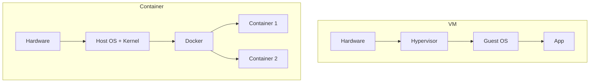
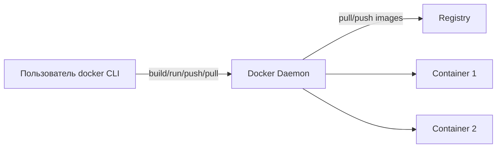
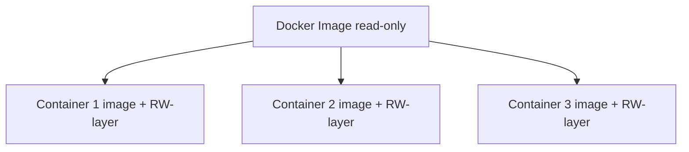
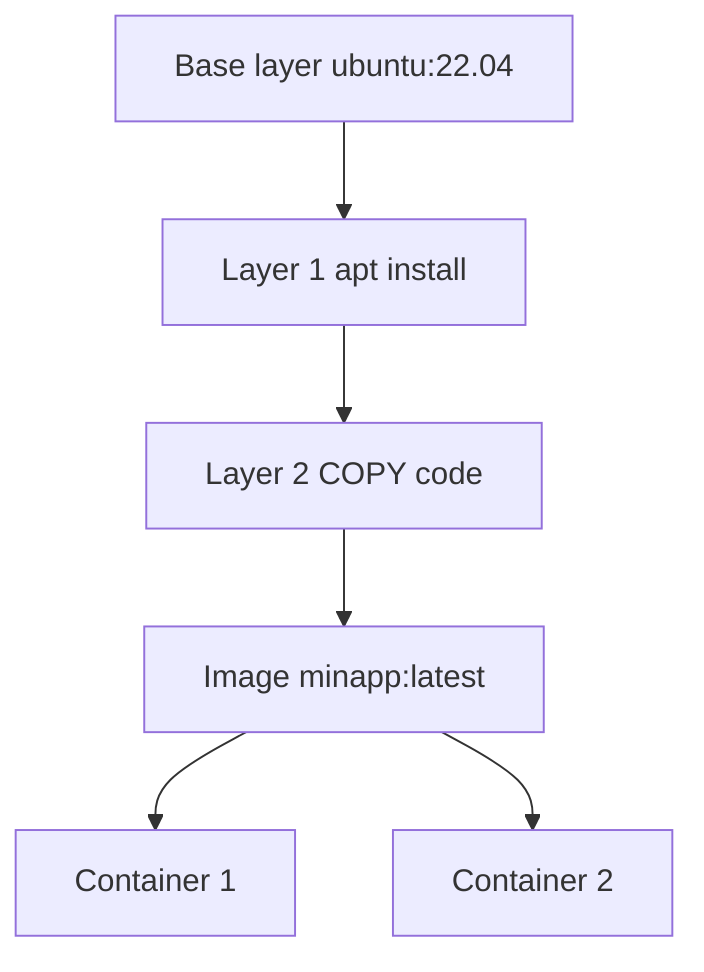

## День 6 — (15 июня) — **Docker: основы**

- Установка Docker
- Написание Dockerfile
- Сборка и запуск container
- **Цель:** простое app в container

**:learning-motives: Цели обучения на день : встреча в Teams в 08:30** :teams_icon: Докладчик @MAGS

1. Я могу установить Docker на сервере и проверить, что он работает
2. Я могу написать и собрать Dockerfile для простого приложения
3. Я могу объяснить разницу между image и container и как они связаны

- :theory-icon: Теория дня

# День 6 – Docker: основы и Dockerfile

> Теория к Дню 6 (15 июня). Docker на **сервере** (Linux) — здесь app-container будет работать в production. Можно также практиковать локально в **Docker Desktop**; команды те же.

---

## 📚 Содержание

1. Container vs виртуальная машина
2. Архитектура Docker: Client, Daemon и Registry
3. Image и container — в чём разница
4. Слои (layers) и caching
5. Dockerfile — инструкции
6. `.dockerignore`
7. Build и Run — workflow
8. Volumes и state (кратко)
9. Tags и registries
10. Итог по целям обучения

---

## 1. Container vs виртуальная машина

Container — **не** маленькая VM, но используются для похожих задач.


|          | VM            | Container              |
| -------- | ------------- | ---------------------- |
| Kernel   | свой guest OS | **общий** kernel хоста |
| Изоляция | сильная       | process + filesystem   |
| Старт    | медленно      | быстро                 |





**Главное:** container = **изоляция процессов** на том же kernel, не полноценная ОС.

### Kernel (ядро)

**Kernel** — **ядро ОС**: «сердце» системы, управляет железом (CPU, RAM, диск, сеть) для всех программ.


|               | Что это                                      |
| ------------- | -------------------------------------------- |
| **Kernel**    | ядро (Linux kernel на Ubuntu)                |
| **Ubuntu**    | **дистрибутив / ОС целиком** — **не** kernel |
| **Container** | **общий** kernel с host                      |
| **VM**        | **свой** guest kernel                        |


```bash
uname -a              # kernel: Linux 6.8.0-...
cat /etc/os-release   # дистрибутив: Ubuntu 24.04
```

### Попробуй сам

1. `docker run -it --rm alpine sh`
2. Внутри: `uname -a` и `ps aux`
3. Сравни с `uname -a` на host — kernel тот же, список процессов другой

---

## 2. Установка Docker и проверка

На Day 6 работаете с Docker на **сервере** (Linux). Можно также тренироваться локально в Docker Desktop.

> **У тебя (Day 3):** Docker уже установлен, `hello-world` и контейнеры `postgres` / `cloudflared` работают — **не повторяй** установку, только проверка: `docker --version`, `docker ps`.

**Linux (Ubuntu/Debian):**

```bash
sudo apt update
sudo apt install docker.io
sudo systemctl enable docker
sudo systemctl start docker
```

**Проверка:**

```bash
docker --version
docker run hello-world
```

- `hello-world` — минимальный image: Docker скачивает (если нужно), запускает container, печатает сообщение и завершается. Если работает — установка в порядке.
- На сервере может понадобиться: `sudo usermod -aG docker $USER` — чтобы `docker` без `sudo`. **Выйти и зайти снова** после команды.

---

## 3. Архитектура Docker: Client, Daemon и Registry

Docker — **client-server** архитектура.




| Компонент                   | Роль                                  |
| --------------------------- | ------------------------------------- |
| **Docker client**           | CLI (`docker ...`)                    |
| **Docker daemon (dockerd)** | собирает images, запускает containers |
| **Registry**                | хранилище images (Docker Hub, GHCR)   |


**Типичный flow:**

1. `docker build` → client просит daemon собрать image из Dockerfile
2. `docker run` → daemon стартует container из image
3. Image нет локально → daemon делает **pull** из registry (обычно Docker Hub)

### Попробуй сам

1. `docker version` — секции **Client** и **Server**
2. `docker info` — число images и containers
3. `docker run --rm hello-world` — как Docker сам тянет image

---

## 4. Image и container — разница и связь


|               | Image                                                           | Container                                   |
| ------------- | --------------------------------------------------------------- | ------------------------------------------- |
| Что           | **замороженный шаблон** (read-only)                             | **работающий** экземпляр image              |
| Содержимое    | filesystem (OS-слои, app, deps) + metadata (команда при старте) | RW-слой поверх image                        |
| Примеры image | `postgres:16-alpine`, `node:20-alpine`, свой из Dockerfile      | каждый `docker run` создаёт новый container |


**Связь:**

- **Один image** → **много containers**
- Изменения в container **не меняют** image
- Обновить app → **новый build** → **новый container** из нового image
- Поэтому Dockerfile и `docker build` — центральная тема Day 6

**Аналогии:**

- Image = чертёж / шаблон
- Container = дом по чертежу (running process)




**RW-layer** (read-write) — тонкий writable-слой у каждого container поверх read-only image. Image общий; записи внутри container — в своём слое.

### Попробуй сам

1. `docker pull nginx`
2. `docker run -d --name web1 nginx` и `docker run -d --name web2 nginx`
3. `docker ps` — два container, один image
4. `docker images` — один nginx-image

---

## 5. Слои (layers) и caching

Image состоит из **нескольких layers** — каждый шаг Dockerfile обычно создаёт новый layer.

**Плюсы:**

- **Caching:** неизменённые layers переиспользуются → быстрее build
- **Sharing:** несколько images могут делить base layer (например `ubuntu:22.04`)




**Best practice:** редко меняющееся **сначала** (base, dependencies), **код — в конце**.

### Попробуй сам

1. `docker build -t testimage .` два раза подряд
2. Второй раз — **Using cache** / **CACHED** на многих steps
3. Измени одну строку кода, build снова — смотри, где cache invalidated

---

## 6. Dockerfile — написание и сборка

**Dockerfile** — пошаговое описание, как собрать image: base image, какие файлы копировать, команды при **build**, команда при **start** (`CMD` / `ENTRYPOINT`).

### Основные инструкции


| Инструкция  | Значение                                                                                                |
| ----------- | ------------------------------------------------------------------------------------------------------- |
| **FROM**    | Base image (например `node:20-alpine`, `python:3.12-slim`). Всё строится поверх него                    |
| **WORKDIR** | Рабочая папка в container. Дальше RUN, COPY, CMD — отсюда                                               |
| **COPY**    | Копирует файлы из **build context** (папка `docker build`) в image                                      |
| **RUN**     | Команда **при build** (например `npm install`, `pip install`). Становится частью image                  |
| **EXPOSE**  | Документирует порт app. **Не открывает** порт — это делает `-p` при `docker run` или `ports:` в Compose |
| **CMD**     | Команда при **старте** container. Обычно одна; форма `["executable", "arg1"]`                           |


**Build context:** `docker build -t myimage:tag .` — **точка** = контекст (папка с Dockerfile). COPY берёт файлы оттуда. Большие папки (например `node_modules`) исключай через `**.dockerignore`**.

### Пример: Node-app

```dockerfile
FROM node:20-alpine
WORKDIR /app
COPY package*.json ./
RUN npm ci --only=production
COPY . .
EXPOSE 3000
CMD ["node", "server.js"]
```

- Сначала только `package.json` + `npm ci` — layer с dependencies кэшируется, если меняется только код
- `EXPOSE 3000` — app слушает 3000; при `docker run` используй `-p 3000:3000`

### Пример: Python/FastAPI-app

```dockerfile
FROM python:3.12-slim
WORKDIR /app
COPY requirements.txt .
RUN pip install --no-cache-dir -r requirements.txt
COPY . .
EXPOSE 8000
CMD ["uvicorn", "app.main:app", "--host", "0.0.0.0", "--port", "8000"]
```

- Base с Python; сначала `requirements.txt` + install, потом код
- `--host 0.0.0.0` — server слушает все interfaces (доступен снаружи container)

---

## 7. `.dockerignore`

`.dockerignore` — какие файлы **не** отправлять в daemon как build context.

**Плюсы:**

- Меньший context → быстрее builds
- Не попадут secrets (например `.env`, ключи) в image

**Пример для Node-проектов:**

```
.git
node_modules
npm-debug.log
Dockerfile*
.dockerignore
.env*
dist
coverage
```

**Пример для .NET (MercantecApi):**

```
bin/
obj/
.git
.env*
*.user
.vs/
```

### Попробуй сам

1. Создай папку `docker-demo` с простым `server.js`
2. Напиши Dockerfile как выше
3. Сделай `.dockerignore` минимум с `node_modules` и `.git`
4. `docker build -t docker-demo .`
5. Добавь большую папку без ignore — заметь разницу во времени build

---

## 8. Build и Run — workflow

**Собрать image:**

```bash
docker build -t minapp:latest .
```

- `-t minapp:latest` — **tag** (имя и версия)
- `.` — build context (текущая папка). Dockerfile здесь (или `-f`)

**Запустить container:**

```bash
docker run -d -p 3000:3000 --name minapp-container minapp:latest
```

- `-d` — detached (в фоне)
- `-p 3000:3000` — host port 3000 → container 3000 → `http://localhost:3000` (или server-IP:3000)
- `--name` — имя для `docker stop`, `docker logs` и т.д.

**Проверка и отладка:**

```bash
docker ps
docker logs minapp-container
docker exec -it minapp-container sh
```

Когда меняешь код: **build снова** → stop/remove старый container → start новый из нового image. Позже в курсе это автоматизируют **Compose** и **Dokploy**.

### Попробуй сам

1. Используй Dockerfile из предыдущего упражнения
2. Build и run с `-p`
3. Открой `http://localhost:3000` (или server-IP:3000)
4. `docker logs` — смотри output app
5. Stop и remove container, start снова — **что будет с logs?** (локальные файлы в RW-layer пропадут; stdout-логи daemon может ещё помнить до prune)

---

## 9. Volumes и state (кратко)

RW-layer container **временный** — удаляется вместе с container (если нет **volumes**).


| Тип              | Пример                                        |
| ---------------- | --------------------------------------------- |
| **Named volume** | `pgdata` (Docker сам выбирает место на диске) |
| **Bind mount**   | `-v ./data:/path/in/container`                |


**Пример — bind mount:**

```bash
docker run -d \
  -v ./data:/var/lib/postgresql/data \
  -e POSTGRES_PASSWORD=secret \
  postgres:16
```

Day 9 углубляет volumes и Docker Compose. У тебя postgres уже использует named volume `pgdata`.

### Попробуй сам

1. `docker run -d --name web-temp nginx`
2. `docker exec -it web-temp sh` → `echo test > /usr/share/nginx/html/test.html`
3. `docker rm -f web-temp`
4. Запусти новый nginx — файла нет! Изменения жили только в RW-layer container.

---

## 10. Tags и registries

Images идентифицируются как `name:tag`, например `node:20-alpine`.

- **Name:** часто `username/name` при push в Docker Hub
- **Tag:** версия (`1.0.0`) или окружение (`latest`, `dev`)

**Типичный flow в registry:**

```bash
docker tag minapp:latest USERNAME/minapp:1.0.0
docker login
docker push USERNAME/minapp:1.0.0

# На другой машине
docker pull USERNAME/minapp:1.0.0
```

Основа для **CI/CD** позже (GitHub Actions + Dokploy).

### Попробуй сам

1. Бесплатный аккаунт на [hub.docker.com](https://hub.docker.com)
2. Build `minapp:latest`
3. Tag и push: `docker tag minapp:latest YOURNAME/minapp:0.1` · `docker push YOURNAME/minapp:0.1`
4. На другой машине/server: `docker pull YOURNAME/minapp:0.1` и run

---

# Чеклист целей обучения

> ✅ Day 6 — MercantecApi в container на VM (2026-06-09)

- [x] Установить Docker и проверить (`docker run hello-world`) — **Day 3 ✅**
- [x] Объяснить **image** vs **container**
- [x] Описать **client, daemon, registry** и flow build/run/pull
- [x] Написать Dockerfile с FROM, WORKDIR, COPY, RUN, EXPOSE, CMD
- [x] Использовать `**.dockerignore`**
- [x] `docker build -t mercantec-api .` и `docker run -d -p 127.0.0.1:5000:3000`
- [x] Проверка: `curl :5000/weatherforecast` и `:8080/api/weatherforecast` → **200**
- [ ] `docker ps`, `docker logs`, `docker exec` — по желанию повторить
- [x] Layers/caching — в Dockerfile (restore до COPY кода)
- [ ] Volumes для app — Day 9

---

## Ключевые идеи (простыми словами)

> MercantecApi — шпаргалка после практики на VM.


| Идея                   | Коротко                                                                                                                               |
| ---------------------- | ------------------------------------------------------------------------------------------------------------------------------------- |
| **Mac vs VM**          | Mac: `dotnet run` (разработка). VM: `docker build` + `docker run` (deploy).                                                           |
| **SDK vs runtime**     | **SDK** собирает app из `.cs` (build). **Runtime** запускает готовый `.dll` (run).                                                    |
| **Три «склада»**       | **git** = твой код · **Docker registry** = готовые images (sdk, aspnet, postgres) · **NuGet** = библиотеки .NET при `dotnet restore`. |
| **Где .NET на VM**     | **Image** лежит на диске VM (`/var/lib/docker/`). `dotnet` **не** установлен на Ubuntu — только внутри image/container.               |
| **Image vs container** | **Image** = упаковка (dll + runtime). **Container** = запущенный процесс + тонкий RW-layer + логи.                                    |
| **git ≠ running app**  | Правки в `~/GitHub/...` не меняют container. Нужны: `git pull` → `docker build` → `docker stop/rm` → `docker run`.                    |
| **RW-layer**           | Правки **внутри** container (`docker exec`) — временные; после `docker rm` пропадают. Image меняется только через `docker build`.     |
| **docker push**        | Для одной VM **не нужен** — достаточно `git push` кода; image собирается локально на сервере.                                         |
| **Порты**              | nginx VM **8080** · Docker VM **5000** · Kestrel container **3000** · postgres **5432** (app к БД позже).                            |


### Трафик client → API (MercantecApi)

```text
Client → HTTPS Cloudflare → tunnel → nginx :8080
  /api/... → proxy_pass 127.0.0.1:5000/ → Docker → container :3000 → JSON
```

- **8080** и **3000** — разные порты (nginx на VM vs app в container)
- **5000** — мост Docker на VM; nginx про **3000** не знает
- **5432** — postgres; из container `127.0.0.1` ≠ VM (подключение app — позже)

**Deploy после изменения кода:**

```bash
cd ~/GitHub/deploy-or-die-anbo0005/app/MercantecApi
git pull
docker build -t mercantec-api .                    # старый container ещё может работать
docker stop mercantec-api && docker rm mercantec-api
docker run -d --name mercantec-api -p 127.0.0.1:5000:3000 --restart unless-stopped mercantec-api
```

---

## Команды (практика)

> Day 6 на **сервере** (Linux). Те же команды работают в Docker Desktop локально.

---

### 1. Установка и проверка (Day 3 — уже сделано)

```bash
sudo apt update
sudo apt install -y docker.io
sudo systemctl enable docker
sudo systemctl start docker
sudo systemctl status docker

docker --version
docker run hello-world
# Hello from Docker!

sudo usermod -aG docker $USER
# logout и login — потом docker без sudo
```

---

### 2. Dockerfile — Node-app (из pensum)

```bash
mkdir -p docker-demo && cd docker-demo
# создать package.json, server.js, Dockerfile, .dockerignore — см. §6–7
```

**Dockerfile (pensum):**

```dockerfile
FROM node:20-alpine
WORKDIR /app
COPY package*.json ./
RUN npm ci --only=production
COPY . .
EXPOSE 3000
CMD ["node", "server.js"]
```

```bash
docker build -t minapp:latest .
docker run -d -p 3000:3000 --name minapp-container minapp:latest

docker ps
docker logs minapp-container
curl http://localhost:3000
# или http://SERVER-IP:3000

docker stop minapp-container
docker rm minapp-container
```

---

### 3. Dockerfile — Python/FastAPI (pensum)

```dockerfile
FROM python:3.12-slim
WORKDIR /app
COPY requirements.txt .
RUN pip install --no-cache-dir -r requirements.txt
COPY . .
EXPOSE 8000
CMD ["uvicorn", "app.main:app", "--host", "0.0.0.0", "--port", "8000"]
```

```bash
docker build -t fastapi-app:latest .
docker run -d -p 8000:8000 --name fastapi-container fastapi-app:latest
curl http://localhost:8000
```

---

### 4. MercantecApi (.NET) — твой проект

> После Dockerfile в `app/MercantecApi/` — build и run на VM:

```bash
cd ~/GitHub/deploy-or-die-anbo0005/app/MercantecApi
git pull
docker build -t mercantec-api .
docker stop mercantec-api && docker rm mercantec-api
docker run -d --name mercantec-api -p 127.0.0.1:5000:3000 --restart unless-stopped mercantec-api

curl http://127.0.0.1:5000/weatherforecast
curl http://127.0.0.1:8080/api/weatherforecast   # через nginx
```

---

### 5. Image vs container — demo

```bash
docker pull nginx
docker run -d --name web1 nginx
docker run -d --name web2 nginx
docker ps
docker images
```

---

### 6. Registry (опционально)

```bash
docker tag minapp:latest USERNAME/minapp:1.0.0
docker login
docker push USERNAME/minapp:1.0.0
```

---

## Короткий текст для Teams (Day 6)

> **Day 6 Docker:** Image = шаблон, container = запущенный экземпляр. Dockerfile: FROM, WORKDIR, COPY, RUN, EXPOSE, CMD. `docker build -t minapp .` и `docker run -d -p 3000:3000`. `.dockerignore` — быстрее и безопаснее build. Volumes — данные переживают container (Day 9).

---

## Итог по целям обучения

После Day 6 вы должны уметь:

1. **Установить Docker** на server и проверить (например `docker run hello-world`).
2. **Написать и собрать Dockerfile** для простого app (FROM, WORKDIR, COPY, RUN, EXPOSE, CMD и `.dockerignore`).
3. **Объяснить разницу** image и container (image = шаблон, container = экземпляр; один image, много containers; изменения в container не меняют image).
4. **Описать архитектуру Docker** (client, daemon, registry) и связь build, run, pull, push.
5. **Собрать image и запустить container** с портом, доступным снаружи.
6. **Объяснить layers и caching** — зачем порядок строк в Dockerfile важен для скорости и размера image.

---

*Обновлено: 2026-06-10 — ключевые идеи Day 6; команды redeploy*