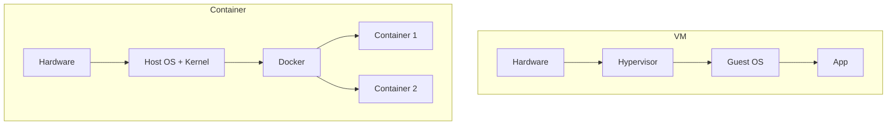
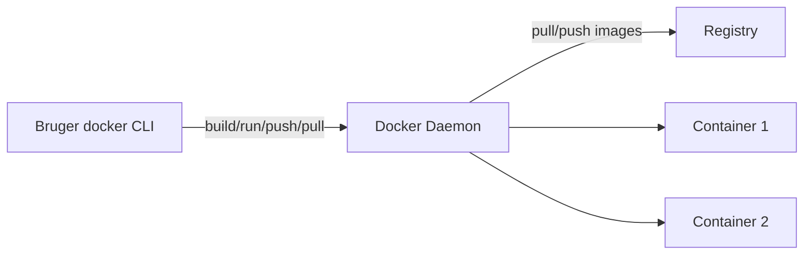
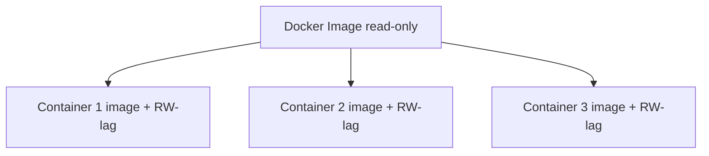
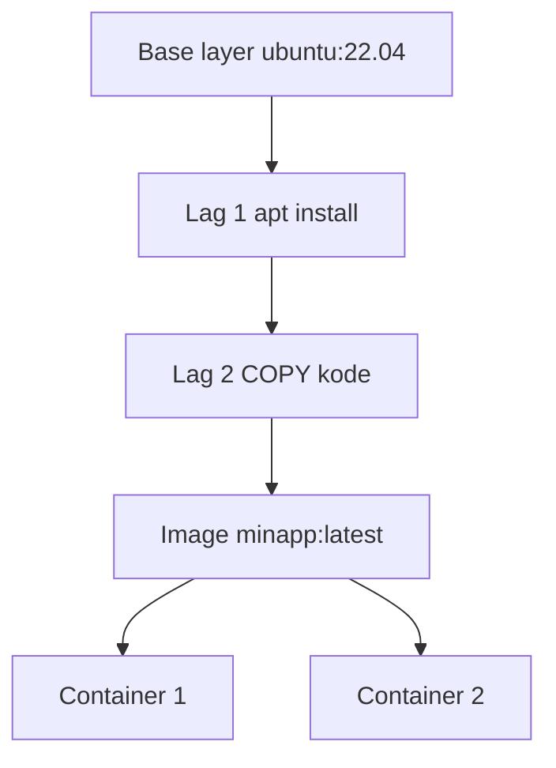

## Dag 6 - (15. juni) - **Docker Grundlæggende**

- Docker installation
- Dockerfile skrivning
- Container build og run
- **Mål**: Simpel app i container

**:learning-motives: Цели обучения на день : встреча в Teams в 08:30** :teams_icon: Докладчик @MAGS

1. Я могу установить Docker на сервере и проверить, что он работает
2. Я могу написать и собрать Dockerfile для простого приложения
3. Я могу объяснить разницу между image и container и как они связаны

- :theory-icon: Теория дня

# День 6 – Docker Grundlæggende & Dockerfile

> Теория к Дню 6 (15 июня). Docker на **сервере** (Linux) — здесь app-container будет работать в drift. Можно также практиковать локально в **Docker Desktop**; команды те же.

---

## 📚 Содержание

1. Containere vs virtuelle maskiner
2. Docker-arkitektur: Client, Daemon & Registry
3. Image og container – forskel
4. Lag (layers) og caching
5. Dockerfile – instruktioner
6. `.dockerignore`
7. Build & Run – workflow
8. Volumes og state (kort intro)
9. Tags og registries
10. Цели обучения (итог)

---

## 1. Containere vs virtuelle maskiner

Container — **не** маленькая VM, но используются для похожих задач.

| | VM | Container |
|---|-----|-----------|
| Kernel | свой guest OS | **общий** kernel хоста |
| Изоляция | сильная | process + filesystem |
| Старт | медленно | быстро |



**Key point:** Container = **process-isolation** на том же kernel, не полноценные OS.

### Kernel (ядро)

**Kernel** — **ядро ОС**: «сердце» системы, управляет железом (CPU, RAM, диск, сеть) для всех программ.

| | Что это |
|---|---------|
| **Kernel** | ядро (Linux kernel на Ubuntu) |
| **Ubuntu** | **дистрибутив / ОС целиком** — **не** kernel |
| **Container** | **общий** kernel с host |
| **VM** | **свой** guest kernel |

```bash
uname -a              # kernel: Linux 6.8.0-...
cat /etc/os-release   # дистрибутив: Ubuntu 24.04
```

### Попробуй сам

1. `docker run -it --rm alpine sh`
2. Внутри: `uname -a` и `ps aux`
3. Сравни с `uname -a` на host — kernel тот же, список процессов другой

---

## 2. Docker installation og verifikation

На Day 6 работаете с Docker на **сервере** (Linux). Можно также тренироваться локально в Docker Desktop.

**Linux (Ubuntu/Debian):**

```bash
sudo apt update
sudo apt install docker.io
sudo systemctl enable docker
sudo systemctl start docker
```

**Проверка:**

```bash
docker --version
docker run hello-world
```

- `hello-world` — минимальный image: Docker скачивает (если нужно), запускает container, печатает сообщение и завершается. Если работает — установка в порядке.
- На сервере может понадобиться: `sudo usermod -aG docker $USER` — чтобы `docker` без `sudo`. **Выйти и зайти снова** после команды.

См. также pensum: Docker Desktop vs Linux, [[Docker-grundlæggende#Installation]].

---

## 3. Docker-arkitektur: Client, Daemon & Registry

Docker — **client-server** архитектура.



| Компонент | Роль |
|-----------|------|
| **Docker client** | CLI (`docker ...`) |
| **Docker daemon (dockerd)** | build images, run containers |
| **Registry** | хранилище images (Docker Hub, GHCR) |

**Typisk flow:**

1. `docker build` → client просит daemon собрать image из Dockerfile
2. `docker run` → daemon стартует container из image
3. Image нет локально → daemon **pull** с registry (обычно Docker Hub)

### Попробуй сам

1. `docker version` — секции **Client** и **Server**
2. `docker info` — число images и containers
3. `docker run --rm hello-world` — как Docker сам тянет image

---

## 4. Image og container – forskel og sammenhæng

| | Image | Container |
|---|-------|-----------|
| Что | **замороженный шаблон** (read-only) | **работающий** экземпляр image |
| Содержимое | filesystem (OS-слои, app, deps) + metadata (команда при старте) | RW-слой поверх image |
| Примеры image | `postgres:16-alpine`, `node:20-alpine`, свой из Dockerfile | каждый `docker run` создаёт новый container |

**Sammenhæng:**

- **Один image** → **много containers**
- Изменения в container **не меняют** image
- Обновить app → **новый build** → **новый container** из нового image
- Поэтому Dockerfile и `docker build` central на Day 6

**Analogier:**

- Image = blueprint / manifest
- Container = дом по blueprint (running process)



### Попробуй сам

1. `docker pull nginx`
2. `docker run -d --name web1 nginx` и `docker run -d --name web2 nginx`
3. `docker ps` — два container, один image
4. `docker images` — один nginx-image

---

## 5. Lag (layers) og caching

Image состоит из **нескольких layers** — каждый шаг Dockerfile обычно создаёт новый layer.

**Fordele:**

- **Caching:** неизменённые layers переиспользуются → быстрее build
- **Deling:** несколько images могут делить base layer (fx `ubuntu:22.04`)



**Best practice:** редко меняющееся **сначала** (base, dependencies), **код — в конце**.

### Попробуй сам

1. `docker build -t testimage .` два раза подряд
2. Второй раз — **Using cache** на многих steps
3. Измени одну строку кода, build снова — смотри где cache invalidated

---

## 6. Dockerfile – skrivning og bygge

**Dockerfile** — пошаговое описание, как собрать image: base image, какие файлы копировать, команды при **build**, команда при **start** (CMD/ENTRYPOINT).

### Grundlæggende instruktioner

| Instruktion | Betydning |
|-------------|-----------|
| **FROM** | Base image (fx `node:20-alpine`, `python:3.12-slim`). Всё строится поверх него |
| **WORKDIR** | Рабочая папка в container. Дальше RUN, COPY, CMD — отсюда |
| **COPY** | Копирует файлы из **build-kontekst** (папка `docker build`) в image |
| **RUN** | Команда **при build** (fx `npm install`, `pip install`). Становится частью image |
| **EXPOSE** | Документирует порт app. **Не открывает** порт — это делает `-p` при `docker run` или `ports:` в Compose |
| **CMD** | Команда при **старте** container. Обычно одна; форма `["executable", "arg1"]` |

**Build-kontekst:** `docker build -t mitimage:tag .` — **точка** = контекст (папка с Dockerfile). COPY берёт файлы оттуда. Большие папки (fx `node_modules`) исключай через **`.dockerignore`**.

### Eksempel: Node-app

```dockerfile
FROM node:20-alpine
WORKDIR /app
COPY package*.json ./
RUN npm ci --only=production
COPY . .
EXPOSE 3000
CMD ["node", "server.js"]
```

- Сначала только `package.json` + `npm ci` — layer с dependencies кэшируется, если меняется только код
- `EXPOSE 3000` — app слушает 3000; при `docker run` используй `-p 3000:3000`

### Eksempel: Python/FastAPI-app

```dockerfile
FROM python:3.12-slim
WORKDIR /app
COPY requirements.txt .
RUN pip install --no-cache-dir -r requirements.txt
COPY . .
EXPOSE 8000
CMD ["uvicorn", "app.main:app", "--host", "0.0.0.0", "--port", "8000"]
```

- Base с Python; сначала `requirements.txt` + install, потом код
- `--host 0.0.0.0` — server слушает все interfaces (доступен снаружи container)

Flere detaljer og multi-stage builds: [[Dockerfile-praksis]].

---

## 7. `.dockerignore`

`.dockerignore` — какие файлы **не** отправлять в daemon som build-kontekst.

**Fordele:**

- Mindre kontekst → hurtigere builds
- Undgå at secrets (fx `.env`, nøgler) ender i image'et

**Eksempel til Node-projekter:**

```
.git
node_modules
npm-debug.log
Dockerfile*
.dockerignore
.env*
dist
coverage
```

### Попробуй сам

1. Opret mappe `docker-demo` med simpel `server.js`
2. Skriv Dockerfile som ovenfor
3. Lav `.dockerignore` med mindst `node_modules` og `.git`
4. `docker build -t docker-demo .`
5. Smid stor mappe ind uden ignore — mærk forskellen i byggetid

---

## 8. Build og run – workflow

**Bygge image:**

```bash
docker build -t minapp:latest .
```

- `-t minapp:latest` — **tag** (navn og version)
- `.` — build-kontekst (nuværende mappe). Dockerfile her (eller `-f`)

**Køre container:**

```bash
docker run -d -p 3000:3000 --name minapp-container minapp:latest
```

- `-d` — detached (baggrunden)
- `-p 3000:3000` — host port 3000 → container 3000 → `http://localhost:3000` (eller server-IP:3000)
- `--name` — navn til `docker stop`, `docker logs` osv.

**Tjek og fejlsøgning:**

```bash
docker ps
docker logs minapp-container
docker exec -it minapp-container sh
```

Når I ændrer koden: **build igen** → stop/fjern gammel container → start ny fra nyt image. Senere på kurset automatiseres det med **Compose** og **Dokploy**.

### Попробуй сам

1. Brug Dockerfile fra forrige øvelse
2. Byg og kør med `-p`
3. Åbn `http://localhost:3000` (eller server-IP:3000)
4. `docker logs` — se app output
5. Stop og fjern container, start igen — hvad sker med logs?

---

## 9. Volumes og state (kort intro)

Container RW-lag er **midlertidigt** — slettes når container fjernes (medmindre **volumes**).

| Type | Eksempel |
|------|----------|
| **Named volume** | `pgdata` (Docker administrerer placering) |
| **Bind mount** | `-v ./data:/path/in/container` |

**Eksempel – bind mount:**

```bash
docker run -d \
  -v ./data:/var/lib/postgresql/data \
  -e POSTGRES_PASSWORD=hemmeligt \
  postgres:16
```

Dag 9 går dybere i volumes og Docker Compose.

### Попробуй сам

1. `docker run -d --name web-temp nginx`
2. `docker exec -it web-temp sh` → `echo hej > /usr/share/nginx/html/test.html`
3. `docker rm -f web-temp`
4. Start ny nginx — filen er væk! Ændringer levede kun i container-laget.

---

## 10. Tags og registries

Images identificeres som `navn:tag`, fx `node:20-alpine`.

- **Navn:** ofte `brugernavn/navn` ved push til Docker Hub
- **Tag:** version (`1.0.0`) eller miljø (`latest`, `dev`)

**Typisk flow mod registry:**

```bash
docker tag minapp:latest BRUGERNAVN/minapp:1.0.0
docker login
docker push BRUGERNAVN/minapp:1.0.0

# På en anden maskine
docker pull BRUGERNAVN/minapp:1.0.0
```

Fundament for senere **CI/CD** (fx GitHub Actions + Dokploy).

### Попробуй сам

1. Opret gratis konto på [hub.docker.com](https://hub.docker.com)
2. Byg `minapp:latest`
3. Tag og push: `docker tag minapp:latest DITNAVN/minapp:0.1` · `docker push DITNAVN/minapp:0.1`
4. På anden maskine/server: `docker pull DITNAVN/minapp:0.1` og kør

---

# Чеклист целей обучения

> ⬜ Day 6 — simpel app i container

- [ ] Installere Docker og verificere (`docker run hello-world`)
- [ ] Forklare **image** vs **container** (skabelon vs instans; ét image, mange containere)
- [ ] Beskrive **client, daemon, registry** og flow build/run/pull
- [ ] Skrive Dockerfile med FROM, WORKDIR, COPY, RUN, EXPOSE, CMD
- [ ] Bruge **`.dockerignore`**
- [ ] `docker build -t ... .` og `docker run -d -p ...`
- [ ] `docker ps`, `docker logs`, `docker exec`
- [ ] Forklare **layers/caching** og hvorfor rækkefølge i Dockerfile betyder noget
- [ ] Kort forstå **volumes** (data overlever container)

---

## Команды (практика)

> Day 6 på **serveren** (Linux). Samme kommandoer virker i Docker Desktop lokalt.

---

### 1. Installation og verifikation

```bash
sudo apt update
sudo apt install -y docker.io
sudo systemctl enable docker
sudo systemctl start docker
sudo systemctl status docker

docker --version
docker run hello-world
# Hello from Docker!

sudo usermod -aG docker $USER
# log ud og ind igen — derefter docker uden sudo
```

---

### 2. Dockerfile – Node-app (fra pensum)

```bash
mkdir -p docker-demo && cd docker-demo
# opret package.json, server.js, Dockerfile, .dockerignore — se §6–7
```

**Dockerfile (pensum):**

```dockerfile
FROM node:20-alpine
WORKDIR /app
COPY package*.json ./
RUN npm ci --only=production
COPY . .
EXPOSE 3000
CMD ["node", "server.js"]
```

```bash
docker build -t minapp:latest .
docker run -d -p 3000:3000 --name minapp-container minapp:latest

docker ps
docker logs minapp-container
curl http://localhost:3000
# eller http://SERVER-IP:3000

docker stop minapp-container
docker rm minapp-container
```

---

### 3. Dockerfile – Python/FastAPI (pensum)

```dockerfile
FROM python:3.12-slim
WORKDIR /app
COPY requirements.txt .
RUN pip install --no-cache-dir -r requirements.txt
COPY . .
EXPOSE 8000
CMD ["uvicorn", "app.main:app", "--host", "0.0.0.0", "--port", "8000"]
```

```bash
docker build -t fastapi-app:latest .
docker run -d -p 8000:8000 --name fastapi-container fastapi-app:latest
curl http://localhost:8000
```

---

### 4. Image vs container – demo

```bash
docker pull nginx
docker run -d --name web1 nginx
docker run -d --name web2 nginx
docker ps
docker images
```

---

### 5. Registry (valgfrit)

```bash
docker tag minapp:latest BRUGERNAVN/minapp:1.0.0
docker login
docker push BRUGERNAVN/minapp:1.0.0
```

---

## Короткий текст для Teams (Day 6)

> **Day 6 Docker:** Image = skabelon, container = kørende instans. Dockerfile: FROM, WORKDIR, COPY, RUN, EXPOSE, CMD. `docker build -t minapp .` og `docker run -d -p 3000:3000`. `.dockerignore` for hurtigere og sikrere build. Volumes — data overlever container (Dag 9).

---

## Læringsmål (opsummering)

Efter Dag 6 skal I kunne:

1. **Installere Docker** på en server og verificere (fx `docker run hello-world`).
2. **Skrive og bygge Dockerfile** til simpel app (FROM, WORKDIR, COPY, RUN, EXPOSE, CMD — og `.dockerignore`).
3. **Forklare forskellen** på image og container og sammenhængen (image = skabelon, container = instans; ét image, mange containere; ændringer i container ændrer ikke image).
4. **Beskrive Docker-arkitekturen** (client, daemon, registry) og hvordan build, run, pull og push hænger sammen.
5. **Bygge image og køre container** der eksponerer en port og kan tilgås udefra.
6. **Forklare hvorfor lag og caching** betyder noget for build-tid og image-størrelse.
