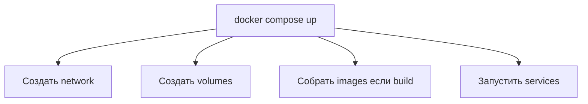
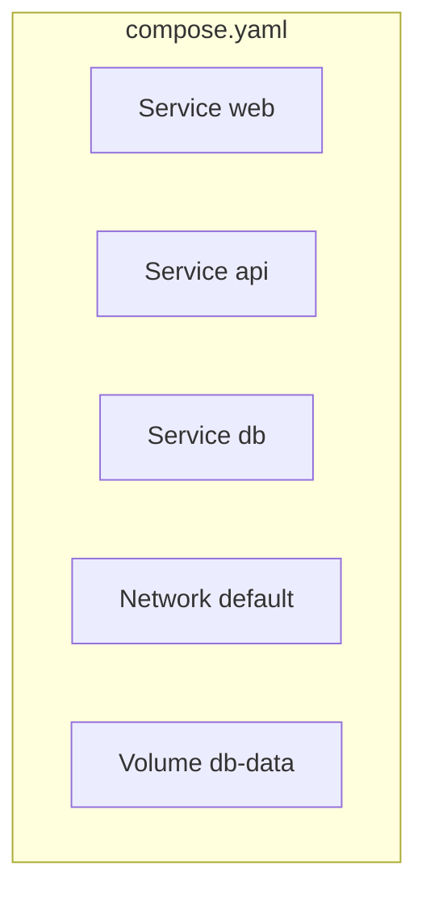
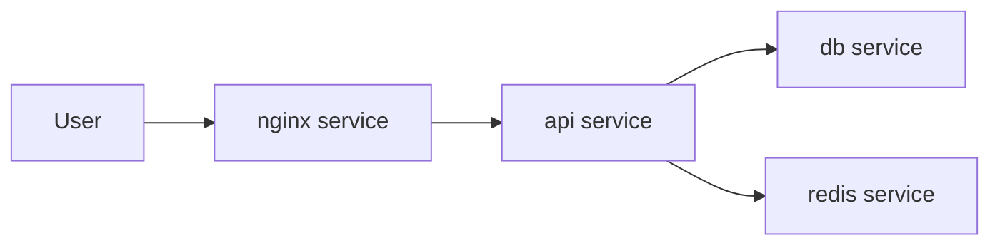
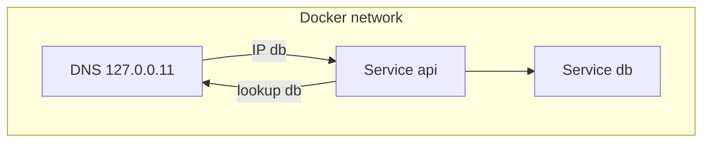
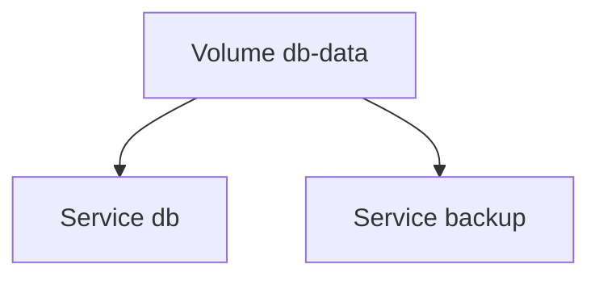
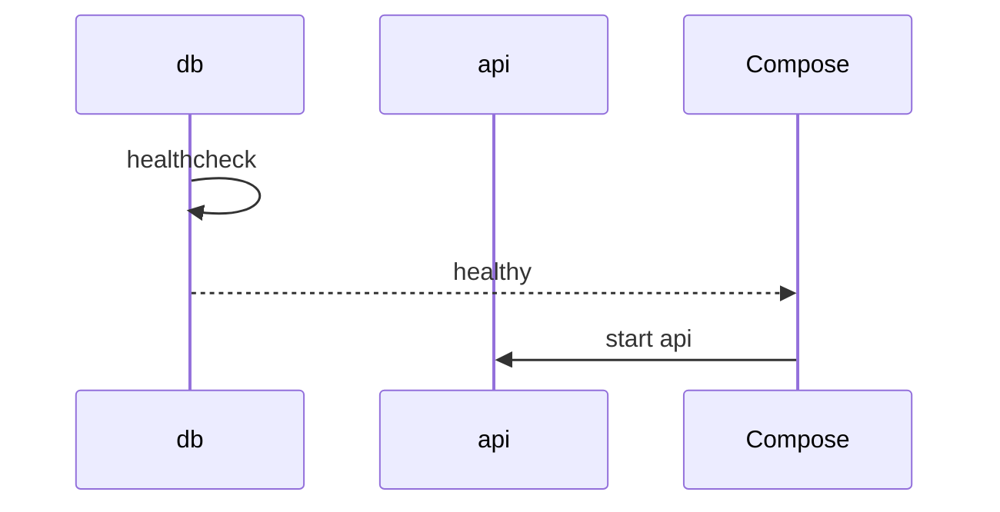
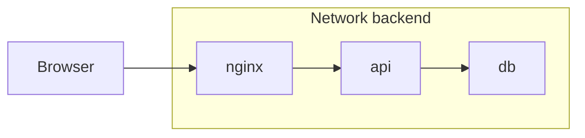
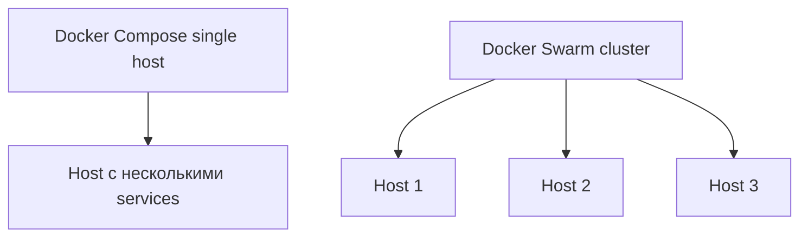

## День 7 — (16 июня) — **Docker Compose & Multi-container**

- Docker Compose setup
- Database + app container
- Environment variables
- **Цель:** full-stack app в containers

> 🚨 **Все группы** должны сообщить формат сдачи **не позднее 23:59 сегодня**.

**:learning-motives: Цели обучения на день : встреча в Teams в 08:30** :teams_icon: MAGS или Paw

1. Я могу написать `docker-compose.yml`, который запускает и app, и database
2. Я могу использовать environment variables для настройки на разных containers
3. Я могу объяснить, как Docker Compose упрощает работу с несколькими services

- :theory-icon: Теория дня

# День 7 – Docker Compose & Multi-container Apps

> Теория к Дню 7 (16 июня). Вместо множества `docker run` — **один YAML-файл** и команда `docker compose up`. App и БД в **общей сети**; app подключается к БД по **имени service** (`db`), не по `localhost`.

---

## 📚 Содержание

1. Что такое Docker Compose — и зачем
2. Базовая структура `docker-compose.yml`
3. Services и multi-container архитектура
4. Сети и service discovery
5. Volumes в Compose
6. Environment variables и `.env`
7. `depends_on` и `healthcheck`
8. Пример: компактный full-stack setup
9. Docker Compose vs Docker Swarm (перспектива)
10. **Наша setup: Day 3 + Day 6 → Day 7** *(andrii.mercantec.tech)*
11. Практический workflow
12. Дополнительные задания «Попробуй сам»

---

## 1. Что такое Docker Compose — и зачем?

**Docker Compose** — инструмент для описания и запуска **multi-container приложений** на **одном хосте** через один YAML-файл (обычно `docker-compose.yml`).

Вместо множества `docker run` вы описываете:

- какие **services** есть (web, api, db, redis, nginx)
- какие **networks** их связывают
- какие **volumes** хранят persistent data

Управление:

```bash
docker compose up      # запустить все services
docker compose down    # остановить и убрать containers (volumes по умолчанию остаются)
```



### Без Compose vs с Compose

| Без Compose | С Compose |
| --- | --- |
| Несколько `docker run` с портами, volumes, network вручную | Один файл; `docker compose up` |
| Сеть и имена containers — вручную | Compose создаёт network; **имя service = hostname** (`db`, `app`) |
| Порядок старта (БД до app) — помнить самому | `depends_on` задаёт порядок |
| Volumes и ports легко рассинхронить | Всё в одном YAML |

**Практика курса:** в одном файле и **database**, и **app**. App подключается к БД с **host = `db`** (имя service) — Compose кладёт оба container в одну сеть.

**Команды:**

| Команда | Назначение |
| --- | --- |
| `docker compose up -d` | старт в фоне |
| `docker compose up -d --build` | пересобрать images и стартовать |
| `docker compose down` | stop + remove containers |
| `docker compose ps` | статус services |
| `docker compose logs -f app` | логи service `app` |
| `docker compose config` | показать итоговый YAML после подстановки `${VAR}` |

---

## 2. Базовая структура docker-compose.yml

Три блока верхнего уровня: `services`, `networks`, `volumes`.

```yaml
services:
  web:
    image: nginx
    ports:
      - "80:80"

  api:
    build: ./api
    ports:
      - "3000:3000"

  db:
    image: postgres:16-alpine
    environment:
      POSTGRES_PASSWORD: example

networks:
  default:
    driver: bridge

volumes:
  db-data:
```

- `services:` — один блок на роль (web, api, db…)
- `networks:` — пользовательские сети (по умолчанию Compose и так создаёт bridge)
- `volumes:` — named volumes для данных между перезапусками



> **Заметка:** поле `version:` в новых версиях Compose **не обязательно** — в примерах курса можно без него.

---

## 3. Services и multi-container архитектура

Compose описывает приложение как **несколько services** — каждый в своём container, но связанных сетью и env.

Типичный web-stack:

- `nginx` (reverse proxy)
- `api` (backend)
- `db` (Postgres)
- `cache` (Redis) — опционально



**Плюсы:**

- один service = одна ответственность
- можно перезапустить или масштабировать один service, не трогая остальные

---

## 4. Сети и service discovery

При `docker compose up` Compose создаёт **default bridge-network** для проекта.

- у каждого service свой IP в этой сети
- Docker поднимает **внутренний DNS** — **имя service** → IP container

App подключается к БД так:

```yaml
services:
  api:
    environment:
      DATABASE_URL: postgres://app:secret@db:5432/mydb
  db:
    image: postgres:16-alpine
```

Host **`db`** — это **имя service**, не `localhost`. Внутри app-container `localhost` — это **сам app**, не postgres.



> **У тебя (Day 6):** `mercantec-api` не видит `127.0.0.1:5432` на VM — postgres в **другом** container. Day 7 решает это через **общую Compose-сеть** и hostname `db`.

---

## 5. Volumes в Compose

Named volumes и bind mounts задаются прямо в YAML.

```yaml
services:
  db:
    image: postgres:16-alpine
    volumes:
      - db-data:/var/lib/postgresql/data

  backup:
    image: my-backup
    volumes:
      - db-data:/backup-source

volumes:
  db-data:
```

- `db-data` объявляется один раз внизу и монтируется в несколько services
- данные переживают `docker compose down` — volume остаётся, пока не сделать `docker volume rm`



> **У тебя (Day 3):** postgres уже с volume `pgdata`. При переходе на Compose можно **переиспользовать** тот же named volume — данные не пропадут (см. §10).

---

## 6. Environment variables и `.env`

Два уровня:

1. **`.env`** рядом с `docker-compose.yml` — переменные для **подстановки** в YAML (`${DB_PASSWORD}`)
2. **`environment:`** или **`env_file:`** внутри service — переменные **внутри** container

### 6.1 Прямо в YAML: `environment:`

```yaml
app:
  environment:
    DB_HOST: db
    DB_PORT: "5432"
    ASPNETCORE_ENVIRONMENT: Production
```

Просто и наглядно. **Минус:** пароли в файле — **не коммитить**. Для secrets — `env_file` или `${VAR}` из `.env`.

### 6.2 Через файл: `env_file:`

```yaml
app:
  env_file:
    - .env
```

В `.env` (в **`.gitignore`**):

```env
DB_HOST=db
DB_PASSWORD=hemmeligt
```

Compose читает файл и передаёт переменные **в этот** container. Database-container **не видит** env app — и наоборот. Ты сам задаёшь app `DB_HOST=db`.

### 6.3 Подстановка `${VARIABEL}` в YAML

```yaml
services:
  db:
    image: postgres:16-alpine
    environment:
      POSTGRES_USER: ${DB_USER}
      POSTGRES_PASSWORD: ${DB_PASSWORD}
      POSTGRES_DB: ${DB_NAME}
```

Compose подставляет из shell или из `.env` в той же папке.

**ASP.NET Core** (MercantecApi) — типичный формат:

```yaml
app:
  environment:
    ConnectionStrings__Postgres: "Host=db;Port=5432;Username=${DB_USER};Password=${DB_PASSWORD};Database=${DB_NAME}"
```

Двойное подчёркивание `__` = вложенный ключ в `appsettings.json`.

**Правило безопасности:** `.env` в **`.gitignore`** и **`.dockerignore`**.

### Попробуй сам

1. Создай `.env` с `DB_USER`, `DB_PASSWORD`, `DB_NAME`
2. Используй `${DB_USER}` в `docker-compose.yml`
3. `docker compose config` — посмотри итоговый YAML с подставленными значениями (пароли в терминале — не скринь в Teams)

---

## 7. depends_on и healthcheck

Container **запущен** ≠ сервис **готов** (Postgres ещё не принимает connections).

| Механизм | Что даёт |
| --- | --- |
| `depends_on: [db]` | Compose **стартует** `db` раньше `app` — но не ждёт готовности Postgres |
| `healthcheck` на `db` | Compose периодически проверяет «БД жива» |
| `depends_on` + `condition: service_healthy` | `app` стартует **после** healthy `db` |

```yaml
services:
  api:
    build: .
    depends_on:
      db:
        condition: service_healthy

  db:
    image: postgres:16-alpine
    healthcheck:
      test: ["CMD-SHELL", "pg_isready -U postgres"]
      interval: 5s
      timeout: 5s
      retries: 5
```



### Попробуй сам

1. Добавь `healthcheck` на `db` с `pg_isready`
2. Добавь `depends_on` с `condition: service_healthy` на `app`
3. `docker compose up -d` → `docker compose ps` — колонка health

---

## 8. Пример: database + app (из pensum)

Типичный минимум для курса:

```yaml
services:
  db:
    image: postgres:16-alpine
    environment:
      POSTGRES_USER: bruger
      POSTGRES_PASSWORD: hemmeligt
      POSTGRES_DB: minapp
    ports:
      - "127.0.0.1:5432:5432"
    volumes:
      - pgdata:/var/lib/postgresql/data
    restart: unless-stopped
    healthcheck:
      test: ["CMD-SHELL", "pg_isready -U bruger -d minapp"]
      interval: 5s
      timeout: 5s
      retries: 5

  app:
    build: .
    ports:
      - "127.0.0.1:5000:3000"
    environment:
      ConnectionStrings__Postgres: "Host=db;Port=5432;Username=bruger;Password=hemmeligt;Database=minapp"
    depends_on:
      db:
        condition: service_healthy
    restart: unless-stopped

volumes:
  pgdata:
```

| Часть | Смысл |
| --- | --- |
| `db` | готовый image postgres; env задаёт user/password/DB; volume `pgdata` |
| `app` | `build: .` — Dockerfile в той же папке (Day 6); **host БД = `db`** |
| `depends_on` | порядок старта + ожидание healthy |
| `ports` | `127.0.0.1` — только localhost VM (как на Day 3/6) |

### Расширенный пример: api + db + nginx в Compose

Для учебного «полного стека» в одном файле (nginx **в** Compose — не твой текущий production setup):

```yaml
services:
  api:
    build: ./api
    environment:
      DATABASE_URL: postgres://app:secret@db:5432/app
    depends_on:
      db:
        condition: service_healthy
    networks:
      - backend

  db:
    image: postgres:16-alpine
    environment:
      POSTGRES_DB: app
      POSTGRES_USER: app
      POSTGRES_PASSWORD: secret
    volumes:
      - db-data:/var/lib/postgresql/data
    healthcheck:
      test: ["CMD-SHELL", "pg_isready -U app -d app"]
      interval: 5s
      timeout: 5s
      retries: 10
    networks:
      - backend

  nginx:
    image: nginx:alpine
    ports:
      - "80:80"
    volumes:
      - ./nginx.conf:/etc/nginx/nginx.conf:ro
    depends_on:
      api:
        condition: service_started
    networks:
      - backend

networks:
  backend: {}

volumes:
  db-data: {}
```



---

## 9. Docker Compose vs Docker Swarm (перспектива)

| | Docker Compose | Docker Swarm |
| --- | --- | --- |
| Масштаб | **один host** | кластер hosts (manager + workers) |
| Задача | dev, test, простой deploy | scale across machines, self-healing |
| Для курса | **достаточно** | обзорно — YAML-идея живёт в K8s, Dokploy |



---

## 10. Наша setup: Day 3 + Day 6 → Day 7

### Что уже есть (до Day 7)

| Компонент | Как запущен сейчас | Day 7 |
| --- | --- | --- |
| `postgres` | отдельный `docker run`, volume `pgdata` | → service `db` в Compose |
| `mercantec-api` | отдельный `docker run` | → service `app` в Compose |
| `cloudflared` | `docker run --network host` | **оставить отдельно** (tunnel нужен host network) |
| **nginx** | `apt` на VM, `:8080` | **оставить на VM** (курс: static + `/api/` → `:5000`) |

```mermaid
graph TB
    CF[Cloudflare HTTPS] --> T[cloudflared host network]
    T --> NGX[nginx VM :8080]
    NGX --> STATIC[/var/www static]
  NGX -->|/api/ proxy :5000| APP[mercantec-api]
    subgraph Compose Day 7
      APP --> DB[db postgres]
    end
```

**Цепочка API (как сейчас):**

```text
Client → CF → tunnel → nginx :8080 → /api/ → :5000 → mercantec-api :3000
```

Compose меняет **как** стартуют `app` + `db` вместе; **nginx и tunnel** не обязаны входить в тот же `docker-compose.yml`.

### Куда положить файлы

Вариант для MercantecApi:

```text
app/MercantecApi/
  Dockerfile          # уже есть (Day 6)
  docker-compose.yml  # новый (Day 7)
  .env                # secrets — только на VM/Mac, не в git
  .env.example        # шаблон без паролей — можно в git
```

### Пример `docker-compose.yml` под твой проект

> Пароли — из `SERVER_INFO.md` / `.env`, **не** в git.

```yaml
services:
  db:
    image: postgres:16-alpine
    environment:
      POSTGRES_USER: ${DB_USER}
      POSTGRES_PASSWORD: ${DB_PASSWORD}
      POSTGRES_DB: ${DB_NAME}
    ports:
      - "127.0.0.1:5432:5432"
    volumes:
      - pgdata:/var/lib/postgresql/data
    restart: unless-stopped
    healthcheck:
      test: ["CMD-SHELL", "pg_isready -U ${DB_USER} -d ${DB_NAME}"]
      interval: 5s
      timeout: 5s
      retries: 5

  app:
    build: .
    ports:
      - "127.0.0.1:5000:3000"
    env_file:
      - .env
    environment:
      ASPNETCORE_URLS: http://+:3000
      ASPNETCORE_ENVIRONMENT: Production
      ConnectionStrings__Postgres: "Host=db;Port=5432;Username=${DB_USER};Password=${DB_PASSWORD};Database=${DB_NAME}"
    depends_on:
      db:
        condition: service_healthy
    restart: unless-stopped

volumes:
  pgdata:
    external: true
    name: pgdata
```

`external: true` + `name: pgdata` — **переиспользовать** volume с Day 3 (данные сохранятся).

### Миграция с отдельных containers

1. Остановить старые: `docker stop mercantec-api postgres` (cloudflared **не** трогать)
2. Удалить containers: `docker rm mercantec-api postgres` (volume **не** удалять)
3. `docker compose up -d --build` в `app/MercantecApi/`
4. Проверить: `docker compose ps`, curl `:5000`, `:8080/api/`, домен

### App ↔ postgres (код)

- Endpoint вроде `GET /Health/db` с `SELECT 1` — **по плану**, пока отложено
- Host в connection string: **`db`**, не `localhost`

---

## 11. Практический workflow

1. Создать `docker-compose.yml` рядом с Dockerfile app
2. Убедиться, что app читает config из **environment** (`ConnectionStrings__Postgres` / `DATABASE_URL`)
3. Host БД = **имя service** (`db`)
4. `docker compose up -d --build`
5. `docker compose ps` — оба Up? health `db` healthy?
6. `docker compose logs -f app` — ошибки подключения?
7. `docker compose down` — containers убраны; **named volume** с данными БД остаётся

---

## 12. Дополнительные задания «Попробуй сам»

### A. Service discovery

1. Compose с `api` и `db` в одной network
2. В env app: `DB_HOST=db`
3. `docker compose up -d`
4. `docker compose exec app ping -c 2 db` — DNS работает

### B. Volume между двумя services

1. Named volume `shared-data`
2. Mount в `app` и `backup`
3. Записать файл из `app`, прочитать из `backup`

### C. Мини full-stack с нуля

1. `nginx` + `api` + `db` (Postgres)
2. Secrets только в `.env`
3. `healthcheck` на `db`, `depends_on` на `api`
4. `docker compose up -d` + `docker compose ps`

---

# Чеклист целей обучения

> ✅ Day 7 — выполнено (2026-06-11)

- [x] Написать `docker-compose.yml` с **db** + **app** (image/build, ports, volumes, `depends_on`)
- [x] Настроить **environment** / **env_file** — host = **`db`** (env в compose; код `/Health/db` ⬜)
- [x] Объяснить, зачем Compose лучше множества `docker run`
- [x] `docker compose up -d --build` на VM
- [x] `docker compose ps` — оба Up; health **`db` healthy** (healthcheck только на db, не на app)
- [x] Проверка API: `curl :5000`, `:8080/api/`, домен — **200**
- [ ] (Опционально) endpoint `/Health/db` → **200** при живой БД
- [x] `.env` в `.gitignore`; пароли не в репозитории; `.env` на VM вручную
- [x] `cloudflared` и nginx — работают после миграции
- [x] `apt install docker-compose-v2` на VM

---

## Ключевые идеи (простыми словами)

| Идея | Коротко |
| --- | --- |
| **Один файл, одна команда** | `docker-compose.yml` + `docker compose up` вместо N× `docker run` |
| **Service name = hostname** | App → `Host=db`, не `localhost` |
| **localhost в container** | Это сам container — главная ошибка Day 6 при подключении к БД |
| **env только в свой service** | `environment` / `env_file` на уровне service `app` или `db` |
| **Secrets** | `.env` локально/на VM · `${VAR}` в YAML · не в git |
| **depends_on** | порядок старта; с `healthcheck` — ждать готовности БД |
| **Volumes** | `pgdata` переживает `compose down` |
| **Не всё в Compose** | `cloudflared --network host`, nginx на VM — можно оставить снаружи |

---

## Команды (практика)

> Day 7 на **сервере** (Linux). Локально — те же команды в Docker Desktop.

---

### 1. Pensum: минимальный Compose (db + app)

```bash
mkdir -p compose-demo && cd compose-demo
# Dockerfile + docker-compose.yml — см. §8
```

**`.env.example`** (в git):

```env
DB_USER=bruger
DB_PASSWORD=change-me
DB_NAME=minapp
```

```bash
cp .env.example .env
# отредактировать .env — реальный пароль

docker compose config          # проверить подстановку переменных
docker compose up -d --build
docker compose ps
docker compose logs -f app

docker compose down            # containers убраны, volume pgdata остаётся
```

---

### 2. MercantecApi — миграция на Compose (VM)

```bash
cd ~/GitHub/deploy-or-die-anbo0005/app/MercantecApi
git pull

# один раз: .env на VM (пароли из SERVER_INFO.md)
# cp .env.example .env && nano .env

# остановить старые отдельные containers (cloudflared НЕ трогать)
docker stop mercantec-api postgres 2>/dev/null || true
docker rm mercantec-api postgres 2>/dev/null || true

docker compose up -d --build
docker compose ps
docker compose logs -f app --tail 50

# API
curl http://127.0.0.1:5000/weatherforecast
curl http://127.0.0.1:8080/api/weatherforecast
curl https://andrii.mercantec.tech/api/weatherforecast

# БД с хоста VM (как Day 3)
docker compose exec db psql -U andrii -d postgres -c 'SELECT 1;'
```

---

### 3. Service discovery — ping db из app

```bash
docker compose exec app sh -c 'apt-get update && apt-get install -y iputils-ping'  # если нет ping
docker compose exec app ping -c 2 db
# или для .NET image — getent hosts db
docker compose exec app getent hosts db
```

---

### 4. Health и перезапуск

```bash
docker compose ps                    # колонка HEALTH
docker compose restart app
docker compose up -d --build app     # только пересобрать app
docker compose logs db --tail 20
```

---

### 5. Откат к отдельным containers (если нужно)

```bash
docker compose down

docker run -d --name postgres \
  -e POSTGRES_USER=andrii \
  -e POSTGRES_PASSWORD=... \
  -e POSTGRES_DB=postgres \
  -p 127.0.0.1:5432:5432 \
  -v pgdata:/var/lib/postgresql/data \
  --restart unless-stopped \
  postgres:16-alpine

docker run -d --name mercantec-api \
  -p 127.0.0.1:5000:3000 \
  --restart unless-stopped \
  mercantec-api
```

---

## Короткий текст для Teams (Day 7)

> **Day 7 Docker Compose:** Один `docker-compose.yml` описывает несколько services (app + db). `docker compose up -d --build` вместо множества `docker run`. App подключается к БД по **имени service** (`db`), не `localhost`. Env через `environment` / `env_file` / `${VAR}` — пароли в `.env`, не в git. `depends_on` + `healthcheck` — app стартует после готовой БД. Named volumes — данные переживают `compose down`.

---

## Итог по целям обучения

После Day 7 вы должны уметь:

1. **Объяснить Docker Compose** — зачем один YAML и `docker compose up` вместо многих `docker run`.
2. **Написать `docker-compose.yml`** с services, networks, volumes, ports, `build`/`image`.
3. **Объяснить service discovery** — hostname = имя service (`db`); внутренний DNS Docker.
4. **Использовать environment variables** — `environment`, `env_file`, `${VAR}`; secrets вне git.
5. **Настроить `depends_on` + `healthcheck`** — правильный порядок старта app после БД.
6. **Запустить full-stack app + db в containers** и проверить через `compose ps` / `logs` / curl.
7. **Понимать контекст** — Compose на одном host; Swarm/K8s — для кластеров позже.

---

*Обновлено: 2026-06-11 — Day 7 ✅ практика на VM (compose app+db)*
