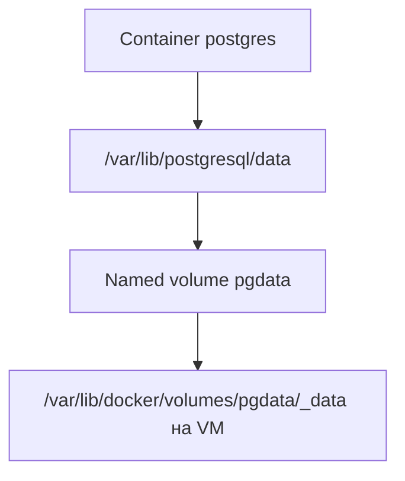
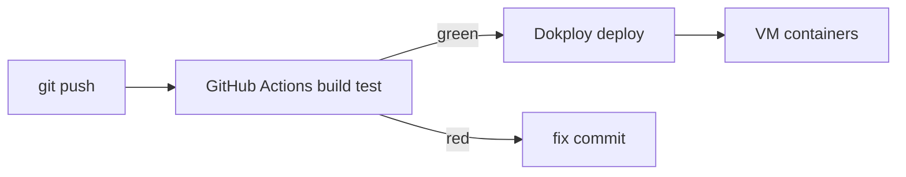
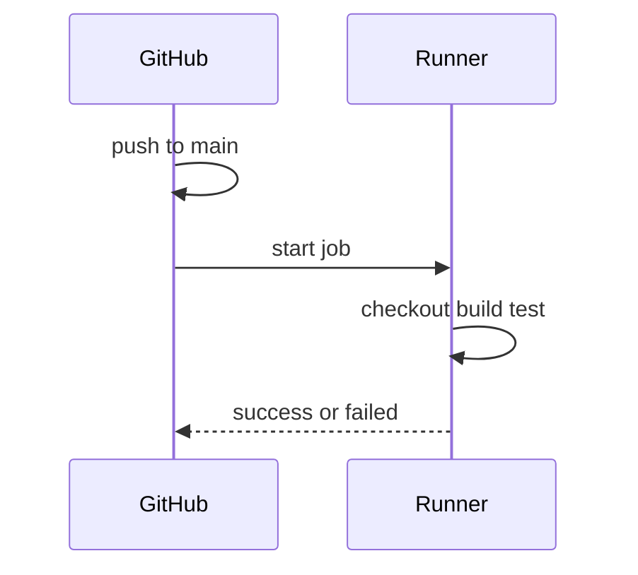
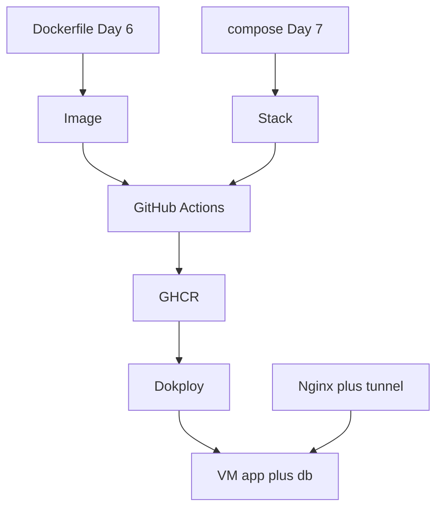
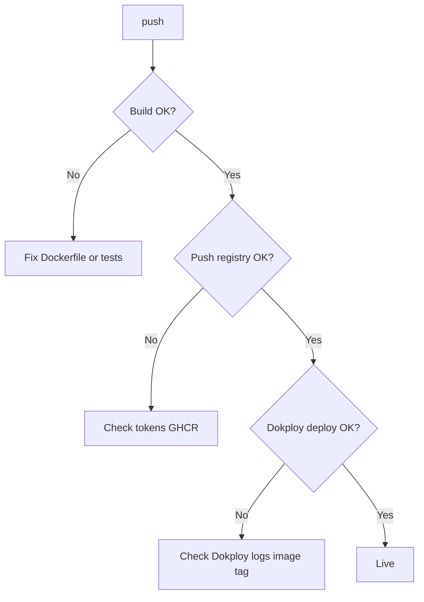

## День 8 — (17 июня) — **Volumes, Data Persistence, CI/CD & Dokploy**

- Volume mapping для database
- Data persistence (данные переживают restart container)
- Backup-стратегии (кратко)
- Docker networks (углубление)
- **CI/CD:** GitHub Actions + Dokploy
- **Цель:** данные не пропадают при перезапуске · deploy по `git push` без ручного SSH

> 🚨 **Все группы** должны сообщить формат сдачи **не позднее 23:59 сегодня**.

**:learning-motives: Цели обучения на день : встреча в Teams в 08:30** :teams_icon: Primært Jakk

### Volumes & persistence

1. Я могу создать volumes в Docker и подключить их к container
2. Я могу обеспечить, чтобы данные БД **пережили** перезапуск container
3. Я могу объяснить разницу **bind mounts** и **named volumes** на практике

### CI/CD & Dokploy

1. Я могу объяснить, что такое **CI/CD** и зачем оно нужно
2. Я понимаю структуру **GitHub Actions**: workflow, event, job, step, runner
3. Я могу описать, как **Dokploy** подключается к GitHub (repo + webhook) и деплоит после push
4. Я понимаю разделение: **CI** (GitHub Actions — build/test) · **CD** (Dokploy — deploy на сервер)

- :theory-icon: Теория дня

# День 8 – Volumes, Persistence, Networks, CI/CD & Dokploy

> Теория к Дню 8 (17 июня). Day 7 дал **compose + pgdata** — Day 8 углубляет **почему данные живут**, **как бэкапить**, и как уйти от ручного `ssh` + `git pull` + `compose up` к **автоматическому deploy** через GitHub Actions и Dokploy.

---

## 📚 Содержание

1. Volumes — зачем и какие бывают
2. Named volume vs bind mount
3. Data persistence — что переживает restart/down
4. Backup БД (кратко)
5. Docker networks — повторение и углубление
6. Зачем CI/CD
7. GitHub Actions — архитектура
8. Workflow: build + push Docker image
9. Dokploy — что это и зачем
10. Установка и GitHub + webhook
11. CI vs CD в нашем курсе
12. Типичные ошибки CI/CD
13. **Наша setup: Day 3–7 → Day 8**
14. Практический workflow
15. Дополнительные задания «Попробуй сам»

---

## 1. Volumes — зачем и какие бывают

**Проблема:** файлы **внутри** container — в RW-layer. Удалил container → данные пропали.

**Решение:** **volume** — хранилище **на хосте** (управляет Docker), подключается к path в container.




| Тип              | Кто задаёт путь на хосте | Типичное использование            |
| ---------------- | ------------------------ | --------------------------------- |
| **Named volume** | Docker                   | БД, persistent data               |
| **Bind mount**   | Ты (`./data:/path`)      | dev config, static, логи на хосте |


---

## 2. Named volume vs bind mount

### Named volume (у тебя — `pgdata`)

```yaml
volumes:
  - pgdata:/var/lib/postgresql/data

volumes:
  pgdata:
    external: true
    name: pgdata
```

- Docker сам кладёт данные в `/var/lib/docker/volumes/pgdata/_data`
- Переносимо между серверами сложнее, но **удобно для БД**
- Имя `pgdata` — логическое; путь на диске не пишешь в yaml

### Bind mount

```yaml
volumes:
  - ./backups:/backups
  - /var/www/andrii:/usr/share/nginx/html:ro
```

- **Явный** путь на хосте
- Удобно: конфиг nginx, static с VM, дампы в папку проекта
- Минус: привязка к структуре папок на конкретной машине

### Сравнение


|                    | Named volume        | Bind mount                             |
| ------------------ | ------------------- | -------------------------------------- |
| Путь на VM         | Docker выбирает     | Ты указываешь                          |
| БД postgres        | ✅ стандарт          | реже                                   |
| Static nginx на VM | —                   | ✅ (у тебя nginx через `apt`, не mount) |
| `compose down`     | volume **остаётся** | папка на хосте **остаётся**            |


---

## 3. Data persistence — что переживает что


| Действие                                           | Container | Named volume `pgdata` |
| -------------------------------------------------- | --------- | --------------------- |
| `docker restart`                                   | тот же    | ✅ данные на месте     |
| `docker compose restart db`                        | тот же    | ✅                     |
| `docker compose down`                              | удалены   | ✅ volume остаётся     |
| `docker rm` + новый container с тем же `-v pgdata` | новый     | ✅                     |
| `docker volume rm pgdata`                          | —         | ❌ **данные удалены**  |


```bash
# проверить volume
docker volume ls
docker volume inspect pgdata
```

> **У тебя (Day 7):** миграция на compose с `external: true` — данные Day 3 **сохранились**.

---

## 4. Backup БД (кратко)

**Цель:** копия данных **вне** единственного volume на VM.

### Ручной dump (postgres)

```bash
# из папки compose
docker compose exec -T db pg_dump -U andrii postgres > backup_$(date +%Y%m%d).sql

# или со старым именем container
docker exec -T mercantecapi-db-1 pg_dump -U andrii postgres > backup.sql
```

### Восстановление (осторожно — перезапишет БД)

```bash
cat backup.sql | docker compose exec -T db psql -U andrii -d postgres
```

### Стратегии (обзор)


| Стратегия              | Идея                                 |
| ---------------------- | ------------------------------------ |
| **Регулярный pg_dump** | cron на VM · файл на диск / S3       |
| **Snapshot volume**    | бэкап на уровне диска VM (провайдер) |
| **Dokploy / скрипты**  | автоматизация после deploy           |


Глубже backup в Dokploy — **Day 9** по программе.

---

## 5. Docker networks — повторение

Day 7: Compose создал `mercantecapi_default` — **bridge**-сеть.


| Концепция          | У тебя                                                            |
| ------------------ | ----------------------------------------------------------------- |
| Service name = DNS | `db` → postgres container                                         |
| Изоляция           | app видит `db`, не видит random container                         |
| Host network       | `cloudflared --network host` — **не** compose-сеть                |
| Порты на VM        | `5000`, `5432` — проброс **наружу** compose-сети для nginx / psql |


```text
Compose-сеть (внутренняя):
  app  →  db:5432

Снаружи compose:
  nginx → 127.0.0.1:5000  →  app
  ты    → 127.0.0.1:5432  →  db
  tunnel → nginx :8080
```

**localhost в container** ≠ localhost на VM — главная ошибка при подключении к БД без compose.

---

## 6. Зачем CI/CD

**CI** (*Continuous Integration*) — при каждом push: build, test, lint → ошибки **рано**.

**CD** (*Continuous Delivery/Deployment*) — после успешного CI: **автоматически** выкатить на сервер.




**Без CI/CD (Day 7 сейчас):**

```text
Mac: edit → git push
VM:  ssh → git pull → docker compose up -d --build
```

**С CI/CD (Day 8 цель):**

```text
Mac: edit → git push
GitHub Actions: build image (CI)
Dokploy: pull image / compose up (CD)
```

---

## 7. GitHub Actions — архитектура

Файлы: `.github/workflows/*.yml` в репо.


| Термин       | Значение                                    |
| ------------ | ------------------------------------------- |
| **Workflow** | один YAML-сценарий                          |
| **Event**    | что запускает (`push`, `pull_request`)      |
| **Job**      | группа steps на одном runner                |
| **Step**     | команда или action                          |
| **Runner**   | VM GitHub (`ubuntu-latest`) или self-hosted |


```yaml
name: CI

on:
  push:
    branches: ["main"]
  pull_request:
    branches: ["main"]

jobs:
  build-and-test:
    runs-on: ubuntu-latest
    steps:
      - uses: actions/checkout@v4
      - name: Build Docker image
        run: docker build -t test -f app/MercantecApi/Dockerfile app/MercantecApi
```




---

## 8. Build + push Docker image в Actions

Классическая модель для Dokploy:

1. **Build** image в CI
2. **Push** в registry (GHCR, Docker Hub)
3. **Dokploy** тянет image и деплоит

```yaml
name: Build and push image

on:
  push:
    branches: ["main"]

env:
  IMAGE_NAME: ghcr.io/${{ github.repository }}/mercantec-api:main

jobs:
  build:
    runs-on: ubuntu-latest
    steps:
      - uses: actions/checkout@v4

      - name: Log in to GHCR
        uses: docker/login-action@v3
        with:
          registry: ghcr.io
          username: ${{ github.actor }}
          password: ${{ secrets.GITHUB_TOKEN }}

      - name: Build and push
        uses: docker/build-push-action@v5
        with:
          context: app/MercantecApi
          file: app/MercantecApi/Dockerfile
          push: true
          tags: ${{ env.IMAGE_NAME }}
```

> Для MercantecApi **context** = `app/MercantecApi`, не корень репо.

---

## 9. Dokploy — что это

**Dokploy** — self-hosted **PaaS**: веб-UI на **твоём** сервере для deploy из Git.


| Без Dokploy               | С Dokploy              |
| ------------------------- | ---------------------- |
| SSH + ручные команды      | Web UI + webhook       |
| Каждый сам помнит compose | Проект привязан к repo |
| Один workflow на команду  | Воспроизводимый deploy |


**Может:**

- Build из Dockerfile / docker-compose
- Deploy containers
- Настраивать **volumes** для БД
- Webhook на push в GitHub

**Не заменяет:** Cloudflare tunnel, nginx на VM (у тебя origin остаётся как сейчас).

---

## 10. Установка Dokploy · GitHub · webhook

### Предварительные условия

- VM с **Docker** (есть)
- SSH (есть)
- Subdomain на Dokploy UI (уточни у teacher — у тебя tunnel на `:8080` для сайта, Dokploy может быть **другой** порт/subdomain)

### Шаги (кратко — следуй docs teacher / Dokploy)

1. Установка Dokploy как container(s) на VM
2. Первый вход в web UI · admin user
3. **New Project** → тип Docker / Docker Compose
4. Подключить GitHub repo (`Mercantec-GHC/deploy-or-die-anbo0005`)
  - публичный repo — проще
  - приватный — **PAT** или **Deploy Key**
5. Branch: `main`
6. Путь к compose: `app/MercantecApi/docker-compose.yml`
7. Env/secrets в UI Dokploy (не в git) — `DB_PASSWORD` и т.д.

### Webhook (GitHub → Dokploy)

**В Dokploy:** скопировать webhook URL (с token).

**В GitHub:** Repo → Settings → Webhooks → Add webhook


| Поле         | Значение           |
| ------------ | ------------------ |
| Payload URL  | URL из Dokploy     |
| Content type | `application/json` |
| Events       | Push               |


**Демо:** маленькое изменение → push → в Dokploy «Building» → сайт обновился **без SSH**.

### Deploy через Action (альтернатива webhook)

```yaml
- name: Trigger Dokploy deployment
  uses: benbristow/dokploy-deploy-action@0.2.2
  with:
    api_token: ${{ secrets.DOKPLOY_AUTH_TOKEN }}
    application_id: ${{ secrets.DOKPLOY_APPLICATION_ID }}
    dokploy_url: ${{ secrets.DOKPLOY_URL }}
```

Или просто:

```yaml
- run: curl -X POST "${{ secrets.DOKPLOY_WEBHOOK_URL }}"
```

---

## 11. CI vs CD в нашем курсе


| Часть               | Инструмент                   | Где                            |
| ------------------- | ---------------------------- | ------------------------------ |
| **CI**              | GitHub Actions               | build, test, push image        |
| **CD**              | Dokploy                      | deploy на VM, volumes, restart |
| **Секреты**         | GitHub Secrets + Dokploy env | не в коде                      |
| **Ручной fallback** | ssh + compose                | всегда можно откатиться        |





**У тебя сейчас:** CI/CD **не** настроен — deploy вручную. Day 8 = теория + практика по указанию teacher.

---

## 12. Типичные ошибки CI/CD




| Ошибка                              | Решение                                       |
| ----------------------------------- | --------------------------------------------- |
| Tag mismatch (`:main` vs `:latest`) | Одинаковый tag в Actions и Dokploy            |
| Неверный `api_token`                | Secrets в GitHub                              |
| Image private                       | GHCR public или credentials в Dokploy         |
| БД пустая после deploy              | Volume mapping в Dokploy / `external: pgdata` |
| Сайт 502                            | container down · tunnel · nginx               |


---

## 13. Наша setup: Day 3–7 → Day 8

### Уже есть ✅


| Компонент             | Статус                                    |
| --------------------- | ----------------------------------------- |
| Named volume `pgdata` | Day 3 → Day 7 `external: true`            |
| Compose app + db      | `mercantecapi-app-1`, `mercantecapi-db-1` |
| `.env` на VM вручную  | пароли не в git                           |
| nginx + tunnel        | вне compose                               |
| Ручной deploy         | `git pull` + `compose up`                 |


### Day 8 — что добавить (по программе)


| Задача             | Действие                                            |
| ------------------ | --------------------------------------------------- |
| Понять persistence | `compose down` / `volume inspect` — данные на месте |
| Backup             | `pg_dump` в файл                                    |
| CI workflow        | `.github/workflows/ci.yml` — build Dockerfile       |
| Dokploy            | по инструкции teacher (если для группы)             |
| Webhook            | push → auto deploy                                  |


> **Volumes в Dokploy:** при deploy указать тот же `pgdata` или volume в UI — иначе **новая** пустая БД.

---

## 14. Практический workflow

### A. Volumes & persistence (на VM)

```bash
cd ~/GitHub/deploy-or-die-anbo0005/app/MercantecApi

docker volume ls
docker volume inspect pgdata

docker compose exec -T db psql -U andrii -d postgres -c 'SELECT 1;'

# перезапуск — данные остаются
docker compose restart db
docker compose ps

# dump
docker compose exec -T db pg_dump -U andrii postgres > ~/backup_$(date +%Y%m%d).sql
ls -la ~/backup_*.sql
```

### B. Мини CI (GitHub only)

1. Создать `.github/workflows/ci.yml` — build на push/PR
2. Push → вкладка **Actions** на GitHub → зелёный/красный

### C. Dokploy end-to-end (если teacher дал доступ)

1. Dokploy на VM · проект → repo · compose path
2. Webhook в GitHub
3. Маленькое изменение → push → deploy без SSH

---

# Чеклист целей обучения

> ⬜ Day 8 — в работе

### Volumes & persistence

- [ ] Объяснить **named volume** vs **bind mount**
- [ ] Показать `docker volume ls` / `inspect pgdata`
- [ ] Убедиться: `compose restart` / `compose down` — данные БД **на месте**
- [ ] Сделать **pg_dump** backup в файл
- [ ] Объяснить Docker **network** (compose vs host vs порты на VM)

### CI/CD & Dokploy

- [ ] Объяснить **CI** vs **CD**
- [ ] Знать структуру GitHub Actions workflow
- [ ] (Опционально) workflow build + push image в GHCR
- [ ] (Опционально) Dokploy: repo + webhook · push → deploy
- [ ] Secrets только в GitHub / Dokploy / `.env` — не в git

---

## Ключевые идеи (простыми словами)


| Идея               | Коротко                              |
| ------------------ | ------------------------------------ |
| **Volume**         | данные **вне** container layer       |
| **Named volume**   | Docker хранит · `pgdata`             |
| **Bind mount**     | твой путь на хосте                   |
| **`compose down`** | containers ушли · volume **остался** |
| **`volume rm`**    | ⚠️ удалит данные                     |
| **CI**             | автоматический build/test на push    |
| **CD**             | автоматический deploy (Dokploy)      |
| **Dokploy**        | PaaS на своей VM · webhook из GitHub |
| **Ручной deploy**  | всё ещё валидный fallback            |


---

## Команды (практика)

> Day 8 на **VM** и **GitHub**. SSH: `mercantec-andrii` · compose: `app/MercantecApi/`

### 0. Перед SSH (Mac)

```bash
# IP после reboot может быть .121 (не .122) — см. SESSION_HANDOFF
ssh-keyscan -t ed25519 10.133.51.121 2>/dev/null | ssh-keygen -lf -
# SHA256:MFyp... = твоя VM → ssh mercantec-andrii → yes
# P4Z... / Ujh... = не yes
ssh-keygen -R 10.133.51.121   # если HOST IDENTIFICATION HAS CHANGED
```

### 1. Volumes & persistence

```bash
cd ~/GitHub/deploy-or-die-anbo0005/app/MercantecApi

docker volume ls
docker volume inspect pgdata

docker compose ps
docker compose exec db psql -U andrii -d postgres -c 'SELECT 1;'

# restart db — данные должны остаться
docker compose restart db
docker compose ps
```

### 2. Backup postgres

```bash
cd ~/GitHub/deploy-or-die-anbo0005/app/MercantecApi

docker compose exec -T db pg_dump -U andrii postgres > ~/backup_$(date +%Y%m%d).sql
ls -lh ~/backup_*.sql
```

### 3. Проверка сети (service discovery)

```bash
cd ~/GitHub/deploy-or-die-anbo0005/app/MercantecApi

docker compose exec app getent hosts db
# должен резолвить IP db в compose-сети
```

### 4. API после любых изменений

```bash
curl http://127.0.0.1:5000/weatherforecast
curl http://127.0.0.1:8080/api/weatherforecast
curl https://andrii.mercantec.tech/api/weatherforecast
```

### 5. GitHub Actions (на Mac, в репо)

```bash
# после создания .github/workflows/ci.yml
git add .github/workflows/ci.yml
git commit -m "Add CI workflow for MercantecApi Docker build"
git push
# смотреть: GitHub → Actions
```

---

## Короткий текст для Teams (Day 8)

> **Day 8:** Volumes — named (`pgdata`) vs bind mount; данные переживают `compose down`, но не `volume rm`. Backup — `pg_dump`. Networks — compose-сеть (`db` hostname) vs host (`cloudflared`). CI/CD: GitHub Actions (CI — build/test/push image) + Dokploy (CD — webhook/deploy на VM). Секреты в GitHub Secrets и `.env`, не в git. У меня persistence уже через `pgdata` с Day 3/7; Day 8 — backup + автоматизация deploy.

---

## Итог по целям обучения

После Day 8 вы должны уметь:

1. **Создавать и подключать volumes** — named и bind; объяснить разницу.
2. **Гарантировать persistence** БД при restart/down compose.
3. **Делать простой backup** (`pg_dump`).
4. **Объяснить Docker networks** в контексте compose и host.
5. **Объяснить CI/CD** и роль GitHub Actions + Dokploy.
6. **Описать webhook-flow:** push → Actions → registry → Dokploy → live.
7. **Хранить secrets** вне репозитория.

---

*Обновлено: 2026-06-11 — теория Day 8; volumes/persistence + CI/CD/Dokploy под MercantecApi*