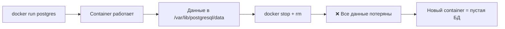
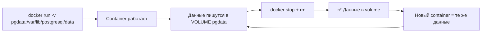
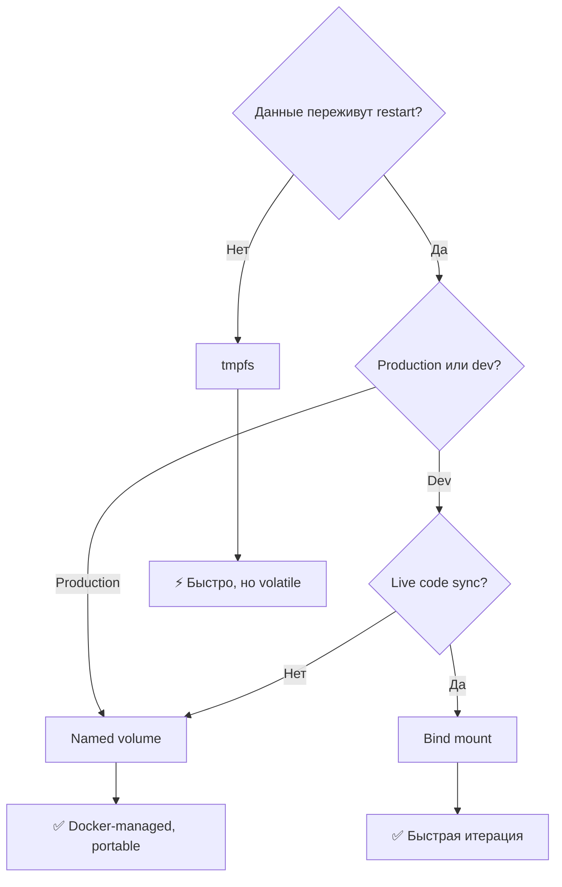
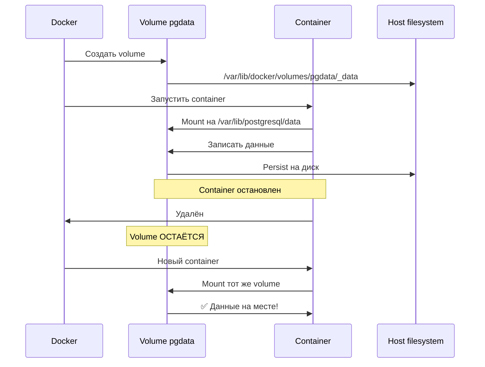
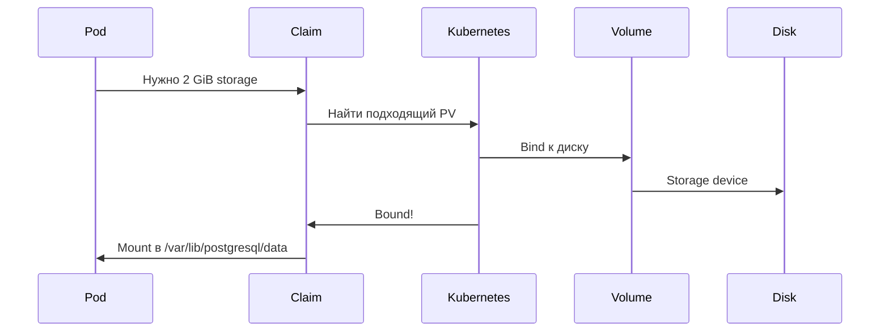
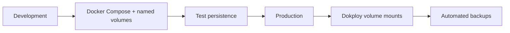

## День 9 — (18 июня) — **Kubernetes, Dokploy, Setup & GitHub Integration**

- Установка Dokploy на сервер
- Настройка web interface
- Подключение Git-репозитория
- Deploy app через Dokploy UI
- Настройка GitHub webhook
- Автоматический deploy при push
- **Цель:** Dokploy готов к deployment · push в GitHub = автоматический deploy через Dokploy

**:learning-motives: Цели обучения на день : встреча в Teams в 08:30** :teams_icon:

1. Я могу установить и настроить Dokploy на сервере
2. Я могу подключить GitHub-репозиторий к Dokploy и настроить webhook
3. Я могу показать, что git push запускает автоматический deployment через Dokploy
4. Я понимаю идею Docker Swarm или Kubernetes (k3s)

- :theory-icon: Теория дня

# День 9 – Docker Volumes, Data Persistence & Kubernetes

> Теория к Дню 9 (18 июня). Повторение volumes и persistence · идея **Kubernetes/K3s** (оркестрация) · **Dokploy** + Git + webhook для автоматического deploy.

---

## 📚 Содержание

1. Проблема efemérных containers
2. Типы Docker storage — обзор
3. Named volumes — подробнее
4. Bind mounts vs volumes
5. Docker Compose с volumes
6. Kubernetes & K3s — введение в оркестрацию
7. PersistentVolumes & PersistentVolumeClaims
8. Dokploy — volumes configuration
9. Kubernetes (K3s) — идея и пример Proxi
10. Docker Swarm — кратко
11. Dokploy, Git и автоматический deployment
12. Практический workflow
13. Best practices & production readiness

---

## 1. Проблема efemérных containers

Containers спроектированы как **efemérные** (временные).

Всё внутри container — файлы, данные БД, логи — **пропадает**, когда container остановлен и удалён.

### Lifecycle без persistence



**Проблема:** для БД, uploads, конфигов данные должны переживать restart container.

**Решение:** volumes — persistent storage **вне** lifecycle container.

### Lifecycle с persistence



---

## 2. Docker storage — обзор

Docker предлагает три способа хранить persistent data:

| Тип | Описание | Рекомендуемое использование |
| --- | --- | --- |
| Named volume | Управляет Docker (`/var/lib/docker/volumes/`) | Production, БД, app-data |
| Bind mount | Прямой mapping на файловую систему хоста | Разработка, live sync, config |
| tmpfs | В RAM, не persistent | Временные данные (cache) |

### Какой тип выбрать?



---

## 3. Named volumes — подробнее

Named volumes — рекомендуемый способ persistent data в production.

### CLI-команды

```bash
# Создать volume
docker volume create pgdata

# Список volumes
docker volume ls

# Инспекция volume
docker volume inspect pgdata

# Удалить неиспользуемый volume
docker volume rm pgdata

# Удалить все неиспользуемые volumes (осторожно!)
docker volume prune
```

### Пример: PostgreSQL с named volume

```bash
docker run -d \
  --name postgres \
  -e POSTGRES_PASSWORD=hemmeligt \
  -v pgdata:/var/lib/postgresql/data \
  -p 5432:5432 \
  postgres:16-alpine
```



---

## 4. Bind mounts vs volumes

### Сравнение

| | Named volume | Bind mount |
| --- | --- | --- |
| Управляет | Docker | Пользователь (папка на host) |
| Расположение | `/var/lib/docker/volumes/` | Где ты укажешь |
| Портативность | ✅ На любой машине | ⚠️ Зависит от структуры host |
| Security | ✅ Изолирован | ⚠️ Container видит host-папку |
| Рекомендуется для | Production | Разработка |

### Named volumes vs bind mounts (из теории дня)

| Тип | Описание | Пример |
| --- | --- | --- |
| **Named volume** | Docker управляет папкой (обычно `/var/lib/docker/volumes/`). Ссылаешься по имени. Данные переживают restart, удобно в Compose. | `volumes: - pgdata:/var/lib/postgresql/data` |
| **Bind mount** | Конкретная **папка на host** в container. Удобно для dev (live-sync кода) или когда нужен точный путь. | `volumes: - ./data:/var/lib/postgresql/data` |

На практике: **named volumes** для БД и persistent data в production-like setup. **Bind mounts** — для кода или конкретной папки.

---

## 5. Docker Compose с volumes

### Пример: App + Database

```yaml
services:
  db:
    image: postgres:16-alpine
    environment:
      POSTGRES_USER: bruger
      POSTGRES_PASSWORD: hemmeligt
      POSTGRES_DB: minapp
    volumes:
      - pgdata:/var/lib/postgresql/data
    restart: unless-stopped

  app:
    build: .
    ports:
      - "3000:3000"
    environment:
      DATABASE_URL: postgres://bruger:hemmeligt@db:5432/minapp
    volumes:
      - uploads:/app/uploads
    depends_on:
      - db
    restart: unless-stopped

volumes:
  pgdata:
  uploads:
```

### Пример из Proxi — Compose с volume

```yaml
services:
  db:
    image: postgres:16-alpine
    volumes:
      - pgdata:/var/lib/postgresql/data
    # ...

volumes:
  pgdata:
```

- **pgdata** — named volume. Docker создаёт при первом `docker compose up`.
- Postgres пишет в `/var/lib/postgresql/data` внутри container — это и есть volume **pgdata**.
- После restart или удаления db-container и нового запуска данные **остаются** в volume.

### Важные команды

```bash
docker compose up -d      # Старт с volumes
docker compose down       # Стоп (volumes остаются)
docker compose down -v    # Стоп + удаление volumes ⚠️
```

---

## 6. Kubernetes & K3s — введение в оркестрацию

**Kubernetes** запускает, мониторит и перезапускает containers на нескольких машинах.

**K3s** — облегчённый Kubernetes: один бинарник с API server, kubelet, containerd, Traefik (ingress) и сетью. Подходит для маленьких clusters и обучения. В Proxi K3s на VM (1 control plane + 2 workers) через Terraform + Ansible.

---

## 7. PersistentVolumes & PersistentVolumeClaims

### Концепция

- **PV** (PersistentVolume) = реальный диск на сервере.
- **PVC** (PersistentVolumeClaim) = «запрос» на кусок диска.



### Пример PVC (K3s)

```yaml
apiVersion: v1
kind: PersistentVolumeClaim
metadata:
  name: postgres-pvc
spec:
  accessModes:
    - ReadWriteOnce
  resources:
    requests:
      storage: 2Gi
```

### Data persistence в Kubernetes — PVC в Proxi

В манифестах Proxi (`app/k8s/postgres.yaml`):

**1. Запрос диска (PVC):**

```yaml
apiVersion: v1
kind: PersistentVolumeClaim
metadata:
  name: postgres-pvc
  namespace: proxi
spec:
  accessModes: [ReadWriteOnce]
  resources:
    requests:
      storage: 2Gi
```

**2. Postgres Deployment монтирует volume:**

```yaml
volumeMounts:
  - name: data
    mountPath: /var/lib/postgresql/data
volumes:
  - name: data
    persistentVolumeClaim:
      claimName: postgres-pvc
```

- K3s выделяет 2 GB для `postgres-pvc`. Данные в `/var/lib/postgresql/data` на этом volume.
- При restart Postgres-pod PVC остаётся — данные переживают.

Это аналог **named volume** в Docker, но управляется Kubernetes и переживает restart pods (в пределах ReadWriteOnce).

---

## 8. Dokploy — volumes configuration

Dokploy поддерживает:

- **Volume mounts (named volumes)** — рекомендуется для production.
- **Bind mounts** — обычно для config-файлов.
- **File mounts** — отдельные файлы (`.env`, config).

Dokploy может делать автоматические backups volumes в S3 для восстановления БД или app-data.

---

## 9. Kubernetes (K3s) — ресурсы и flow (Proxi)

### Важные ресурсы K8s

| Ресурс | Описание | В Proxi |
| --- | --- | --- |
| **Namespace** | Виртуальное пространство для группировки. | `proxi` — app и db |
| **PersistentVolumeClaim (PVC)** | «Нужно X GB диска.» Cluster выделяет volume; данные переживают restart pod. | Postgres: `postgres-pvc` (2 Gi) |
| **Deployment** | Описание app: image, replicas, env, volumeMounts. Держит pods running. | `proxi-app` (3 replicas), `postgres` (1) |
| **Pod** | Минимальная единица — один или несколько containers. | Каждая replica app = pod |
| **Service** | Стабильное сетевое имя (ClusterIP). Другие pods достучатся до БД как `proxi-db:5432`. | `proxi-db`, `proxi-app` |
| **Ingress** | Правила входящего HTTP. Traefik (в K3s) направляет трафик на нужный Service. | `/` → `proxi-app:80` |

### App + database + доступ — flow в Proxi

- **App-pods** (3 шт.) берут connection data из **Secret** (`proxi-db`), подключаются к `NODE_DB_HOST=proxi-db` (имя Service).
- **Postgres** — один pod с PVC; Service `proxi-db` даёт стабильное имя (`proxi-db.proxi.svc.cluster.local`) на порту 5432.
- **Ingress** (Traefik) шлёт HTTP на Service `proxi-app`, который round-robin на 3 app-pods.

Можно открыть app на `http://<control-plane-ip>` и обновлять страницу — видно переключение между pods (load balancing).

---

## 10. Docker Swarm — кратко

**Docker Swarm** — встроенный orchestrator Docker: несколько машин = swarm, deploy services (containers) с масштабированием и restart.

Похоже на Kubernetes (replicas, services, сеть), но проще и менее функционален. Сегодня чаще K8s/K3s. **Идея та же:** описываешь желаемое состояние — система его поддерживает.

Dokploy при установке использует **Swarm** на VM (свои сервисы: dokploy, postgres, redis, traefik).

---

## 11. Dokploy, Git и автоматический deployment

На Дне 9 работа с **Dokploy**: web UI для deploy из Git + **webhook**, чтобы **push в GitHub** запускал rebuild и deploy.

- **Dokploy** подключается к GitHub-repo, build из Dockerfile или docker-compose.
- **Webhook** — GitHub шлёт запрос при каждом push → Dokploy build и deploy.
- Простая **CI/CD**-цепочка: push → build → deploy без ssh и ручных команд.

Proxi-demo показывает другой путь (Ansible + K3s), но **цель та же:** от кода до running app через automation.

### Шаги (цели дня)

1. Установка Dokploy на сервер
2. Настройка web interface
3. Подключение Git-репозитория
4. Deploy через Dokploy UI
5. GitHub webhook
6. Демонстрация: push → автоматический deploy

---

## 12. Практический workflow

### Чеклист перед deployment

1. Определить, какие данные должны persist (БД, uploads, logs).
2. Использовать named volumes в Docker Compose.
3. Тест: stop container → start снова → данные на месте?
4. Включить backups (локально или через Dokploy).



---

## 13. Best practices & production readiness

### DO

- Named volumes в production.
- Автоматические backups.
- `restart: unless-stopped` в Compose.
- Тест persistence перед go-live.

### DON'T

- Bind mounts для database-data в production.
- Забыть backup pgdata и uploads.
- `docker compose down -v` без backup.

---

# Чеклист целей обучения

> ⬜ Day 9 — в работе

### Volumes & persistence

- [ ] Создать volumes и подключить к container (как `pgdata` в compose)
- [ ] Данные БД переживают restart container (named volume или PVC)
- [ ] Объяснить bind mounts vs named volumes на практике
- [ ] `docker volume ls` / `docker volume inspect pgdata`

### Kubernetes / Swarm (теория)

- [ ] Понять идею K8s/K3s: Namespace, Deployment, Pod, Service, Ingress, PVC
- [ ] Сравнить named volume (Docker) и PVC (Kubernetes)
- [ ] Кратко объяснить Docker Swarm vs Kubernetes

### Dokploy & GitHub

- [ ] Установить и настроить Dokploy на сервере
- [ ] Подключить GitHub-repo к Dokploy
- [ ] Настроить webhook (Content-Type: `application/json`)
- [ ] Показать: push → автоматический deploy

---

## Ключевые идеи (простыми словами)

| Идея | Коротко |
| --- | --- |
| **Efemér container** | без volume данные пропадают при `rm` |
| **Named volume** | Docker хранит · `pgdata` |
| **Bind mount** | твоя папка на host |
| **PVC** | «запрос диска» в Kubernetes |
| **Pod** | минимальная единица в K8s |
| **Service** | стабильное имя для pods (`proxi-db`) |
| **Ingress** | HTTP-маршрутизация снаружи cluster |
| **Swarm** | простой orchestrator Docker (Dokploy) |
| **K3s** | лёгкий Kubernetes для обучения |
| **Dokploy webhook** | push → auto deploy |

---

## Команды (практика)

> Volumes — на **VM**. Dokploy/Git — по инструкции teacher.

### Volumes

```bash
docker volume ls
docker volume inspect pgdata

cd ~/GitHub/deploy-or-die-anbo0005/app/MercantecApi
docker compose restart db
# данные должны остаться
```

### Backup

```bash
docker compose exec -T db pg_dump -U andrii postgres > ~/backup_$(date +%Y%m%d).sql
```

---

## Proxi — где лежит демо

См. **Proxi-demo** в материалах курса.

- **Docker volumes:** `app/docker-compose.yml` — Postgres с `pgdata`.
- **K3s-манифесты:** `app/k8s/` — `namespace.yaml`, `db-secret.yaml`, `postgres.yaml`, `app.yaml`, `ingress.yaml`. См. `app/k8s/README.md` для порядка `kubectl apply`.

---

## Короткий текст для Teams (Day 9)

> **Day 9:** Volumes — named vs bind mount; persistence в Docker (`pgdata`) и в K8s (PVC). Идея Kubernetes/K3s: Namespace, Deployment, Pod, Service, Ingress. Docker Swarm — кратко (orchestration). Dokploy: install, GitHub repo, webhook, push = auto deploy. Proxi как demo K3s + Compose с volumes.

---

## Итог по целям обучения

После Day 9 вы должны уметь:

1. **Создавать volumes** в Docker и подключать к container.
2. **Обеспечить persistence** БД при restart (named volume или PVC).
3. **Объяснить** bind mounts vs named volumes.
4. **Понимать идею** Docker Swarm и Kubernetes (K3s) — orchestration, Deployments, Services, Ingress, PVC (Proxi как пример).
5. **Установить Dokploy**, подключить GitHub, настроить webhook.
6. **Продемонстрировать** автоматический deploy при push.

---

*Обновлено: 2026-06-12 — теория Day 9; volumes, K8s/K3s, Dokploy, GitHub integration*
